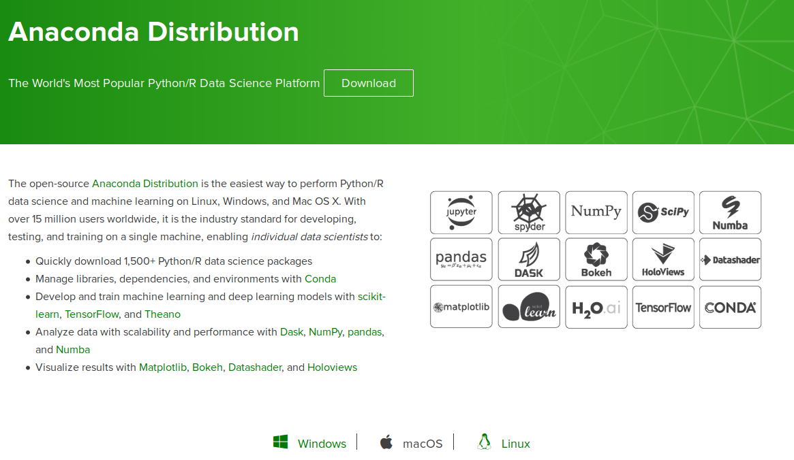
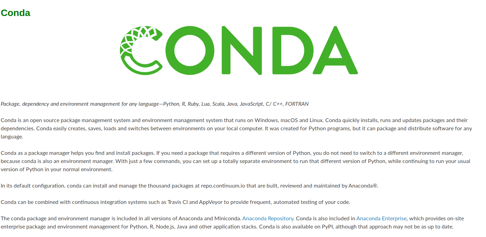

# 01_Installion: installing anaconda
-----

- **python distribution**
- **python package management**
- **Resolve dependencies** 

**Specifications**:
- Linux, mac, windows (hopefully :p)
- Anaconda 2019.03

## **Step 1: Install anaconda**

https://docs.anaconda.com/anaconda/install/

## **Step 2: Verify installation**

- open python prompt: `ipython`

    $ ipython

# **Setup conda environments**
-----

https://conda.io/projects/conda/en/latest/

**Making a new environment**

*Example environment `test` installing package `numpy 1.14`*

    $ conda create -n test numpy=1.14 # specific package

*List conda environments*

    $ conda info --envs

*Initialize* (__must restart terminal__)

    $ conda init

*Activate environment `test`*

    $ conda activate test

*Deactivate environment `test`*

    $ conda deactivate

# **Setup conda environments**
-----

https://conda.io/projects/conda/en/latest/

## **Step1 : Install jupyterlab**

using `yaml` file for conda

    $ conda env create -f binder/environment.yml

## **Step 2: Start jupyterlab**

    $ jupyter lab
