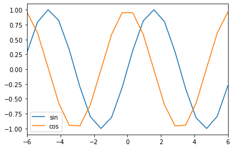
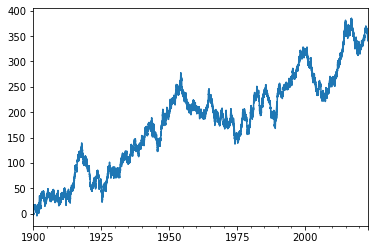
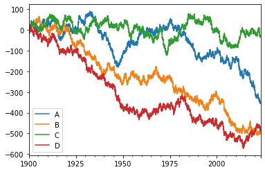
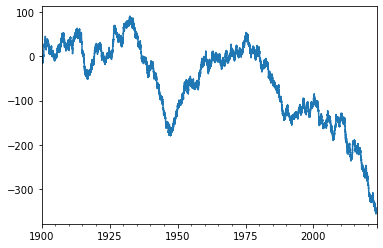
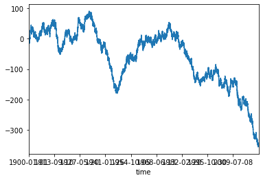
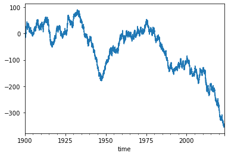
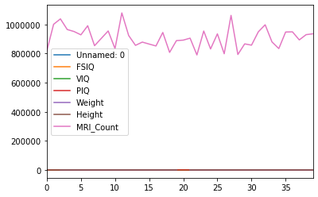
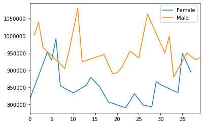
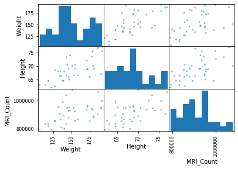
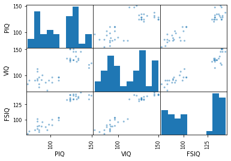

# Statistical analysis using `pandas`

- [Python Data science handbook](https://jakevdp.github.io/PythonDataScienceHandbook/03.01-introducing-pandas-objects.html)
- [10 Minutes to Pandas](https://pandas.pydata.org/pandas-docs/stable/getting_started/10min.html)


**Table of Content:**

1. [Introduction](#intro)
2. [Series](#series)
3. [Dataframes](#dataframes)
4. [Plotting](#plotting)
5. [Reading, writing **excel**, csv, and hdf5](#io)
6. [Basic statistical analysis](#statistics)

<a id='intro'></a>
# Introduction

This is a short introduction to pandas, geared mainly for new users. You can see more complex recipes in the [cookbook](https://pandas.pydata.org/pandas-docs/stable/user_guide/cookbook.html#cookbook).


### **Import `pandas`**


```python
%matplotlib inline
import pandas as pd
import numpy as np
import matplotlib.pyplot as plt
```

<a id='series'></a>
# Pandas Series


```python
data = pd.Series([0.25, 0.5, 0.75, 1.0])
data
```


    0    0.25
    1    0.50
    2    0.75
    3    1.00
    dtype: float64


```python
data.values
```


    array([0.25, 0.5 , 0.75, 1.  ])


```python
data.index
```


    RangeIndex(start=0, stop=4, step=1)


```python
data[1]
```


    0.5


```python
data[1:3]
```


    1    0.50
    2    0.75
    dtype: float64


### **Dealing with `nan`**


```python
data_np = np.array([1, 3, 5, np.nan, 6, 8])
data = pd.Series(data_np)
data
```


    0    1.0
    1    3.0
    2    5.0
    3    NaN
    4    6.0
    5    8.0
    dtype: float64


### **max, min, mean**


```python
#no problem
data.max(), data.min(), data.mean()
```


    (8.0, 1.0, 4.6)


```python
# A bit complicated
data_np.max(), data_np.min(), data_np.mean()
```


    (nan, nan, nan)


```python
# But not impossible
np.nanmax(data_np), np.nanmin(data_np), np.nanmean(data_np)
```


    (8.0, 1.0, 4.6)


### **labelled series**


```python
data = pd.Series([0.25, 0.5, 0.75, 1.0],
                 index=['a', 'b', 'c', 'd'])
data
```


    a    0.25
    b    0.50
    c    0.75
    d    1.00
    dtype: float64


```python
data['b']
```


    0.5


```python
data.iloc[1]
```


    0.5


```python
data.iloc[1:3]
```


    b    0.50
    c    0.75
    dtype: float64


### **Dictionary index**


```python
population_dict = {'California': 38332521,
                   'Texas': 26448193,
                   'New York': 19651127,
                   'Florida': 19552860,
                   'Illinois': 12882135}
population = pd.Series(population_dict)
population
```


    California    38332521
    Texas         26448193
    New York      19651127
    Florida       19552860
    Illinois      12882135
    dtype: int64


<a id='dataframes'></a>
# DataFrames


```python
import numpy as np
t = np.linspace(-6, 6, 20)
sin_t = np.sin(t)
cos_t = np.cos(t)
```


```python
df = pd.DataFrame({'sin': sin_t, 'cos': cos_t},index=t)  
df.head()
```


<div>
<style scoped>
    .dataframe tbody tr th:only-of-type {
        vertical-align: middle;
    }

    .dataframe tbody tr th {
        vertical-align: top;
    }

    .dataframe thead th {
        text-align: right;
    }
</style>
<table border="1" class="dataframe">
  <thead>
    <tr style="text-align: right;">
      <th></th>
      <th>sin</th>
      <th>cos</th>
    </tr>
  </thead>
  <tbody>
    <tr>
      <th>-6.000000</th>
      <td>0.279415</td>
      <td>0.960170</td>
    </tr>
    <tr>
      <th>-5.368421</th>
      <td>0.792419</td>
      <td>0.609977</td>
    </tr>
    <tr>
      <th>-4.736842</th>
      <td>0.999701</td>
      <td>0.024451</td>
    </tr>
    <tr>
      <th>-4.105263</th>
      <td>0.821291</td>
      <td>-0.570509</td>
    </tr>
    <tr>
      <th>-3.473684</th>
      <td>0.326021</td>
      <td>-0.945363</td>
    </tr>
  </tbody>
</table>
</div>


```python
df.to_numpy()
```


    array([[ 0.2794155 ,  0.96017029],
           [ 0.79241881,  0.6099774 ],
           [ 0.99970104,  0.02445069],
           [ 0.82129115, -0.57050928],
           [ 0.32602102, -0.94536252],
           [-0.29503045, -0.95548785],
           [-0.80225698, -0.59697884],
           [-0.99996678, -0.00815095],
           [-0.81188195,  0.58382164],
           [-0.310567  ,  0.95055149],
           [ 0.310567  ,  0.95055149],
           [ 0.81188195,  0.58382164],
           [ 0.99996678, -0.00815095],
           [ 0.80225698, -0.59697884],
           [ 0.29503045, -0.95548785],
           [-0.32602102, -0.94536252],
           [-0.82129115, -0.57050928],
           [-0.99970104,  0.02445069],
           [-0.79241881,  0.6099774 ],
           [-0.2794155 ,  0.96017029]])


```python
df.dtypes
```


    sin    float64
    cos    float64
    dtype: object


```python
df2 = pd.DataFrame({'A': 1.,
                    'B': pd.Timestamp('20130102'),
                    'C': pd.Series(1, index=list(range(4)), dtype='float32'),
                    'D': np.array([3] * 4, dtype='int32'),
                    'E': pd.Categorical(["test", "train", "test", "train"]),
                    'F': 'foo'})

df2
```


<div>
<style scoped>
    .dataframe tbody tr th:only-of-type {
        vertical-align: middle;
    }

    .dataframe tbody tr th {
        vertical-align: top;
    }

    .dataframe thead th {
        text-align: right;
    }
</style>
<table border="1" class="dataframe">
  <thead>
    <tr style="text-align: right;">
      <th></th>
      <th>A</th>
      <th>B</th>
      <th>C</th>
      <th>D</th>
      <th>E</th>
      <th>F</th>
    </tr>
  </thead>
  <tbody>
    <tr>
      <th>0</th>
      <td>1.0</td>
      <td>2013-01-02</td>
      <td>1.0</td>
      <td>3</td>
      <td>test</td>
      <td>foo</td>
    </tr>
    <tr>
      <th>1</th>
      <td>1.0</td>
      <td>2013-01-02</td>
      <td>1.0</td>
      <td>3</td>
      <td>train</td>
      <td>foo</td>
    </tr>
    <tr>
      <th>2</th>
      <td>1.0</td>
      <td>2013-01-02</td>
      <td>1.0</td>
      <td>3</td>
      <td>test</td>
      <td>foo</td>
    </tr>
    <tr>
      <th>3</th>
      <td>1.0</td>
      <td>2013-01-02</td>
      <td>1.0</td>
      <td>3</td>
      <td>train</td>
      <td>foo</td>
    </tr>
  </tbody>
</table>
</div>


```python
df2.dtypes
```


    A           float64
    B    datetime64[ns]
    C           float32
    D             int32
    E          category
    F            object
    dtype: object


<a id='plotting'></a>
# Plotting

plotting is super-easy


```python
df.plot()
```


    <matplotlib.axes._subplots.AxesSubplot at 0x7fdef2cfa780>





```python
ts = pd.Series(np.random.randn(45000),
               index=pd.date_range('1/1/1900', periods=45000))
ts = ts.cumsum()
ts.plot()
```


    <matplotlib.axes._subplots.AxesSubplot at 0x7fdef0b762e8>





```python
df = pd.DataFrame(np.random.randn(45000, 4), index=ts.index,
                  columns=['A', 'B', 'C', 'D'])
df = df.cumsum()

plt.figure()
df.plot()
plt.legend(loc='best')
```


    <matplotlib.legend.Legend at 0x7fdef0679a20>


    <Figure size 432x288 with 0 Axes>





```python
df['A'].plot()
```


    <matplotlib.axes._subplots.AxesSubplot at 0x7fdeef7fc898>





```python
df.describe()
```


<div>
<style scoped>
    .dataframe tbody tr th:only-of-type {
        vertical-align: middle;
    }

    .dataframe tbody tr th {
        vertical-align: top;
    }

    .dataframe thead th {
        text-align: right;
    }
</style>
<table border="1" class="dataframe">
  <thead>
    <tr style="text-align: right;">
      <th></th>
      <th>A</th>
      <th>B</th>
      <th>C</th>
      <th>D</th>
    </tr>
  </thead>
  <tbody>
    <tr>
      <th>count</th>
      <td>45000.000000</td>
      <td>45000.000000</td>
      <td>45000.000000</td>
      <td>45000.000000</td>
    </tr>
    <tr>
      <th>mean</th>
      <td>-58.612850</td>
      <td>-226.988164</td>
      <td>3.214128</td>
      <td>-313.361073</td>
    </tr>
    <tr>
      <th>std</th>
      <td>91.822689</td>
      <td>155.822916</td>
      <td>40.212850</td>
      <td>162.296298</td>
    </tr>
    <tr>
      <th>min</th>
      <td>-355.928156</td>
      <td>-509.128080</td>
      <td>-122.654053</td>
      <td>-572.380638</td>
    </tr>
    <tr>
      <th>25%</th>
      <td>-128.998996</td>
      <td>-336.737556</td>
      <td>-20.737855</td>
      <td>-437.785377</td>
    </tr>
    <tr>
      <th>50%</th>
      <td>-26.659032</td>
      <td>-231.407431</td>
      <td>6.508351</td>
      <td>-372.697840</td>
    </tr>
    <tr>
      <th>75%</th>
      <td>10.543447</td>
      <td>-111.334958</td>
      <td>33.871246</td>
      <td>-177.654215</td>
    </tr>
    <tr>
      <th>max</th>
      <td>90.370865</td>
      <td>66.346537</td>
      <td>79.357691</td>
      <td>24.809176</td>
    </tr>
  </tbody>
</table>
</div>


<a id='io'></a>

# **File I/O**

- reading `csv`
- reading `excel`
- reading `hdf5`

### **csv** (fast, simple)


```python
df.index.name = 'time'
df.to_csv('foo.csv')
```


```python
!head foo.csv
```

    time,A,B,C,D
    1900-01-01,-1.1190652434145012,-0.8170260608211657,0.6896412881609868,0.007396558262463458
    1900-01-02,-1.6654255310812793,-2.5564780908235623,0.8426492151506279,0.5846468374183935
    1900-01-03,-1.711251251813269,-3.0108175817376357,1.8700588286988142,0.703069778502929
    1900-01-04,-3.509780829152314,-3.160235785270834,2.967196507245297,1.9261438412635823
    1900-01-05,-4.501883066644041,-3.571093314048569,4.061838027508743,2.0715778268645084
    1900-01-06,-3.728904735033837,-4.2595186308557125,4.678906407421984,3.552845298071466
    1900-01-07,-2.5172141650767736,-4.920684125219758,4.043916014062499,1.959364112160967
    1900-01-08,-2.2145059329950443,-2.9993851482961125,3.675626611019119,2.5106106841781974
    1900-01-09,-0.16421252367596972,-2.2517598726023165,5.412327160720512,3.405195372202757


```python
df2 = pd.read_csv('foo.csv', index_col=0)
df2.head()
```


<div>
<style scoped>
    .dataframe tbody tr th:only-of-type {
        vertical-align: middle;
    }

    .dataframe tbody tr th {
        vertical-align: top;
    }

    .dataframe thead th {
        text-align: right;
    }
</style>
<table border="1" class="dataframe">
  <thead>
    <tr style="text-align: right;">
      <th></th>
      <th>A</th>
      <th>B</th>
      <th>C</th>
      <th>D</th>
    </tr>
    <tr>
      <th>time</th>
      <th></th>
      <th></th>
      <th></th>
      <th></th>
    </tr>
  </thead>
  <tbody>
    <tr>
      <th>1900-01-01</th>
      <td>-1.119065</td>
      <td>-0.817026</td>
      <td>0.689641</td>
      <td>0.007397</td>
    </tr>
    <tr>
      <th>1900-01-02</th>
      <td>-1.665426</td>
      <td>-2.556478</td>
      <td>0.842649</td>
      <td>0.584647</td>
    </tr>
    <tr>
      <th>1900-01-03</th>
      <td>-1.711251</td>
      <td>-3.010818</td>
      <td>1.870059</td>
      <td>0.703070</td>
    </tr>
    <tr>
      <th>1900-01-04</th>
      <td>-3.509781</td>
      <td>-3.160236</td>
      <td>2.967197</td>
      <td>1.926144</td>
    </tr>
    <tr>
      <th>1900-01-05</th>
      <td>-4.501883</td>
      <td>-3.571093</td>
      <td>4.061838</td>
      <td>2.071578</td>
    </tr>
  </tbody>
</table>
</div>


```python
df2['A'].plot()
```


    <matplotlib.axes._subplots.AxesSubplot at 0x7fdeef443780>





### **excel** (slow)


```python
df.to_excel('foo.xlsx', sheet_name='Sheet1')
```


```python
df2 = pd.read_excel('foo.xlsx', 'Sheet1', index_col=0, na_values=['NA'])
df2.head()
```


<div>
<style scoped>
    .dataframe tbody tr th:only-of-type {
        vertical-align: middle;
    }

    .dataframe tbody tr th {
        vertical-align: top;
    }

    .dataframe thead th {
        text-align: right;
    }
</style>
<table border="1" class="dataframe">
  <thead>
    <tr style="text-align: right;">
      <th></th>
      <th>A</th>
      <th>B</th>
      <th>C</th>
      <th>D</th>
    </tr>
    <tr>
      <th>time</th>
      <th></th>
      <th></th>
      <th></th>
      <th></th>
    </tr>
  </thead>
  <tbody>
    <tr>
      <th>1900-01-01</th>
      <td>-1.119065</td>
      <td>-0.817026</td>
      <td>0.689641</td>
      <td>0.007397</td>
    </tr>
    <tr>
      <th>1900-01-02</th>
      <td>-1.665426</td>
      <td>-2.556478</td>
      <td>0.842649</td>
      <td>0.584647</td>
    </tr>
    <tr>
      <th>1900-01-03</th>
      <td>-1.711251</td>
      <td>-3.010818</td>
      <td>1.870059</td>
      <td>0.703070</td>
    </tr>
    <tr>
      <th>1900-01-04</th>
      <td>-3.509781</td>
      <td>-3.160236</td>
      <td>2.967197</td>
      <td>1.926144</td>
    </tr>
    <tr>
      <th>1900-01-05</th>
      <td>-4.501883</td>
      <td>-3.571093</td>
      <td>4.061838</td>
      <td>2.071578</td>
    </tr>
  </tbody>
</table>
</div>


```python
df2['A'].plot()
```


    <matplotlib.axes._subplots.AxesSubplot at 0x7fdee1ffe400>





### **hdf5** (efficient, compressed)


```python
df.to_hdf('foo.h5', 'df')
```


```python
df2 = pd.read_hdf('foo.h5', 'df')
df2.head()
```


<div>
<style scoped>
    .dataframe tbody tr th:only-of-type {
        vertical-align: middle;
    }

    .dataframe tbody tr th {
        vertical-align: top;
    }

    .dataframe thead th {
        text-align: right;
    }
</style>
<table border="1" class="dataframe">
  <thead>
    <tr style="text-align: right;">
      <th></th>
      <th>A</th>
      <th>B</th>
      <th>C</th>
      <th>D</th>
    </tr>
    <tr>
      <th>time</th>
      <th></th>
      <th></th>
      <th></th>
      <th></th>
    </tr>
  </thead>
  <tbody>
    <tr>
      <th>1900-01-01</th>
      <td>-1.119065</td>
      <td>-0.817026</td>
      <td>0.689641</td>
      <td>0.007397</td>
    </tr>
    <tr>
      <th>1900-01-02</th>
      <td>-1.665426</td>
      <td>-2.556478</td>
      <td>0.842649</td>
      <td>0.584647</td>
    </tr>
    <tr>
      <th>1900-01-03</th>
      <td>-1.711251</td>
      <td>-3.010818</td>
      <td>1.870059</td>
      <td>0.703070</td>
    </tr>
    <tr>
      <th>1900-01-04</th>
      <td>-3.509781</td>
      <td>-3.160236</td>
      <td>2.967197</td>
      <td>1.926144</td>
    </tr>
    <tr>
      <th>1900-01-05</th>
      <td>-4.501883</td>
      <td>-3.571093</td>
      <td>4.061838</td>
      <td>2.071578</td>
    </tr>
  </tbody>
</table>
</div>


```python
df2['A'].plot()
```


    <matplotlib.axes._subplots.AxesSubplot at 0x7fdee840a2e8>


### **File size**


```python
!ls -lh foo* | sort
```

    -rw-r--r-- 1 lento lento 1.8M Jul 16 19:29 foo.h5
    -rw-r--r-- 1 lento lento 2.7M Jul 16 19:29 foo.xlsx
    -rw-r--r-- 1 lento lento 3.8M Jul 16 19:29 foo.csv


<a id='statistics'></a>
# Basic statistical analysis

### **Load csv data**


```python
df = pd.read_csv('data/brain_size.csv', sep=';', na_values=".")
df.head()
```


<div>
<style scoped>
    .dataframe tbody tr th:only-of-type {
        vertical-align: middle;
    }

    .dataframe tbody tr th {
        vertical-align: top;
    }

    .dataframe thead th {
        text-align: right;
    }
</style>
<table border="1" class="dataframe">
  <thead>
    <tr style="text-align: right;">
      <th></th>
      <th>Unnamed: 0</th>
      <th>Gender</th>
      <th>FSIQ</th>
      <th>VIQ</th>
      <th>PIQ</th>
      <th>Weight</th>
      <th>Height</th>
      <th>MRI_Count</th>
    </tr>
  </thead>
  <tbody>
    <tr>
      <th>0</th>
      <td>1</td>
      <td>Female</td>
      <td>133</td>
      <td>132</td>
      <td>124</td>
      <td>118.0</td>
      <td>64.5</td>
      <td>816932</td>
    </tr>
    <tr>
      <th>1</th>
      <td>2</td>
      <td>Male</td>
      <td>140</td>
      <td>150</td>
      <td>124</td>
      <td>NaN</td>
      <td>72.5</td>
      <td>1001121</td>
    </tr>
    <tr>
      <th>2</th>
      <td>3</td>
      <td>Male</td>
      <td>139</td>
      <td>123</td>
      <td>150</td>
      <td>143.0</td>
      <td>73.3</td>
      <td>1038437</td>
    </tr>
    <tr>
      <th>3</th>
      <td>4</td>
      <td>Male</td>
      <td>133</td>
      <td>129</td>
      <td>128</td>
      <td>172.0</td>
      <td>68.8</td>
      <td>965353</td>
    </tr>
    <tr>
      <th>4</th>
      <td>5</td>
      <td>Female</td>
      <td>137</td>
      <td>132</td>
      <td>134</td>
      <td>147.0</td>
      <td>65.0</td>
      <td>951545</td>
    </tr>
  </tbody>
</table>
</div>


```python
df.columns  # It has columns   
```


    Index(['Unnamed: 0', 'Gender', 'FSIQ', 'VIQ', 'PIQ', 'Weight', 'Height',
           'MRI_Count'],
          dtype='object')


```python
df['Gender'].head()  # Columns can be addressed by name   
```


    0    Female
    1      Male
    2      Male
    3      Male
    4    Female
    Name: Gender, dtype: object


### **Plot and inspect**


```python
df.plot()
```


    <matplotlib.axes._subplots.AxesSubplot at 0x7fdeeea8a1d0>





Let's calculate the *mean* `VIQ` for `Female`


```python
df.describe()
```


<div>
<style scoped>
    .dataframe tbody tr th:only-of-type {
        vertical-align: middle;
    }

    .dataframe tbody tr th {
        vertical-align: top;
    }

    .dataframe thead th {
        text-align: right;
    }
</style>
<table border="1" class="dataframe">
  <thead>
    <tr style="text-align: right;">
      <th></th>
      <th>Unnamed: 0</th>
      <th>FSIQ</th>
      <th>VIQ</th>
      <th>PIQ</th>
      <th>Weight</th>
      <th>Height</th>
      <th>MRI_Count</th>
    </tr>
  </thead>
  <tbody>
    <tr>
      <th>count</th>
      <td>40.000000</td>
      <td>40.000000</td>
      <td>40.000000</td>
      <td>40.00000</td>
      <td>38.000000</td>
      <td>39.000000</td>
      <td>4.000000e+01</td>
    </tr>
    <tr>
      <th>mean</th>
      <td>20.500000</td>
      <td>113.450000</td>
      <td>112.350000</td>
      <td>111.02500</td>
      <td>151.052632</td>
      <td>68.525641</td>
      <td>9.087550e+05</td>
    </tr>
    <tr>
      <th>std</th>
      <td>11.690452</td>
      <td>24.082071</td>
      <td>23.616107</td>
      <td>22.47105</td>
      <td>23.478509</td>
      <td>3.994649</td>
      <td>7.228205e+04</td>
    </tr>
    <tr>
      <th>min</th>
      <td>1.000000</td>
      <td>77.000000</td>
      <td>71.000000</td>
      <td>72.00000</td>
      <td>106.000000</td>
      <td>62.000000</td>
      <td>7.906190e+05</td>
    </tr>
    <tr>
      <th>25%</th>
      <td>10.750000</td>
      <td>89.750000</td>
      <td>90.000000</td>
      <td>88.25000</td>
      <td>135.250000</td>
      <td>66.000000</td>
      <td>8.559185e+05</td>
    </tr>
    <tr>
      <th>50%</th>
      <td>20.500000</td>
      <td>116.500000</td>
      <td>113.000000</td>
      <td>115.00000</td>
      <td>146.500000</td>
      <td>68.000000</td>
      <td>9.053990e+05</td>
    </tr>
    <tr>
      <th>75%</th>
      <td>30.250000</td>
      <td>135.500000</td>
      <td>129.750000</td>
      <td>128.00000</td>
      <td>172.000000</td>
      <td>70.500000</td>
      <td>9.500780e+05</td>
    </tr>
    <tr>
      <th>max</th>
      <td>40.000000</td>
      <td>144.000000</td>
      <td>150.000000</td>
      <td>150.00000</td>
      <td>192.000000</td>
      <td>77.000000</td>
      <td>1.079549e+06</td>
    </tr>
  </tbody>
</table>
</div>


```python
# Simpler selector
df[df['Gender'] == 'Female']['VIQ'].mean()
```


    109.45


```python
groupby_gender = df.groupby('Gender')
for gender, value in groupby_gender['VIQ']:
    print((gender, value.mean()))
```

    ('Female', 109.45)
    ('Male', 115.25)


```python
groupby_gender.mean()
```


<div>
<style scoped>
    .dataframe tbody tr th:only-of-type {
        vertical-align: middle;
    }

    .dataframe tbody tr th {
        vertical-align: top;
    }

    .dataframe thead th {
        text-align: right;
    }
</style>
<table border="1" class="dataframe">
  <thead>
    <tr style="text-align: right;">
      <th></th>
      <th>Unnamed: 0</th>
      <th>FSIQ</th>
      <th>VIQ</th>
      <th>PIQ</th>
      <th>Weight</th>
      <th>Height</th>
      <th>MRI_Count</th>
    </tr>
    <tr>
      <th>Gender</th>
      <th></th>
      <th></th>
      <th></th>
      <th></th>
      <th></th>
      <th></th>
      <th></th>
    </tr>
  </thead>
  <tbody>
    <tr>
      <th>Female</th>
      <td>19.65</td>
      <td>111.9</td>
      <td>109.45</td>
      <td>110.45</td>
      <td>137.200000</td>
      <td>65.765000</td>
      <td>862654.6</td>
    </tr>
    <tr>
      <th>Male</th>
      <td>21.35</td>
      <td>115.0</td>
      <td>115.25</td>
      <td>111.60</td>
      <td>166.444444</td>
      <td>71.431579</td>
      <td>954855.4</td>
    </tr>
  </tbody>
</table>
</div>


```python
groupby_gender['MRI_Count'].plot(legend='True')
```


    Gender
    Female    AxesSubplot(0.125,0.125;0.775x0.755)
    Male      AxesSubplot(0.125,0.125;0.775x0.755)
    Name: MRI_Count, dtype: object





```python
pd.plotting.scatter_matrix(df[['Weight', 'Height', 'MRI_Count']]);
```





```python
pd.plotting.scatter_matrix(df[['PIQ', 'VIQ', 'FSIQ']]);
```





# cleanup


```python
!rm foo.csv foo.xlsx foo.h5
```
