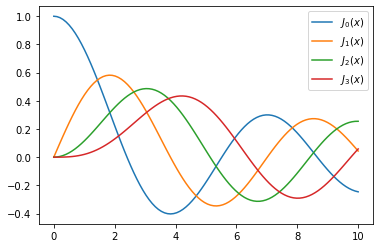
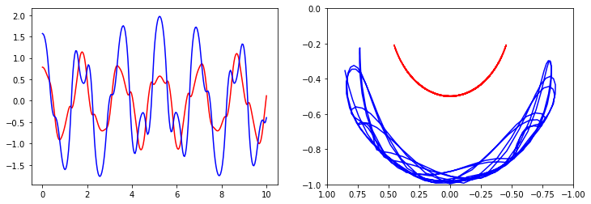
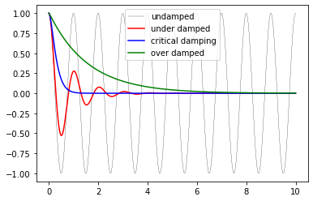
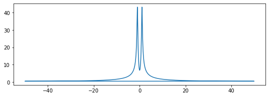
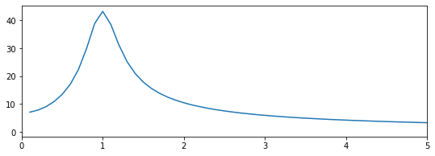
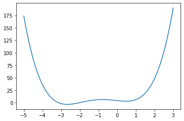
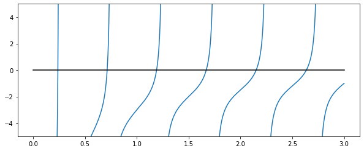
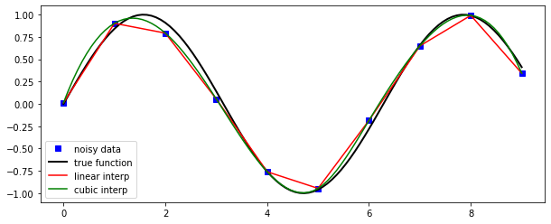
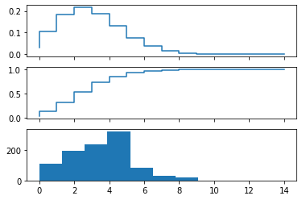
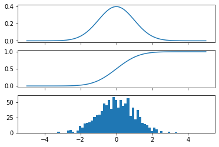

# SciPy - Library of scientific algorithms for Python

J.R. Johansson (jrjohansson at gmail.com) and **edited by Lento**

The latest version of this [IPython notebook](http://ipython.org/notebook.html) lecture is available at [http://github.com/jrjohansson/scientific-python-lectures](http://github.com/jrjohansson/scientific-python-lectures).

The other notebooks in this lecture series are indexed at [http://jrjohansson.github.io](http://jrjohansson.github.io).


```python
# what is this line all about? Answer in lecture 4
%matplotlib inline
import matplotlib.pyplot as plt
from IPython.display import Image
```

## Introduction

The SciPy framework builds on top of the low-level NumPy framework for multidimensional arrays, and provides a large number of higher-level scientific algorithms. Some of the topics that SciPy covers are:

* Special functions ([scipy.special](http://docs.scipy.org/doc/scipy/reference/special.html))
* Integration ([scipy.integrate](http://docs.scipy.org/doc/scipy/reference/integrate.html))
* Optimization ([scipy.optimize](http://docs.scipy.org/doc/scipy/reference/optimize.html))
* Interpolation ([scipy.interpolate](http://docs.scipy.org/doc/scipy/reference/interpolate.html))
* Fourier Transforms ([scipy.fftpack](http://docs.scipy.org/doc/scipy/reference/fftpack.html))
* Signal Processing ([scipy.signal](http://docs.scipy.org/doc/scipy/reference/signal.html))
* Linear Algebra ([scipy.linalg](http://docs.scipy.org/doc/scipy/reference/linalg.html))
* Sparse Eigenvalue Problems ([scipy.sparse](http://docs.scipy.org/doc/scipy/reference/sparse.html))
* Statistics ([scipy.stats](http://docs.scipy.org/doc/scipy/reference/stats.html))
* Multi-dimensional image processing ([scipy.ndimage](http://docs.scipy.org/doc/scipy/reference/ndimage.html))
* File IO ([scipy.io](http://docs.scipy.org/doc/scipy/reference/io.html))

Each of these submodules provides a number of functions and classes that can be used to solve problems in their respective topics.

In this lecture we will look at how to use some of these subpackages.

To access the SciPy package in a Python program, we start by importing everything from the `scipy` module.

**bad**
```python
from scipy import *
```

**good**

```python
import scipy as sp
```

If we only need to use part of the SciPy framework we can selectively include only those modules we are interested in. For example, to include the linear algebra package under the name `la`, we can do:


```python
import numpy as np
import scipy as sp
import scipy.linalg as la
```

## Special functions

A large number of mathematical special functions are important for many computional physics problems. SciPy provides implementations of a very extensive set of special functions. For details, see the list of functions in the reference documention at http://docs.scipy.org/doc/scipy/reference/special.html#module-scipy.special. 

To demonstrate the typical usage of special functions we will look in more detail at the Bessel functions:


```python
#
# The scipy.special module includes a large number of Bessel-functions
# Here we will use the functions jn and yn, which are the Bessel functions 
# of the first and second kind and real-valued order. We also include the 
# function jn_zeros and yn_zeros that gives the zeroes of the functions jn
# and yn.
#
from scipy.special import jn, yn, jn_zeros, yn_zeros
```


```python
n = 0    # order
x = 0.0

# Bessel function of first kind
print("J_{}({}) = {}".format(n, x, jn(n, x)))

x = 1.0
# Bessel function of second kind
print("Y_{}({}) = {}".format(n, x, yn(n, x)))
```

    J_0(0.0) = 1.0
    Y_0(1.0) = 0.08825696421567697


```python
x = np.linspace(0, 10, 100)

fig, ax = plt.subplots()
for n in range(4):
    ax.plot(x, jn(n, x), label=r"$J_%d(x)$" % n)
ax.legend();
```





```python
# zeros of Bessel functions
n = 0 # order
m = 4 # number of roots to compute
jn_zeros(n, m)
```


    array([ 2.40482556,  5.52007811,  8.65372791, 11.79153444])


## Integration

### Numerical integration: quadrature

Numerical evaluation of a function of the type

$\displaystyle \int_a^b f(x) dx$

is called *numerical quadrature*, or simply *quadature*. SciPy provides a series of functions for different kind of quadrature, for example the `quad`, `dblquad` and `tplquad` for single, double and triple integrals, respectively.


```python
from scipy.integrate import quad, dblquad, tplquad
```

The `quad` function takes a large number of optional arguments, which can be used to fine-tune the behaviour of the function (try `help(quad)` for details).

The basic usage is as follows:


```python
# define a simple function for the integrand
def f(x):
    return x
```


```python
x_lower = 0 # the lower limit of x
x_upper = 1 # the upper limit of x

val, abserr = quad(f, x_lower, x_upper)

print("integral value =", val, ", absolute error =", abserr)
```

    integral value = 0.5 , absolute error = 5.551115123125783e-15


If we need to pass extra arguments to integrand function we can use the `args` keyword argument:


```python
def integrand(x, n):
    """
    Bessel function of first kind and order n. 
    """
    return jn(n, x)


x_lower = 0  # the lower limit of x
x_upper = 10 # the upper limit of x

val, abserr = quad(integrand, x_lower, x_upper, args=(3,))

print(val, abserr)
```

    0.7366751370811073 9.389126882496403e-13


For simple functions we can use a lambda function (name-less function) instead of explicitly defining a function for the integrand:


```python
val, abserr = quad(lambda x: np.exp(-x ** 2), -np.Inf, np.Inf)

print("numerical  =", val, abserr)

analytical = np.sqrt(np.pi)
print("analytical =", analytical)
```

    numerical  = 1.7724538509055159 1.4202636780944923e-08
    analytical = 1.7724538509055159


As show in the example above, we can also use 'Inf' or '-Inf' as integral limits.

Higher-dimensional integration works in the same way:


```python
def integrand(x, y):
    return np.exp(-x**2-y**2)

x_lower = 0  
x_upper = 10
y_lower = 0
y_upper = 10

val, abserr = dblquad(integrand, x_lower, x_upper, lambda x : y_lower, lambda x: y_upper)

print(val, abserr)
```

    0.7853981633974476 1.3753098510218528e-08


Note how we had to pass lambda functions for the limits for the y integration, since these in general can be functions of x.

## Ordinary differential equations (ODEs)

SciPy provides two different ways to solve ODEs: An API based on the function `odeint`, and object-oriented API based on the class `ode`. Usually `odeint` is easier to get started with, but the `ode` class offers some finer level of control.

Here we will use the `odeint` functions. For more information about the class `ode`, try `help(ode)`. It does pretty much the same thing as `odeint`, but in an object-oriented fashion.

To use `odeint`, first import it from the `scipy.integrate` module


```python
from scipy.integrate import odeint, ode
```

A system of ODEs are usually formulated on standard form before it is attacked numerically. The standard form is:

$y' = f(y, t)$

where 

$y = [y_1(t), y_2(t), ..., y_n(t)]$ 

and $f$ is some function that gives the derivatives of the function $y_i(t)$. To solve an ODE we need to know the function $f$ and an initial condition, $y(0)$.

Note that higher-order ODEs can always be written in this form by introducing new variables for the intermediate derivatives.

Once we have defined the Python function `f` and array `y_0` (that is $f$ and $y(0)$ in the mathematical formulation), we can use the `odeint` function as:

    y_t = odeint(f, y_0, t)

where `t` is and array with time-coordinates for which to solve the ODE problem. `y_t` is an array with one row for each point in time in `t`, where each column corresponds to a solution `y_i(t)` at that point in time. 

We will see how we can implement `f` and `y_0` in Python code in the examples below.

#### Example: double pendulum

Let's consider a physical example: The double compound pendulum, described in some detail here: http://en.wikipedia.org/wiki/Double_pendulum


```python
Image(url='http://upload.wikimedia.org/wikipedia/commons/c/c9/Double-compound-pendulum-dimensioned.svg')
```


The equations of motion of the pendulum are given on the wiki page:

${\dot \theta_1} = \frac{6}{m\ell^2} \frac{ 2 p_{\theta_1} - 3 \cos(\theta_1-\theta_2) p_{\theta_2}}{16 - 9 \cos^2(\theta_1-\theta_2)}$

${\dot \theta_2} = \frac{6}{m\ell^2} \frac{ 8 p_{\theta_2} - 3 \cos(\theta_1-\theta_2) p_{\theta_1}}{16 - 9 \cos^2(\theta_1-\theta_2)}.$

${\dot p_{\theta_1}} = -\frac{1}{2} m \ell^2 \left [ {\dot \theta_1} {\dot \theta_2} \sin (\theta_1-\theta_2) + 3 \frac{g}{\ell} \sin \theta_1 \right ]$

${\dot p_{\theta_2}} = -\frac{1}{2} m \ell^2 \left [ -{\dot \theta_1} {\dot \theta_2} \sin (\theta_1-\theta_2) +  \frac{g}{\ell} \sin \theta_2 \right]$

To make the Python code simpler to follow, let's introduce new variable names and the vector notation: $x = [\theta_1, \theta_2, p_{\theta_1}, p_{\theta_2}]$

${\dot x_1} = \frac{6}{m\ell^2} \frac{ 2 x_3 - 3 \cos(x_1-x_2) x_4}{16 - 9 \cos^2(x_1-x_2)}$

${\dot x_2} = \frac{6}{m\ell^2} \frac{ 8 x_4 - 3 \cos(x_1-x_2) x_3}{16 - 9 \cos^2(x_1-x_2)}$

${\dot x_3} = -\frac{1}{2} m \ell^2 \left [ {\dot x_1} {\dot x_2} \sin (x_1-x_2) + 3 \frac{g}{\ell} \sin x_1 \right ]$

${\dot x_4} = -\frac{1}{2} m \ell^2 \left [ -{\dot x_1} {\dot x_2} \sin (x_1-x_2) +  \frac{g}{\ell} \sin x_2 \right]$


```python
g = 9.82
L = 0.5
m = 0.1

def dx(x, t):
    """
    The right-hand side of the pendulum ODE
    """
    x1, x2, x3, x4 = x[0], x[1], x[2], x[3]
    
    dx1 = 6.0/(m*L**2) * (2 * x3 - 3 * np.cos(x1-x2) * x4)/(16 - 9 * np.cos(x1-x2)**2)
    dx2 = 6.0/(m*L**2) * (8 * x4 - 3 * np.cos(x1-x2) * x3)/(16 - 9 * np.cos(x1-x2)**2)
    dx3 = -0.5 * m * L**2 * ( dx1 * dx2 * np.sin(x1-x2) + 3 * (g/L) * np.sin(x1))
    dx4 = -0.5 * m * L**2 * (-dx1 * dx2 * np.sin(x1-x2) + (g/L) * np.sin(x2))
    
    return [dx1, dx2, dx3, dx4]
```


```python
# choose an initial state
x0 = [np.pi/4, np.pi/2, 0, 0]
```


```python
# time coodinate to solve the ODE for: from 0 to 10 seconds
t = np.linspace(0, 10, 250)
```


```python
# solve the ODE problem
x = odeint(dx, x0, t)
```


```python
# plot the angles as a function of time

fig, axes = plt.subplots(1,2, figsize=(12,4))
axes[0].plot(t, x[:, 0], 'r', label="theta1")
axes[0].plot(t, x[:, 1], 'b', label="theta2")


x1 = + L * np.sin(x[:, 0])
y1 = - L * np.cos(x[:, 0])

x2 = x1 + L * np.sin(x[:, 1])
y2 = y1 - L * np.cos(x[:, 1])
    
axes[1].plot(x1, y1, 'r', label="pendulum1")
axes[1].plot(x2, y2, 'b', label="pendulum2")
axes[1].set_ylim([-1, 0])
axes[1].set_xlim([1, -1]);
```





Simple annimation of the pendulum motion. We will see how to make better animation in Lecture 4.


```python
from matplotlib import animation, rc
from IPython.display import HTML
```


```python
# First set up the figure, the axis, and the plot element we want to animate
fig, ax = plt.subplots(figsize=(4,4))

ax.set_ylim([-1.5, 0.5])
ax.set_xlim([1, -1])


line1, = ax.plot([], [], 'r.-')
line2, = ax.plot([], [], 'b.-')

# initialization function: plot the background of each frame
def init():
    line1.set_data([], [])
    line2.set_data([], [])
    return (line1,line2)

# animation function. This is called sequentially
def animate(i):
    
    x1 = + L * np.sin(x[i, 0])
    y1 = - L * np.cos(x[i, 0])

    x2 = x1 + L * np.sin(x[i, 1])
    y2 = y1 - L * np.cos(x[i, 1])
    
    line1.set_data([0, x1], [0, y1])
    line2.set_data([x1, x2], [y1, y2])
    
    return (line1,line2)


# call the animator. blit=True means only re-draw the parts that have changed.
anim = animation.FuncAnimation(fig, animate, init_func=init,
                               frames=200, interval=40, blit=True)

plt.close()
```


```python
HTML(anim.to_html5_video())
```


<video width="288" height="288" controls autoplay loop>
  <source type="video/mp4" src="data:video/mp4;base64,AAAAHGZ0eXBNNFYgAAACAGlzb21pc28yYXZjMQAAAAhmcmVlAADqDm1kYXQAAAKuBgX//6rcRem9
5tlIt5Ys2CDZI+7veDI2NCAtIGNvcmUgMTUyIHIyODU0IGU5YTU5MDMgLSBILjI2NC9NUEVHLTQg
QVZDIGNvZGVjIC0gQ29weWxlZnQgMjAwMy0yMDE3IC0gaHR0cDovL3d3dy52aWRlb2xhbi5vcmcv
eDI2NC5odG1sIC0gb3B0aW9uczogY2FiYWM9MSByZWY9MyBkZWJsb2NrPTE6MDowIGFuYWx5c2U9
MHgzOjB4MTEzIG1lPWhleCBzdWJtZT03IHBzeT0xIHBzeV9yZD0xLjAwOjAuMDAgbWl4ZWRfcmVm
PTEgbWVfcmFuZ2U9MTYgY2hyb21hX21lPTEgdHJlbGxpcz0xIDh4OGRjdD0xIGNxbT0wIGRlYWR6
b25lPTIxLDExIGZhc3RfcHNraXA9MSBjaHJvbWFfcXBfb2Zmc2V0PS0yIHRocmVhZHM9OSBsb29r
YWhlYWRfdGhyZWFkcz0xIHNsaWNlZF90aHJlYWRzPTAgbnI9MCBkZWNpbWF0ZT0xIGludGVybGFj
ZWQ9MCBibHVyYXlfY29tcGF0PTAgY29uc3RyYWluZWRfaW50cmE9MCBiZnJhbWVzPTMgYl9weXJh
bWlkPTIgYl9hZGFwdD0xIGJfYmlhcz0wIGRpcmVjdD0xIHdlaWdodGI9MSBvcGVuX2dvcD0wIHdl
aWdodHA9MiBrZXlpbnQ9MjUwIGtleWludF9taW49MjUgc2NlbmVjdXQ9NDAgaW50cmFfcmVmcmVz
aD0wIHJjX2xvb2thaGVhZD00MCByYz1jcmYgbWJ0cmVlPTEgY3JmPTIzLjAgcWNvbXA9MC42MCBx
cG1pbj0wIHFwbWF4PTY5IHFwc3RlcD00IGlwX3JhdGlvPTEuNDAgYXE9MToxLjAwAIAAAAufZYiE
ADf//vbw/gU2O5jQlxHN6J0zH78VuLo0N73OBq/wQROMwMAFdwRRf9ZHwx95Y1FiipA8tnsixUG3
B11W+yEX767fV0sW5ntbiBRhckL1MuqPAFykaS/qJ6meB97gBIkFanPtvgGRRzb2YenvMr3M7pmh
0CpDt9Kx2ia7+TPm+DhXKvCOsQcU+BMuY1KeMXd7xHdAeV5QkFSAe2kKKTAWJv3db1n5HZki5Ho1
da30XIksBvXiKi3LAUOZ4wSWFhJgY+lEgQ505YjfW/LUPVga4Idt+jw8YnbCuimQfLUT6jcLSPaA
h89LdB/ZqBO+ThcPKomQ9h8MDXa4UpK343VffI8oSHt+yBOaMh1cqWVNAYrBDo94oovKnoFc9ByJ
id0imN5Garg9JQNL1spy2lf27PmfPNEkBhhwp5fRm0LOEVtFW8UZrwk0xhLEr9lmBxBqzK2iff8X
LxbGkm3a6Np7mc7PCpfw1kYOTLAwHYgmkPtwig3nBcaclcTtS3GC6coK7vLhHjpuIyFyos5TGnx7
mrcNBMDGABOSH6l4b0ngFYhQuaOs7gCOA374PuXH8uSb5qvuYIPTszxGoWzRNOS0FFYtnFOgaJWE
yXldoJU6TBtyevZqioAE4i/D/+3NAtQOTYqTlBag1JOQfrd3j7s69RRh9d4raCHABc9ipKmNrPQR
6bCK8Jg8tEk4blWX+sUC/VvZK74Ze//TMktt6v2vYah5JormIc2JeoUR9u4wNgU940tb2lPBE2U1
Z9lnqcVtAyrxFUFMm3VE8KiiWSCDLrWUmejEIRqhZOea2hp7E/1DXqc/AbdQx9VmkMVi6bEigbh4
Dsu8/5L40/FnXpme4LJE306ldNRps0cP1HR22CoxxEuv6x+GM0kyW2H93MSX+/qgD/t5b8QHg0XK
tggE828NyOZxxr/ra6T4uKBbZWLSOVD0pkXuM73TlQ3nM41fl9uz+iEWylLC+7/x4JsU8am0B/mp
Hs75aZ/hl58FsSs/GgV4P+PlQZXdrqQ9s/SzEzxl1mZgHTDf4s1S59JhA5b2DRAaB4I0zjSpgZmT
pEq7OibGnQAkcdoohmZldtLp08fQW9sdtwpDlsCt7IpKr/6d/QqJmiC2iKLDyKb5UMlWGqlHMSQk
Twa+53VJn1q4HnxUzeSGlu+yzTan/v84jDgSbkeoX9AtKwxKiS8TiQfZm8Hl+NgO++CZ9M88W62D
s9N44eUG3nKZp6kb0s8IaUpFH2EKOAJBjTwOivw+nB/xWk/4yZ+PZLOyBTXTaDQpHOaaggw9WDK7
dHoSnWDQViog/a2yCO6GI+Sv33lq6YE3j4Nu/5bdfbTWYkOZFsFs9lEt+1iHQXD3FlL4s7yPAn+F
e7C189C1URwmW7uBAnzuIM8iklbX58vkUt7XWYl9wSbfMtg1noS/WZGAI0wlDPpWCg/vnFsRBCYs
Op865MY4NJadmHg5uDXl8PAYycX8vP+5PzqrrRba/10SSd1cft9tC6a+oqjDnOWIctyMbHpnWh1v
NKWp716k/J26lmBTA5CXR18JsITaPnHEXSCFVYlhA/e/AAIppeb7Bx2yeBqq9M31kZ6Llf9sAAA/
n/+M83SRwkz5KqKhzu92jcMgQTDg1JXJ22Erq20khgBmet0fDujTrY9er/5cgrqm3uiP8fRkHnPs
aL+RdDXdrLFNHiG4KWUh/i3XxgJIquklyKltAX3ZLHZsZV2bzdsMruW5hhmdy0VDnmJFmEEb5mlB
Ut6xkSSXEu8bjEhWOYLa0e7hC7YIG0201vZfH+jCh4AH7ww9YsYptympE5/H3pB3hxrDwnGnfgoF
5hMqkzh+n8pP1mKbJCIP7ink8qp5N2jNSenpOfLwE+B+KAMh/nUrD3GR/9UyDY2sW32edLSYFjMo
dp2prTTK5k5QSNkTCW06PC1pnHw+v//3/crsQupD1OOuAafmki/1PjSIF1e3DGO/X4cLz+JQjhjc
br7eowb0Nflr8mBN9ZxIw3+17Ml8KqUpqrhOL3iY2A0PL75b3A+ATeHAtyoIf9IPfdpmQu1F4soe
NO7DoRDwbAHLo5jwazzogGkf6DxhRr+4NQ1nuhwGYcpOhNcBngcHHj0TOvJ0fa0j9xcOlqS+VJua
JakDpSz3zhMANQI5r1jtsNlrw7v0M4oLHcaf5b2Xd0I/z8mJwryUjcEJ1sCw/oPjmPjKHK8UPNVw
wVw3gu/L5/GvfjIEIyvn3nF8uxkbovMnoehn5XRt1CzTAAwexT6qAYVV9P9gd4Q8InoYvRKmCloU
1/8ITckFEi+c7mml/uQau1HHp6w+iohjzHd9VKPx0rTclL6ZQVFiUjHnLa4si62+LNHqdhxUZtsq
9I662sThk0LefVR+hgfPVrCxWuuqwcBBR/E/Rwj2E2M3Amf1C6hEm3+qxJKPvw947ETCAdDn7wZy
QuRt/jbe5uSPWCMNYm4oxDfSpFz+3z0N0T+J2gKanJqlyKp71Lp79g3VZmOoycom2RAMwqv4Lpfu
QXyLpxGUtcmS3cNnuZGV13c+04VR8tiUWMc4oQXsZ7uXdKaA4ulPLuEQGyVYywabC7olpaEaazTg
vEGXxdjo7MQFI/xlq6ql+UExB9Lh1JVFnEbp+RsFllKOjikaOTnm442Vzd8i+Hu1siEgYGunusYh
qD2sZXxzyxHYtvSoVItsiCwK77Te93cVDedsZqz0PhC6p1Wm/7L9e46iAQhqRYrDOUtZd34mJz/F
j4H50PZMXS/ZxPzkhyA3Mi26wza+tngDl6qLM33exwnAMNzXc2sHGU8oP8sfa7Z9yCgRTTQmFvNT
U3xaMGEimu1uAMcDunp30j+5z6SfbrN6cmv0zlwCR96aeaG4xpjL02hqrmh8lIqr/eBHzShW1C4m
sqa37eiy8rdsDzC0LgIeVghWKoRZq4/uIH5w7nT8l8Pe2+RWzYUKLdD277w8McyAeK24O6bBMnF9
0j/2Ghq2lLLg2caaMtNQWOzJauZauA2BDatD3LWngV2y2vmUKVo+k1VLVjZN4upJ0aUbXLfP/5wY
VfSFUN3Hj8Rf4bDKJ899RkpjYWWoaLvVw7pEPq0231PqS1DVzs6RRwH8ec5EL44VTh6JBwOdc17P
/1HPZvGNB+ASBzwj7AQeypYlQCobu9ci92Mz2IBjOUv6ap6JKV1ymxI/FvJ9mbaTZlRQN+7mjstW
NFUlGhrAjfNjXgqX82wfxbjofI1rCGybN03dBFpDLl/yoRh4ZA+HgK62ov/zBX4UADaqyfx37V4R
9TknAWp4YE4ib6cGexxNyj2vNW9eopNyd9RN5dD0n2dr0RrNWR3SpzGGbG7xfQdS+JZcKJLRImTy
a/ZzxdZYBWcY1x0B5hGQNjrStbeB9IxlF7UPHfCSnYnSfyNGGAVZmmWxSbAB/H/doeLi17N02PKU
XkEWGT+ILR+tt4wa/qrTv8B1zBRcOC8nEioyGZpABwtmNzU+KweewTeiaMmnstqhYiqsDnxaiS8Z
qcQ00xfLPqRU/2hHiwPFWNhnsjO0F6WzMXOa3RuDRLxfeEyx6swe0pgpMcDxSxEKIOT7bo/4ScbY
U2q5EoiVtq4yDojWEYDYeXl+lzXGTpYpgSlnY49WOdnqEFhg+oHBse1HPKjxfrAMDHFqavbaYDiy
fBrOFortp0xmcRPUpm3FUIqddzX+GOvswf7uJVHNHUo4ap9j1OTkvO6CnvVnr2OcKV6cR7kzZZ3F
tyW+wXmwDbxTQMNt3OBqkgXw6E+i/FOiGmGOlNJMvaQxJrwJJfUA1d8FXpDxSicYjmqtuh/uP2cm
EyHn7Xf4wg4IZ4n6o+X0gKx5buzAJQimE+lVj5iFoSnNkhB5n0xCI33kRYyMwEcIOlSL5DOWjOWW
PyeZmJhIIguT6teM8bW3OULs/9yIf7UCY1tU/zf8Ldy0eNGYFInvsl3E3SDq3m59kVrHHIt2uNbq
i8oAACAAJGEAAAGPQZoibEN//qeGT0oquuLdbpcQv+JQg+MAmKe7MAyfWIu78lphRR0Du921UaII
NoJW+j/LlSXF/N3zafJ7QcfuWybd1ZCA2kjDFVQMEsZ2uzsmOE/F9V9haQClh/javvjPaqOW94R2
lhYMppSUEN8ORUI8DWx/1XqyOYG2qXSogwoaBch1Pn1s6hRtmazYXdY7XFocU/MvZv6Ql4DSwWzO
bzHG4pnf918vA6o7X/wrkqkNKEVTSL/BZEH5rQuO+KpQqtZ5GQJQsJZP9C/B4rP1/ukp9rvj2M1c
yC3lDLhpIrcUkI6eSdBgTNwQM1kBy76+P8J9V8JDIa6BJWfLu7DQvqS9tGlOdGA/LtBCUNRvOZkQ
XgKM53bQX6yeLXL1nbIIjyrAw3KTy5HSX6eYk9Rtyzhg6OgbfAXBV2IFttcEqlpJcFhRHsjOwoR4
up9N0oe/AdmPMp47i3XbzEOu+taoHYKK8OFcNZS6/GqMnhSbI9GpqVQpnnWgOTUMaaOS8DUpLOjX
htMcBeU0FEUX9tW4AAAAewGeQXkK/wGdIR5UsfcUNd85JgZQUXpeDd8mZTb0w+Yy2K8bBkzACcsE
y+Dk0JCMwZNzoaRECDwP2dNqMbVd4VqxJa0HYVlnDgA008+voQMg+CbtacJ8BKiNCalvubqWGTAg
Zp21QpnPmMqLNnqngFp0h3oBVGFwq8QNwQAAAa5BmkQ8IZMphDf//qeECfc1tgBk+sRd35LTCijo
HThz9JstdolpWej8oELUrTPpJnsBTR2PwHDwO2/N9urYDP9ipYAbvS5W+BRk5/ZsuaNfXjxJsEF+
rW60dqoR4QuGtXd0YIUl69g+3GYwqW0n9Pv12TCzFe6HFTp3CFJJ/w7xFW+O12kMfwKfkwNPDPSb
l5gNSvxB+3s4yjmN/VaXvyq4k7U8E/6t7LT3QJVY0GT07mIm8zxuqDckB4HsdPJVQyyUt4OFxWfL
YpgSVoR34CyW3slE+lBcchqvuOa6oqVFKFxmzF3zV5yi9hmeAJor3GPkC6tgajxQhYiqPJKN8f8R
jTqHkNAO5CN5vokaDy573NIwlkmb+nAk6hHX9EJTsMBEHPnQI1llrZc4JJCfBZnEk+x4euxwqQXW
ChUg5fEh6BO9DfwMTBVoJTrp8O43keBJdtqz5Zt8acdK1DrFwmTDH01Ywk6ghJdhCNJbmPZk8RlZ
G/A9nLVAj5T49Lo03KRiKshMvzONa5+X+tCBnP6fNEBSZ4y02Ynq5dDvH5+W13fMCbA/v83kQ1nu
Hk5kAAAAuwGeY2pCvwJ1XxX0HblsxN10abVINiebSQltrL0jPBDMMMwAJRFbTpbX1xisqjTofcAb
Q4fJo6dPsYYVvzQrp0KXUA940wygVqLR+3BP4hlWrMvy6J9j6koipGcmyoINfVmChFgs6+rZw8tg
H2Itg8AdsV9QWT90KNi1Vw0HH3PM0xyDZ8jlaNbB51VfLWbPhDogQUVjCSVJgHzj8qApEboivWGF
1e6ceia7EIhoZSUU9c89whI9mryZJWEAAAFdQZplSeEPJlMCG//+p4QBPfkbEp4NeELjrAAZsqR+
Oc9U4hqbKgIbx4Zk0eF5EG/iI/pOQL/+EYCHOFybWkPfsnJoRpd2DcDqs2m+6vo94R8QWHzZnFyo
RYmS/x22od/97Gj0imB0iD4hiw0zf+Vof5b11wKxQyrtDvezXL+vJ5HHiZg6S1oKdhuiXNdHB5Yu
7lrPOQTLQeOomPBkFouTLRO82hCOftMUo3BLhTU+oflSoRzeVLiGjf4/sZIIzHTSiviNHwjv4oPN
8XZZULlNr+ESgo9h+Cfl1/OnAzzYfZGsueYvMwC7t2pAwjNiuNRE1vRku2/4n8efC/dJH/MEwkyc
gm4WzhCsdo774G0H7q2yGPbF9C7tJsURl6l8OzMku4jXWLI/f0L7TkNmbPpRdp1sUed2gtHy//EI
KU5w/YRe41n0FE6jCHypH/ASihwnrtg7M1Y+in58kDpBjQAAAdlBmohJ4Q8mUwIb//6nhACajU+j
19EAFi+Lj5O9WPePnDd384doA75nPUK4ykboaTM3yLjNE6s1EIx/cxXdklbq/QmdybQ7Ne1Pr2In
GvpgijXQC7NKyVCoPHLQdD2Ro+rw5OQfBGgZL/xtOKNqnhkTX/w6xQ340cI7sF4Sqxp2sqMJebLo
YXJNmFfjlBaSgoZqd0leoHNnOg16nUCOFYeOH6xqmySXz0MqSqzu0uikH/ppBkJ75fByUU6bbiR9
pS32y/8j3zEERHFV7pBj0sf1E6mX/WZU+y2KaaQ+dLEXOMbp95fEACsD/Et/d2AyHcbtnNJOXmFK
DMnzmsOB6TggCSY6/VvnuA91VDGFthzhYW8ofhHeoLXgadPP7jmv4QlS8dUI75kSsl67bTXD1Zen
xLfSEe6o70Dh3wu3bAV5SnpjgFUZoWgt7HENaiVG09cOgbTBhM3Rx6yR0yXDGiUP8WFdJcG9cEhJ
O2fYQAbJbWnYTcuq077+4ZAPsQfLQA7dXdDoleywXcAL+WZ5lWk9rE3pS/qApsrOzdOkJbsG9RYZ
W16D85Q3xhWnZXRWPV//ieKGiz40d0k1yGiA9DYL4NzduzQ17Z70mbVZs0vhal2rvQav17/TMQAA
AVJBnqZFETwr/wB8TW4KMoEoQjA+F4ARW34dCYARh39WbWCIz8QzO8/aJHoylO4gSWm8mXZ/p4Gy
2Z/jwCN9ZM575DVUPdHIWKV5YqyvdZjHigMDELn5odqlirkiLhUC+tgiukqM5i1C0Z0I5BWlkqFo
NtRiK9jE52O3JeCpaD6b6NryQzbn1wDvduFOkLD8BpNwRmd28wabMvAww0DoCln5o1bAsHLtP8Ll
/oECKfEIxvADHguypkgr3IK86VPYL0h3JVPc+P8nBaAskx329bPm/omvvFD42IWDqE4kv8/ACUjJ
5hZUEzYrO6ZCUmZ7wIetlOEuo9JSNNMvCcF324chjRMNsqf88McAHk2whZzB4wE8eXnZ9zJeAuGV
5xgCyViHPrOByOuBMckOEztZodkHyTnFcDF2habuySCstI8aOjdj7oncGZJ2u/vSkP2l9PvLqQAA
AUABnsdqQr8AfE3PVoxJqTiArGv5yY3h42MVWua8FCogNF+jwAJSI03vc5BnmxeprWsLO3a8OFa7
AYQVa7zrKjzAAp5LWMu9OGjpIo+j0zulMaXKR4rGl9E2jdNp69jv2T4YNxvk7ACVvJ9mLxbZQgbr
OVnO0L3Q8swVja4qjGFvIuKb9XX/N6JeND7EoOd8lFTYuNr0WXH+CtPrsH/atimg5kvfYwb3bUte
+J1oRWfMlgpiUKA12RO2+LyVWXHfvL81FyLJo8LrAo1GISvJRyJ0pI2hvJ2TWiybPCK7z61IYQJH
u7Jt7U7WRihY0iXdcjxhzi+TbTJSEStYqXXL6yyxsAlRBsZhefNO5oKRoO+WIBDtO11OrcPhyRis
NJvIc3RVchzEpziyuxRTettxx8jr09aTwWpvOQ3LDuul64BlQAAAAcpBmstJqEFomUwIZ//+nhAC
XfFZ96WAEkdu76J+BjfycAwcr6rOE3BrKdKi1CNnJhhKfTdhER1t12UGL4nwVXACJKIlI5hUF9k0
eaJxHHHmlE1A46AKs+TAadTc5pDj+4nwUICN1wjmDkgLOjqLWWAzEsBeOzjPzgNeGrsLB1gWe+et
MUs2D9eXI0jrTj3d08j/BkNtXAkjKRl7d/r4NcncqKt2NB9/Fi2EBCR0gtRBXnky0P01iW0asIRu
JQI669/FNo/O61VCsJi666vjsx2pMhqIH3wvHxs6auqr7sk4/VrXe7fbSG6e3UXZmcLFcyaxPi+P
hIoFwyYy/jDaXRX+T1J1koxZI0dN3uDMvxuKTpN6pZDJ4ViNVsgPpihdMLMbcoRSjZ3CWWoL3Pzm
NUicx80qMQVpXIjOV6tcShL2/xa0Ue7pSkE5M6Yb8cMcr6OgkQynvh4iFbfGJMWl4ixqi/yfI/zO
wM6zyfZhozFWbUP5/y107RZMZuKmOepli4vcOAL5QEyOGebpAkNZiug8r/8SR/W96JLven9yZ6CM
6mjteubxwglITCjbei9NwuK8WtiLhfpFHbJnEB5jqT/RiuKA4USzLCmaZgAAATtBnulFESwr/wB8
QLCmIALmRsRWSqIsqwIMM+Fa2ZC6xXbe86dA3pZ3jYRrar1L70ULBa29d9SePlbPndh+sR+sO5jF
l0W2TklyfQGEt4xRq7uC1EEbt+PP7ofFp8xNx+nug4EVQqk4E+m3T4kXLDl0zNDNSgrMZHpR+1eF
5BwPZ4Z9KIfmCZTFhWL8Kpf+hRiPhagoUfU9xJlB8zBYiWF4NvDZ1+dWyZuZt8wnp8NUgvv2GW7+
GI5mEu1hD+MsCQLcDAHV5gDQ+Al/C4XrSgUC6ODKXmWwT4yaBbM1tvGx7xZWdv6PVBOjM1Fkrd4G
U2qPl1C/fUXwt8mCWGimjQhTBHQzCgugv2kIHF2AUfW03TQkYXfr5IkaCbDUd4Cly6VWm4YuwIlB
VV76lhjKmm8kRojffL1FTiSq24sAAAELAZ8KakK/AHsUcdXAAE5Pw9rPg2p80Wta9GBE4d2fKAnG
aeGQAgOHd8oKrqANLK/T4m8nZkFEtCcBazDI2xArIjNiVIJc6Gy6RzaCJvk9inNsvzqw4o71ta3h
hWZkYRMjCgOOb4qil1lgZZRyFxqcm9ef4F8GDQuRm6eIQJk8LTBqnfJbP2FLBuuX6Sb6RWlmvQeD
t0D6c8CafBQLW7eDuL2D7G8xAAhw07SEfhfIPgywlqEkBac/wY4Q1rCx68joR4e+Q9GRy/IN+QdY
lkSq+j8fv6CrtwmHna2SeZEckH4KMTTpzfXPG8/jv9EaFXq7OZwamDYHZ6nArxTIDVYO9paZQr+z
4Yf33NIiAAABW0GbDEmoQWyZTAhn//6eEAJMdjGcgBWVbo3ieZeD0763mwerb0X6tuAQDn7C3q/8
hF7g1yCGA+dKM63EANvMkLCvswTKJDcrfSTHbZGDQXLSNg0QCYLkOnPuqcuiakTxhbwa7vrWeMFP
puHIKrUFeORhMA5PzxSRlICt9+Tk4aY0ZG8e8SzJBZFmXDLpn53h3mJxp17+TiBazsWTeWuAXl0g
PJs86dn7YMX68saffz/027hUfXYJmkSGf84VWiLHDHtNe8EwFUpcSKZXVj/zZt2GgWfS/aC2sjwO
kSIs+7yLS4IRvJ1q4d2KHQBoJvIkUs3HPPL7GDce0b1u3KaY0P9b9tzlzfTlOs4xFMpA6gYoi+e4
uyo1TBZDIrRRul8XkqrYtN73qcdlfYtWEy0pyH+KYenf3u3KOwve+8O2MW4ZxRz1ZiYHExYg+ewO
3EMBfksUM/DMaQbpGFjAAAABUkGbLUnhClJlMCGf/p4QAkyuzYkANsZAo8WaebkxBitnO5b6B3OE
ytz1nvFzzikfeid3sGHWv2jUk3JFJVTSYH6Z6fZ05VIP34jXQTQaPADzjepded9m+ZV3udnjCdCv
f9kDG1HhDQaB3su6PEbVN38BTTaKKkx8qIFyQQwryJCyEijzhHtqaNJAyOshYsW3FyoFxL9MMcTm
ebYqMBqdphghy+A2sKCq5RQmvCQWqw7AKY0m9U2c8Yw3adg6OWloZUu89wJR2z393Qhi6vqUAlVi
ebWWHSIaQQ3KgNZcfYXpQrNJuggRJIvi4k9NzisUJwHWRr1e5WDh5P6AB6feiXYdKwx39Bdsrpfv
Qy83HN47lenctHrnIB79zpMrzKdYJzxbbogt6TCOx//GGs8LHrUHbvhT0Z5XUEkC3QpGhHQ4me71
Jgdx8FwHqPi5F00VZdVBAAABPkGbTknhDomUwIZ//p4QAk0VF6Q4ANsIe2TmXBil+W+a9tQizRe1
XsVOWXyMl1TC/cvFb9068JCQsG7WSHUzeSDGTarK4Wv3NX/j8agMiUVz1S46n+aYYdPdAzI7YsGG
VUfHhoMcMp0en1pYxvQpbMvFcgT6CAdZKSTBPkk3Yq7o2KHaQR86jnN75W/fpAfxtpaQ3CBjL1dJ
90H46r3HYRI5RnKEaUEJuRMDM5aJ8bSCzrNdhDhMBQB3Mqk+2ircRxFAGX4TiQkuiaDNTDymQ3o7
cZVc3Kn2+ttHC3Re1rJOr9fVXstXXQ2zvzlwGA8rJsuyvkkyO+l2i6Wa+/rTa0MPUfBlSvD27uTc
k0Vq5oLAcshW1kv/cZtoA/S3om9tIXIQqBsnrv+mO4r6fQCqzGMMo2YFy3hY0Zem+6t56QAAAUdB
m29J4Q8mUwIZ//6eEAJJv66+j+FiwA2tw8A6lP+D0xkrL8HadgmKmcjlxHIhbc8LOTPWWeurE7vW
5Pecq9Lp+sNLRpwsB3f7DkJ20mCQK9JOoIqsn+Rbs6f8uw2wCf9AR3usroigEpKF/M+GONAP/qMD
DzOEe7VdIdShxbGI4wzgbppXWsxJhpTymRL3c7ykrzRKXUueWdexvNV27S6MMQHmwf+adJRO/cIs
Nl7Ma4QSZTxwYc3KFWMAAOtQrd9dHto3PHEnd4wmmcIJj5aChftZdlvvOohKKnHejp2BwH9EpqIe
RqG9PSNaby8FvY7+OmzD1X6JMBry9AIEowbtlQYwRPJ60/cJ8U5o5HNzb8p7/2woU8z+RE2zx7Pw
FTge6wdNie6vC2vcSwxGNuFCaRwZFXxCJB/vbmXfFhNaNOKm/gP8YMEAAAGVQZuQSeEPJlMCG//+
p4QAlyz+1uAC1VT+B+jClJNVNzB3o7SfUiQdzqiUubcFZsC1r0VRff7jyYdi68V8y7kSaOwX870w
IhkKQwuA+ONaCKndOuUuk4inDZ2HHZu6vpx69udaOdbSU65YIvT43KPw6nqbTQ0XfFBgry7tiK1b
Lm5yfvqyQem7Cef+sq6lzVkJ7PQvL+jWVS1/sODl9Y/s0m+nHbwhk2gjoF2kf63RWRGVYTolCx7P
lY8O13spNbkYfee/dNDcmTcHptEHyBpYWAI+2plW0AZKPqCPds9M7RJ93WPNGJUJ5M+WodhlGnR1
gqP38TwWixmYijnLLEwto1IlY+QdsZ0FM8i0EIi1P3djDZi9P710jRKgv+tG0LlxH82bns0QZhvS
8YjbtoScoUJAmDdjQkqcg9xh8PZxxEoiSFm4yQu99IXeaUA8KE276lOFV+f5KN/JG9m3hOo89kHZ
IeIBrAzXlT/jKeXHP/8OcJsiX59+bxm5L8cXQT1smlysDoER+BbDO2TwRjSAAA3mowdUAAABrUGb
sUnhDyZTAhv//qeEAJZy46DKDwAsLK27eTMfNkbpba5P/0jbs0YVQDyZQMJ6MNd197Eb3gLzmuVf
HR7wQZXs5wPcB7FZzQ56DbUA5WERLvxnqQL+8ynOux0eiMnfuyo2Bjlszu8vv9W9oK/AwJVwuWfS
qLRFKKc3Q3XyrmEK/j2aFoBFU8VreDZslgKbrROmnjOcwb1RC8ESI2qHMhddJM3KOgOe9aRuSxyH
R/QZnLhkPIxM1Zrmx5DqanN956vpJQgp8xIw9W7ofCz9XMJ926SFk2PZAni+rNzWEgObrC7E5rP+
zHzQNRN8I7EdA+KBofpBTGMBjglxHEVnIhTNtx3vpicafabl2UO2qac3HU/rF5X/Jn/e8hJXtQPF
ypMwNFdCW7zZNVZlfj5QUubVVY4D10C8Q+QyVwvF4cQA7qhe78Md7gyrmmy44ChelM/Cm1Yzbs6r
3fgUzAF/ZstvHIfAaoATo6Olcij9mxYIANNshU/oh+U7svREngcET/qB5aPmc3fRxDV4ok/7i8x0
h/gg0CU2p7EaGexX0fM19ap+B7jrqWxMJ/cs/wAAAX1Bm9RJ4Q8mUwIb//6nhACW0EzUEAFvRif8
1geoWRS82yJxfvoxmsAaN+Z+YT05Fsjq6LWE6Tx34Q33EgzEnXtn0C+M6E6MGHXXOKQ+Mn+dslNt
Drt0DpcDz8gDc7Q/YBiYLsR+gzKBgjruzj1K2vzk6TrbC1qBMsFgdZvlXKSwTUHyVIWNKsBbFxR5
GYj/n+346NEbV2mQJJKvO/IvXftLuztXBpn547HUx4PLJjhehb2fRnJK+V0EVXvahom7LTGcHK60
zaEJla9oFOCrMJHUuxbGaI4023OEQRhN5XVsvrOH63Guoc0yzgmMDHmbHWldz1ZwraQazhtCWq0M
G0QdXArNUrniwH4z1nZPa/6EhG6rN3O3Vs0IjjDF2pdGpKNnVZ4LmkOexhDmWkQsY3Tkn8eISDVP
Gx2NiT4RBacQH1WRG0H6uwSvTSD0LQ5ZER7pxO23OGkRiaUIl/8f+y04Gi3+3+EKnl0pjuYgUeIf
QNow7OyCVWB9+rf9AtkAAAEIQZ/yRRE8K/8AeYCe0rF5i/yEaKwQm7qceIAVxfC3zl4d4futEx8D
naiM7171I1cU2a2XcV8qZ5WzPxYCUOxja5MW92MtCl2lwbtT4mpp/9KuLZfGLO5oQQvDa+9WW36R
9kAYPAxrR5Awt6Lth35IWoXPturkIOvoJl0D/vd/m4t/8Xq5B7rQQcwvX5JLDJ941B/c7uullwUU
q4vcpiQbBSeI22dq9G2FPLFileSglf/iEiD6Mcz79odN1e0ZpMNkYSPGyIADpvVw6mZgl02BVneK
qBoW+X2aYdhyTvGoEKy0rilvr34PmVYXKLvrz9gjcGTq6MiOvc8MCym1dNBmMfb9OecxApXwAAAA
9AGeE2pCvwB22XGzi9NQ/rm5aQAmpgseIRS80NnPEPrO8cdX07J29h4NcFyrlJTYI1EPOJ7XhKDM
5x4mKl5HAl1GHTk+bUPJ29SV0lmS83AdCVqdfP0JOjTVXFeiBufklbH8rVUyHI4eOBfPkZxraMPL
g+fJbLj+eC8+Gqb38GHYD4QNTdetJPZEszwrwUhXlotdIYyXjJ+hxP9O5fmIr6i8+W28ckoXXJ2F
nqwb33ePdhZsZat6RSkzyN7n5V+CA+iNmU5ScG1UbUC7Ko4mfwHoUM7RCXaaYVszGkPH9KE+5qEn
PLe7iVvvVt77Q33m1enkJ0AAAAEEQZoVSahBaJlMCG///qeEAJbS9TwAqlw+7o7NCsCnaTfYL5w7
Q6GQPtWfLaBEG1M4qcPcW5Mk5TiA+Zn5Y/fw4jSf2YIM4e8g2scUlQD4ALSnbxL7H6eDXG0k+HCq
IkizGALf0ty07DHwlHmUTi4V4MM2DuzmDzAKjRFItd15jo+K2lqN2Gh47DmFULNgdcKbPDGSo6Av
3T6suikHBeBRL8ey9lqz0jK6UvPohaYHE2BWQpTdbqD8r6DfyCOzMQsTsl8mPNwiM9Y0FHWQndjr
Vd58T0NM8iR/wrkN7IwpCL6ybn444g0Zz2rnmqJ0c8OHOHx6AH+ORQTAeS/LJw6pdrB9hYEAAAGC
QZo5SeEKUmUwIZ/+nhACSbOWnFtcAKntrh4FqfjUmTV/LvnUW/zOYmA9t5EBXyZeSGUAaDKmhawJ
0ZANR9WR20q0YEe+J/9Aboz4bAQahi8KOK50A0q4a6kcnCupOQ3mrF0h8hoUkKc/z0E2yWjfiNEa
DSO64sJeM/y/f93cStZtzlYCAX7T6s+QkCpEg1yU7F5cqQHlgenwZXuuCMsJV7fRkz3hApOyQ6Ma
lGgh2OXDz7jja51uU3NlHV0ci2hsbeSVovfjPNPaLvzosTqoar0VCv1ZESQyb7oHd3i1TGSZztA2
YXFzfceMkob15o4+58aGGTbPodclJUmUiwX0Lto8471E/iNeF0/xaoUprFoyQy+tTrBB1qpB0xn3
1JqdPSHMkxXv/n/JuFFScPyGIvZ7L3UJFLNJ6h+uA79+HRMwpLiG5kJkooyjjUHh2U4eNcqfgQG3
3UV0ib0zlysh9XSDDeAVn3+ahYgHWxTmKT/u9qUkQeNzkgzhdaUIXYwNAZIAAAEDQZ5XRTRML/8F
hr9mHuhHpDhWS2jHZeJ4Wkl/zoRHEzWmoALCmCDca1sl4vnoDvJTr5/aXMUe7zEEYE/gY+EroPCj
VoISKLTpeP2Qx3gBlI739MireD7Q0e5SbB+55JIa0i1WxeAnAsdNQz210sSoYW81ECzW8bI0pUm4
jyoqNmRhz0xv48UglOfVW5EZ6eWuDxtN/AC1i2B0BvcOpfwtgkfP6usweA4EiOtmkdFne6GEFSBv
IGbtc/VYD/A5GD5juuI0WeYrr393zH5qrxJZnebRgtAR/M85Y9/yWRgiv5RLjtMym9Z/EVh0nbOw
V3S0U8JemtH3AhZBXU9WFM6Vbz90PwAAAIgBnnZ0Qr8AeAueClYdGM9PkYlS8u317fU9EiAaAp3b
QK86wLhir31wAhRq2/SybADcabm2xodsOazJjMOLg8HoN0QghIzzq2Lc29wpKb4YAqX+7X1MYtos
cExQKoJ1lCJSg5Qtas1ZJwI+633PYLEnz8Bw7Rwxa2JgBTTawrym4YZiaeZJ+7GBAAAAkQGeeGpC
vwB4zv48evdw9mWDFpPxT9He2V12YFmAF0zkaDHwUJ4jUg0QZsrGPE1t6XxbxsbBmD8+LFBJ+cvE
MtPcFn6z5we0c+XOqh5rXA+nNOG2DmOmOEjltHpK3MxA9937f+ixgtqUXOzxFFEqTI1yTbhHDyXX
9vd1O/nLX+J8XYmqsgBZOlPSnTxIzqNXueQAAADIQZp6SahBaJlMCGf//p4QAkmzXFP3AWAG1u1E
2c3gxIZW7px/L7cCsMp1uXc1NPaRJ+xsweEIFlmEngOBxakAERoppvriJJBZXEzaYS8NsruveTJI
79tTldJvFGde4y0GoiuO60AQIjZOSvpkKOhoYNqbNTc5NYt9pBMBMwEz0g2s9OphA+jCr2Gff8xj
VrdkeHA2gleiBwO1FMbkUMbKkt/Ilgke4Yo3f9JBpDZlN4gnfUPpTcyhF8XfhWiBjjfRy5zmgQaz
FMEAAAEUQZqbSeEKUmUwIb/+p4QAlpjoEAIhYOhnGvKOiJVKJRKPBUBU3CcV5fS+lN7wHF2ac+vE
eo93xFxRqVdH9N9ZwuHY+Ys64ww1xuOf8jbiQCj0wZ1LMSpBU9htvguNIuOYBaDr1Dg9tCP05GxC
6oaehIJ2XVOcdbX9DsWf/Uw15132t/rsde9LMoaPqw9psUck/bw+zptd69ZkUyiyteLrpGxAEfH/
KGvALK492sbsBv63+5H+w565du2S8QqEwlbep6rkgXqx9/RrRpQLT9IBu7avygzHL/b1+8mVgSz8
EsRU187bD+LOx2Us40BGjk0FPQGBZhTAhUEthFA3xd04/VG4txE2O0kgw05s3y3dLORfpJ6AAAAB
qkGavUnhDomUwU0TDP/+nhACTLWvWOAKXzlXWZ8L7a/rs5jLXWPlxCMEmhDIF23JpMOUp8aw/9y8
VwDdiraO+buhkf5QkA7PcExhu9jzxwKhfnHFXYgxZIt3UwNeEs6NzFuOkvczf2YOXS9dLOagE3AM
FeJLeqfK1Uylpyph6CikCTXlZpjftNdwzRE7IH2ZE/wK8j3oWQ99cK1ZservBeVRULNvNNSPt095
8i6pqih+TZkTbUcmaMJ2N8EjhBnMd6NAZSuVztQEv9PkyBcE6sjcXe0HT7YrwyvUmafzqtfVTUjt
if9dO17ZB3I9xhP40YjTa/3zBGyCFzGBhpD5j+2gq9WaJ3PydKs2FzonREeqm99RB0jAFkqxfyiv
m1k9fKAX09ARFbv4+IsavifHf1VoPn1ASmXgaINaHILdVvGnuzAvUbbzq0iKDA77XJ4fZ1TXGhxe
FAGSTwGKaEZOnhtZs9uNWMQ/cuQs7ozZi3FSrmkX+AYgAuyw5MT3mN2H49M2vv6XnkxCt4rEYLYT
MdqMPXL8dRGKmTZ0NED1+MG+elHj9mn+M+KuwQAAAOwBntxqQr8AexRx1cAATsq9FLWkYtQ2Vu8c
s/CDXtWMPXJ6UviVDG1WmjiNV/6UfPyOSwCvGns45eRwyRPNU5yq939/XtEZdUZvI0rMW/j6Oqvx
uI5f8oIF/hrOusYdMYznrwo/TAaBW5/EkXR311tm57UiilpxPgWxEYOcJkCLwoXonTSo2djvMPi+
4oHWqRr1XDzHqeb1h4q64YtQ3fuhKofGHbamzJapKEb5B0EIG9qq43iNZQmyKshEoAOqOeWHxuyj
HCIVN/JkQxwn27EyuhGh6IalxZOERMNd+7CslUNIEJhchBVgssZfWwAAAVdBmt5J4Q8mUwIb//6n
hACXKzufAARWnk7V2WGzJpN5Tspwk7B83vAYxrAkCl+1FdGAvxky+gvmAdcUFmHVg7doJJDWBpx+
ww95M+x+N/abDzaBqtIdKeuQRZvPcjLg2uNXBZeI+eZn7YZxVCZI9EmTr9ppD+rJUThILpJUwBvL
iLdXO4zb1sqIPkUgyoyvv2ueSz1ucOZ31hkxT3mPla6Q+6hMRFXfPke/8f0HRCl/YKcPGbYRy8zb
96PP4m0IAE0ZGAqZYVB33lwmipRogmU3VZGQcUySEO2r6pZdghGMgbpmHqVzUpYU/fQqWJ7ccdRa
XYUy0O1I72dQ9I0hwPZa3sytWH+4myaP2i1XBB5xLShJv1w9YHVwEVA40LYZQ2aUW+mCIn+hu2ME
O+0Sl3qww/7IPMkH2ug+6HFEnjlewnXr/+Hb9oEPthHe8f2HHkvfpZCp49PGAAAAu0Ga4EnhDyZT
BRE8M//+nhAB5/Y8bxJ8M6kmXRWKErjewAH8Y3G2Yp13FZZjli7Zrc2sCIPYf49nowOdju/h/afp
3S6SYUKIrl7pvnC4jWdzA90/NbB9IryiYhBt1uot5Ix2ERz6FAqrrsT6jSJWn4n9uJyg3cElw1px
BJzH1p9RMryc/HilZJyjbDcIxMbnSitXTdP5G1ca0ZTKxTWxQpa3HwCv0iw5nZVqHhE6nSXMOWsU
C3VFd3magaMAAADpAZ8fakK/AGcIgD/8X8cRILM4vUQ3UscAJM4yucSmHsK66eU8eCdNqJMCkNWZ
bx50gMCjeE/l7MvV8/PSda6+KtB01F1ehlSeKJDi4w1r+8Vtuf4YHYGFbQdI5uf8xJgEzX8PisGy
sqrmWgP+yoalDJGEgkGZWpS+WeEZUianJtNDI558WaysOYbOecM4b2RfLGA8TSwEuXiW/wrMDisE
yfjKltaLkiwMSNF5CsIlmxl7vVJDxnH/TA6veB5glge3lNeSk28z1YaSuwkjb6ylI8GvxCgzU3vi
6FM8NeAwVuaxjH6rJS0bEBEAAAD8QZsBSeEPJlMCGf/+nhACSktrABF+8vdW637GStzFXrC8wQyD
pNWDZRiPieruKY4b8GQsolo7GYzz6LgG9Imw2y6SC6wKNb7w9aXKUbIHAhVyEBLzBOnxL6Kj5e+l
6a0qH1JUFOCLb4l2Kd67+phcYIp8y8uuWSSJnjNZ1dPsd0M+0HWBYX9Z/ukKm9id+RmjwowV+oQ/
CBJd01gbivVL6iG/uusw6KVdUyiSky8R7NbOZfHoL7kvoBcKlK5zMvgtxlvjmc5OsrMOgydZYTRh
fPTTMBx7Q8edBPfYbzUjSuK64RhgKawYisFCLT+M3KyOPL/zMQr35hVw76dgAAABP0GbIknhDyZT
Ahv//qeEAJt8i22kWAHFaqLVR3/MZMz111SrHIKdRNrQ+QSUHBkqLo83UBAzgTfyT6N3L/ly/3me
xmvR8Tmr0pUn8ra7aHL2b4fnXhI8m3HW4AydQxp4OIE379L1K5J4fTKHsrgKM/xU2LVnVD+25Yav
TWD2N7iYh2oQm7kCMv/0NQ9yF/80O0Q7GlISsJdeZnsbkvuGKTOSJX0sVRq38wR+m6GuGLE6hSVW
0izr95GB7fwdYqBA+s2h8/7JjjHqBGQTP5D8aLAtSpWx79vf/GQM0J0fprCecn+GZIyJkT5R9tpG
lRZgJ85/SJy0hPq9SUNRSp95D4D0/My2/jO+yz4cEyWUW4kahAdgt6rwDVIOhKrA4bYclbFEeH7S
q3dRyck7ZJiZUu7IVBlehlQCcHuJ0uQy0xMAAAGnQZtESeEPJlMFETw3//6nhACXKzsjQAjR0oN5
2bTajWIvVMhcaf16VD+DEDz15p6pv4N/1t8DTvla5CBOAarWc2Q7ZEjTgvu3EvUkst5hxCDXCfnx
xS9UGrashJ1cLdk7DOmAnRvJ2rmfAs3lY5CULjtLzDOZTclkTW7lvmBA8W3O4FunMtrIr1lExpHq
49mrugS98O/gjYttS6ZQjrHpi8Gf+dNdM+RfafOqAADr9X2ItWZhtTgHNE1HH/1oabBEnlVwbtuH
aSJW5+VZri9qf25EQEgvdPBXoAuTwV6fUh6GljQVw2Y5KIocjLCHLx0fHUmQ5doiZ9BcEum6ArjA
YsT7qw1ubsKc9d+MRIaZ2O03iLQ3uqivTxLGGSGV1M1EK5qIADXlnEtPiP909DR0VdT13wESxw+N
e9OgPvV+gvrmAv5fqopglfaEwOefmtNqxcgCotQAbaOUhW7d/p2tv7HmPNV7HqZAr//wF7TRryL+
JWK+bawf+6Ao1EK5JlUDzd6lXJWcX6U2Voqyy06o9cyxLzHTPIFmUh4wZXPYi59dgWTMP9MYAAAB
LwGfY2pCvwB7FHHVwABOebGj7W/4ep/4Du29Cf7kHzM4GxIvwe9rE5/qyytYyQChj8xGCTxLaXhg
jISYi6OGF0lqKzj0wmNuEiT97kvghSslb4TyYqtz9FTUG5foLRJB2e0Oy2uLX6cMK2AvhQ13yuva
IBev6ED4pLicIjOqxMDPBNhpdY6NfKPzhxFSggpyzB/Rgxhm+Dw7uMD1dGxgTXtQl4gRgn2EAl/5
epr6tryUx6O9V0siph+43gPfk8OiYaPNsD2tC4IVOqgEV5PBDRWkPYR246GZI2VDq3eBl4RvCcx8
0WdEkDkYUIb/dGmor+EkD6UaLPZ7zN9gbRBr7clPcTHKGZt91KLoE0I1Ahm/CY/TKru7LQjHbYut
THmSwzroHhaf5WFuCADRz0mq2wAAAgVBm2dJ4Q8mUwIZ//6eEAJaRgcALD49rVMNQ56GW8wo6pbf
S5yWw6BXasILpZ56k8q0jSkCDn2lRUVLRgZyFwo82WNGHwzFd64yLhSMK/6ljmgRYAvqRC/N1UZc
hmGEMnxpi8h1JPL4bQ0G3/kyBI0RWMuJrsG+Hz3W5pGifXKOg5DscFF0XAC/luN+P4J4SRr5131c
PS18a2HrRXKpXFKlHf+GFIF8Rng1idqxIl7JRXmQqhJeg1MeBAybfL9447CJ19zYUITc8tnc+ViF
z7lgxvM7LJDhmdA9eo1fPsMScKErNZR1vyAJzYbnAVIm/iZSFoax0aBIZw1e+aBcs3xpfqBTCc60
M3zdKqIb7KPDDtOxd0NH+1PPfLfYefqYIyhf/6VDmFEYFUVbWbBaLKk7s2TpynP9RawqzXehK/xY
BzjH2/a0xAbiqhupXu3UdJ4l9jz6ta66hS4D7sz8E0g9xrvW1PYL31bQvWSwN+3vlFT7Bz/8qCfn
BO60Fa6hBBxDutDqfxj4392KftOc2RX91bI1lP+515A/XMIX0ExcvCwVU3Yy0ffogIMafTHHWB3i
5yT4nWq74WvF/8fj3kHdZdxChj01oUUmG1KK/i994M5gKYmxlXVN4I7KsQvrcihqluqUr1RIq5n8
/VMJqjidcZ3N0MuPc64Kax9zfpujS14YLby/AAABH0GfhUURPCv/AHxiuFLwsAKouTw4U1zB8shU
g6vkqU7XI1ucTzfnMJKhSzUg17YQfbXjoe+HcYOWpviSSSDdZY/sJKmtuHOCagrik43yX0byBdAW
qgcv0VgPZTivQcvLLyNlw6Emta5vujTLAzfJSi8yPkkcli3uPKVYOrKGvKJykzAvJLJhcrBIs26x
R2vz1IC/9nli+PcR9QhtVLRibwaw3x/qSEFOqxQQK5o8rhb/1L8B2CiFZ5LaSPm2eP0jp87UAgp8
YTFkc1C4Phd/ibiPdH09tTADwvapE8rKtP20+CYoGi20qc8jUEqhEHrHeKKw42nITx8QLwew6Dn6
R9vtL1dJJIG7oQiZkF+RVztJDiGXXXvq1WdGX6o5uTqBAAAA8wGfpmpCvwB8Wl7AG350daA25964
FfdjWcpnv5cFhM3kkxETl2ihJ+Gco+cFu3X+lKhMXBgXetLXFNJKJqVwh225Onf6VHrHX4z0fApX
05Tb1kvmR7C0pRMBXMTNeIgIE16m13mpAJ4YwxwjDzFnIWNa0Str6dntYAfbUwvsDEDRikFItvDu
ob299M1aHJgFSinGOktuqFEBdrpiyGhcqlZGJxoffrclBU+IsZlxxSaR7riJD/UdKS3ZTfLyTc82
CEX+ajTpSwnwfF3mECQ5j1H8Gg+O5fFuPRTAzDNkLFb0IBqQ7Y/+DuFbDH1zdVFxfwxJsQAAAY5B
m6hJqEFomUwIZ//+nhACXMHmDOAIe6nlffG8AbQXfQelD65iA6CukYFsFIQ/bonUV+L2KsLE3P5F
EhCD9r23RbD+1mn4Sh6zMGCLvYuQtimi/EfaY9HHjqDSlXHQ/vblcYmOpU5NgQsA/69WKk17c4VZ
lbIotfPuouh6bgvfzGY9c48BeypIAT8EXncIo/sDJDx8CZjV1Tnin/6qVBblH99muFaosp9QNlN6
Ecbu3br0vN6qj+7Fdr9zWSdt6LHtI4DGcZEb1/qfSU0QFbmWNotnMf8JyrQnhdJ8/FgPZLUmRUnl
D0cdhnLe64R8c5Brw8X5cTc0JuxeuF65KiHIiaPROyzqaSotKkGFeZwr/04G6tqSpEEpV4wB2Y2j
ZLV7AakBUY/Qg9c8V0rXECUdyFNEf9jqJI7+sDTz3n9In5AG7p/IU7pClLHCZBlpcpOLIZIXwkcH
HotVjhBXBZieDKJuPwhZydxQfkjMdqj082s2ZhWNOz+/1+5cSHaj5qFY56l8qY8khcLBnflz0AAA
AXFBm8lJ4QpSZTAhn/6eEAJZt+vi2HAEPiaqRq54Kd5k8bxg+ThnpOlLRTUtbRaD6UGHve1iZZ5C
+Q1X45tVAG5pZEAWtCRLYK/NT5HzvQbJgO5GbDKyBid2ZXhAwyonW8NSPCvx8NghcJ9ws4sjyMtS
fqRyLAeJ7QwQSqm/tYCwRYSAEZYCYZ3Q2I5sXXgam2aACOH1H6utXRSJFvLIhMq+ovl/9Yx9zsBH
SsMIBQUdz8ChwD/lNRZbRqELjTVq8EtBk8p9kc12d+wHQmGWLfbPTzwz4Gkrn4ooeg23pJJekG+K
xU5krydnU71ULZi4fXmaSeAuglDPk5AUoNxJmCI/JnDQT0nevlO8vzbNLPjHvOAepowYAkM+NjrE
awjA9tBa6ZcjaziA6Uy5gK/IGgkW4mliXLF4cGnFO55aGFuTcYFItxaZbF7u94JhLaTEkjW7mQcF
m7fOqVhZmc7LJr5eQOQJDLt3fc0NoJ1v86TNl88AAAFEQZvqSeEOiZTAhn/+nhACWbNsZ7hNgBZ9
w/Aiuu/vbYS08hUHhjDjmwAOzgNf9UhovA7f/o21x/qiEWzYKzOHEHFoZcBjTbbQJwnWTM7I08jL
CGUk1BB8wFMR+23kvMK9W1fX+unDW5gtrBBdwvrlH5y5my6AXtpsPodn32j+ii28Y2s7+ZjGggt8
d8WrG3xsTcIKcE2s2ximsc7MFDhiyjNsrMXfSi5dPj0OLeVcysev8KQJTkbwmYSZ7dLkwxm6pneW
pgTEOR4ztLvIa+b/w5dqlVuFmv+4SI6w3+kit1JRnJzai0/3u7bkcWq9jvdzo36oqaE3g/us2xuN
thN/N/A3AE/2GwhOAMamwEjxI7258AFhstZF5ZMtraexV82Ya/ZnCwvRhmgNB+VWScOPyfUQ+Fkj
4pRSnD+SpZFsoeZPwkshAAABWkGaDEnhDyZTBRE8M//+nhACWx2Ooy6AFrrDse8DCOqEAilTp0jW
92flYiCSEkL8UScj0d99G+BovafsVn+OQYYrTzLJxJ5+sRgXq7eYFdGeNgiAQ3Lo+7/KQlRfjlNR
4TkP4AkhAi3yE+nsGBhd22noDvGmOjuTgUV4DPcoY2cHD3K5YAmEq4O6nWXQXVAj1Czcu3l1nQRN
5tpfXfq7sVITnCAsPa1X3kGboee8PHsH/o5UPtyky0Isfpf8+P5JouL+o4ljTeMaU7MCdDw2i876
YXQguKuaPJTGUfZhr7IupAFL6LpmU+A4UFN9tibwnwudETlKgwHtbwtxFva1T7MEH5qqC5TLTPr+
ISqbichY5Iu7yAAYYZUz9gCWshB21QETqHlHWetOsjxX9hQcU1ioM51WA75Htu0gyuR3ylZNLdUW
0xsdrXYUcL49UD0yw9gQDnU35diFn2AAAABjAZ4rakK/AH8rt2qdQijWbp9RRAB+ZCUjxKrrpmHx
oKdVd6OaG139e3OTLn89hgIcRxu9WPNmvO4P3MX0WxmphHsw4R7HhfZnFXKfp0p6bjktZNSUYHBS
Y49CR4RG5aPEj1G6AAAAlEGaLUnhDyZTAhn//p4QAls01yyvfnWa80jnZlRtwNnq4awAaybEKK1L
90SlnFye0Dlk2KibtPJcTltHpVQwPq3N52qK5uxQXluc5Mk4M9fk9cDnAh5mwpAmwPeVTJJkxDhP
yxExIUibL4m7I8BMSquAljUBrKUg+qWNXs4T9nID0Lvh7Zp88ic4mEFxyHsM5v/NMIEAAAB9QZpO
SeEPJlMCGf/+nhACW5Wr3Df8n7GhQoAHshxctdoQACcmklzOWQFe87VSE/51/iHxykwdekDOPr3v
gzIuzXIAsJRcD2PHAN1QFelthw7Ijum5cwA4L2lpl1mkStVr5+FkolTunCVFCXuXGf/znzaXVZty
RsaKWLQ0b6EAAAC4QZpvSeEPJlMCGf/+nhACW2iTdtaSAFqdcPKjE1nW4OQPwYFIGDIGEtVOoRG/
9B/yffelCU1lYPE/D37YxGkxYFuMP+wpx3BBZzebwlqSoDQuNoZWJPN/4rrzJu1oje1fhlBQ/P8J
Jsn6u0EKn7phTbvAoU7cVlo0wCTCVMa0EcUIkqyFtpL9ABusf6iZhDC5yuLRFTPI8/uUTXgJ5QR2
eVaNqx/+e3Cl9tZHVhRl05tktaGKAcbyiwAAAUFBmpBJ4Q8mUwIb//6nhACakAEUgBMx//kBICjW
HIjgJAiiBmMwOqcynoOhLbhXvJM9tBonSizk0Xc9e4Zqodwr+6LXezJOuxewCauPCOOmt/R6ohdh
UMQ2het8XRYIpAJEPq1IfwkoZ61oZ+43kvzzWrK9bPHYIL/oNXNTKuaxN54/KmS8uzhLHtDxRJW0
rVAgys08Vv/PGwY3uGBEELBpSRmlIoooOnXMn4LRadPfGYc9jRUvoKlaw+E6oyGQUxAr2Ks2EY7G
9tUlUM1ZWUU+38W10cIcXgjReg/Qp4r02B4b6MPefhUZUE10NGfU0uq3PU5TqMIiwivKF797nkv7
UKYnsSai6upeo6giXCzaGip7PsC6nmonpGN1W1KfAjC3LFnPcKNKSKZSD42EvTiLzIXKaxNDmKn5
zznCldODBIAAAAHfQZqySeEPJlMFETw3//6nhACbcg+ApjQGb7zOT4/n+ghIDBYfZiK/+DvXYEzM
J8JUc9K6BCRUfrc2g2xKvlLTV+5fEVx7edvHH4eW86U/Mbu2ifYzPn/osTNsYx4Jv5Ec9SF8WrW+
MoL3gXTK3Uh0iWBQ3qvLFtwnVUral3//8TqWV+iQC/A3O1G77Oja3Rwu/lPE0ieJEda376ApVzPw
HEcLSktG/OyHTTQBwEzs6Zd+thzHmEnVRhd+thtb0EIm+QyON1ecB9EvGfUHq7mRSkr6ryHKdHkA
FLzye9onqs0FqcYKc0fXdoXfk0Olkh1fo8UJS3brBSAjlvpeh0lacn9xFGjAxNE+82ffc1dhBphs
rQU/vxXqMblpmtxcHgTAMTI7yK4g5lEtckL7F9F3ConLdP8uGvtNh3IUfB7SfZD4/Jsv8b3kK64g
cuxRR4KUi4k9MILaF/CzAuPhzaWX7XoexdiaPwhzQhFX5MVk+kW0yQrfLVQxn0qOYD7Riq5uNWh2
ooujP/jG0YqUIEE9T+zNb2rZD5AJHlpb1bQRMh8TUEUZh2dqcqF+CQKQNfVNJ5cyw2W782mNm/Gt
NK07jnU8rTT3hgEMWcTNy6BFoTMEq2Ti9tfIYkj7/+QplIAAAAEbAZ7RakK/AH3Ub1BdogmAIxR2
La/wbOFLFZt1tzh60olrBBdfT17bm3BBf+jnBs/C5TzMI3RPFN1qaaW+7K2ar3e3YgFFNfSjuQYU
o414XvrNHMgAQTyKyAZ8wZFcn/bQ+46AP4nLghtQBdUce09BAGheWqYkkcNxnCLRrgsSVVqC8EOJ
HSIPOQN8cBcU5MRWUylbQrEiCt4tBUGDx+LXRWxoFuO4Eh06zvfgj1Kphdj6gQwbtUO5+kAPxquU
MrjcbaHrSyIphcuqdaYuok+nMLGzE7SW73AVSDK6ioxp7Mx2v1Vqyg3+Vh5WFd1R4qNW0BKBgPUb
qIabB9N+YY58XFB51sWFQ48Ed3QVNvpxIr4muSI7ZIMedvqOIQAAAXFBmtRJ4Q8mUwU8M//+nhAC
XdNtkeAFwAqSRuE4ekwT6qyceXKvfNcwiXzLK17ikV7jku10EpAx0MSvA8ozMzSq94irgJ1D78Ze
oRhBhpKHILt70fx/FFUtMPFhoqH6H6GrIMhck3iBAP03HRB203afzQTABgmPHkLr/U5YdXI/RPq5
LbnDj/1fFujXHdEBVl+kmTOl0BwBOjHSC8gjZFtUeHuPuS+eAYWSWck/9qv7XWtrREhE8MPvH7g2
bYNM47AR4GsNpDu1C9CjM1rozFxdtBxNqoYZAp4zQklrWaP/Dt9CyPf/fVtmNs86jDHD4cS1ECo4
l2Ewm5ut0LKQ8iKfkFp7APb70ZeAnS/vjPPZwXnk2EjL5bdVJdXPSIHtbzlWpaQdQd0MQwnOzuQ3
NalRo34LIYnSyLyy0dZiWHyfv/2nPREySFCXyre8aS9i3CepnU3U6OkmWxUGm/wRxD7r0XAaBwzb
aryYbvvBw/Z/xMAAAADaAZ7zakK/AHsTQuwygBOea1mgJAZMKpquF7+Ecc8mWf60EvPIHbvqo+oj
EZ3u3qT5plAsmYXZw3XRWVp/xf/SBX4mXu5U94PwypDzsC3ApouhdJLNBo+aliwX4JjJWKxTUG4a
vT3Y3MQcL+IcIhoSzvcrRc/wKI5qLW/e1/7ZzCKSG1B4onY85wJ5ablVNnTVywLEGcYStrIfBEVq
c4yGcHHW4wZUWoLmYcjPyYaUmaL1cjom85xusiFpFhfYejeAIzmphvnWNPww20Zl1YBdPG6gIyk7
9XLKMLIAAAGnQZr1SeEPJlMCG//+p4QAlyxSzwBEyif7vGLadcN9URp+0VY0Xp9H3TE8N6AZ441E
JVsmMOP+4Z7L97P/yYIU9H5fMD56VuqVhcZ0hzT6dx1zu0Dk0ghcODldR4QBx1XSz7lrjRn0Jd/q
w+qJTPPmkJjGWvfipSrXBH95Kt512huREJHB7ydXQnrATS2ZgPzHnONGQBPk6vPMsvvQFjp4Xoe7
1L+p2qMvkrsUYMl0KzHj074SogN2zsHDekujlZ3azVQ/Pe4FxAJhRoGRRjqNxEcmwkDHRTCz4AT+
hySv8m+Os+7PpJLqr2DRjqY6Kp+XKuRuX1LsPPT24L7TvcL887B4+JWpnEgG8ngFwH4qnrgISx8V
Row2AxBck5AdDY611b/B2WyL8mc9lrInWVp/1WTWhcE/ovKRtRht2FlgH2rzDXnXs5uOkD3hqFRK
zsz327eNSDSauCIFxCGx3PBq6lXrXrYBwV3lzn+FDTPABlgVz4I0zRXsA+MXoc9A+thSh2tPQRhf
I0Sm/scXVwnXSWbNbRI59sGJEDx+U4hwwat/8qTrw+hBAAABZUGbFknhDyZTAhv//qeEAJctBqNS
AKaTtNH+0H2MohkwqYgJpRpwmkVluQU5S6AWI49ltuu6J2e1LIfg3A4OYTCoWfA3g631+I1t3uck
Q06R7euDjnCDj/wWBZsUkn/fbOH48GdcVJqV5/qydbyBIZ5bFH2l+7OEVLx38WWxJT0133O8ibFQ
Pp7YYib85luU4LG8cW0gogYed/uda7UE3ZH/9TfW2D2wW1QETeOTFrsM4gK8G+wAsaSzLrW3J9XP
+DImRumXccLZFnHNSq5quNvpQEJ/orMQZy2UxfdcTeyxkMJ/U4lupwhL36cQ1tc89itDjEUTKVE1
vZ6z9A3jmDdWiE6pI1NLTXQuuOQfOej17O1Pkic7cYyBq+P0cfnH46MwpB2X8O514L9hse7KpuiY
kakQXo3rUSsZsgsuPoK347t6RpNql0qws7g5odrOHjFuQUrDv7NCmzo+r1ZJ/3uzh5gLxAAAAXNB
mzlJ4Q8mUwIZ//6eEAJMrs2JAGhus15FktBaEfm7Y2b7uWzEaTkoL6v3HDsDRdNzQEvD+aloWLLU
iQMippCyaRQaPD2w9nzrczIV3EPNRXOHpwccHJrprn8PZszHrJ+84De6Tk+kn+kqqzXkhV7jDhGj
G7iItW7w3GCtG71R0jwiU/0mdygUaWdyZT31/NPvDNsVtlM8K8hUR/0vtGbRY3ee0jCA0jdYsXIH
l1iyJ3UMtqYI5JxL+iZqJMgEZgPxyAtzs5mqIR7B8ka4VnQRthan0953y71K+C9LbwhABFrBJk/A
0uBaIpMGGESStcnfpi53EBw11sy08D0AoJGDIGtibyRUSNqbsbjbYp/qejf9k+S03vU/Y0ejayul
+qz7un920LvUKMh1iV4Xud5wIPiUB0HIKf45WpZl+ktT/u5RzgA0Vc8AVDuSMx5Yhoq4pE4Eb7XZ
hmSDMPKnGa2tPyEtref4glXBxQLMODNIxsFEgQAAAOlBn1dFETwr/wB7E0HWDX9roVcludfpJcll
rtmvHgDXsU0D7fN3pXDeF6Ei7IhsqSS6J3M4LLAKeEeMG/TKkHS3X8Vmdoi4mg4Jo48NOMFgakhg
rVjmOf5gJlGcWRFHTRRHdiRhYO4kMP90NbC1WCsrw6lor6cb2Kz4TS6HH9scPJjYb2EOZoL+F1Eb
OxHPHEJhIF3lGzuJKB9YJlqdd1pOTeIcgT4dwSD979aFxUxfiN89OL9hEHPMBH1VwQQbkgnm9ign
Rd1CsKKxGIrHg735ucGMQC2K06om78cs89Hi12LKqj3AXY66oQAAAPYBn3hqQr8AfFlZZBheP6yY
AO+jAF6SH7eVxdtWlnkDJcJN+75ejEHXJnMKKgTYr+MVBbi0+y3AMtJGwJI7twEwkhW8JBynByUP
+X2qhaOAu1HPM3djsAa1ZCM6CPqtBheZq2YaJ5f9uDoy5wAQPpG/A23YvbHo+XTo55P9W+6hC5Ks
qLLdeqgojeRhVjdnsnXPv+El5ZR6ok9wZ4hX4g7URGhnZ1B1MfSpIHk/ek36CukrxPpaKQHHCjig
ZGViPWfqlglw7OOSBYZE3skCJHxJUUcepqIrSht4/T5Eh/SCEgswv1rXViyT5xtUgt9nwNVtOjZB
4IAAAAD4QZt6SahBaJlMCG///qeEAJbS/aUJaYLEOpkUM1ngorcsAEvjgz5tfconUYRJ+Ov7sZ8s
Geix9M/m6WUNfMGkA6fyHze/TSYxzyfAVJbGPW+o31YLRw/XnmwML0weuscfQ0TeDTAHumCOAYD8
el3Fjg5JkuSs6V6YHXYenztsA/VIvvcUqXTAi8yWz9zzk40UXN11YVOPaHDX4I1o3MlSmS3TJf7u
6H0Qg+aiNEafPRGA7yCQoBCExz2mASUCfJ+2zY+poQ5G+PJC1ju7to5eZALoLLmw+tx8Eeppb+rJ
yknPm9P/AUnLvTaWrd/k7MkZp/Q32o9673EAAAGPQZucSeEKUmUwURLDf/6nhACWxUBPAETZ4pt8
TswhbWiNrOW5MG+wEO5fQjcNpqyonKjlCdHsMKez/LTfpa0HbS5H6ocb5pJVhtpacwomWkbWJv/I
Ia0IMbdC9zthtZ1bpmA6YSHOrwfpmAiWed0YtO0k7AcOkUZ7KRBI97QUO/x4IKYWOncxk0U5Q++M
0Xc/S8YGnAra8qeJF5MnYjZA7SLxPSmabgaMwu4vLSTBAAMeL2AC8V8LX+uRtOJXSzecdUYSGTn+
OZJtWdwweuDjqPM4OIQ54CvQvkTrEE82M2X1pJlLxgrj7G3+ayMi3l+UwCaGkOpR2A5DAdiLNXUL
Clm38SjkfqBCkcltpWMP/8Fkmyic3FQpHe61J5ByTgSEn6EHi6iq5VpVB68h5ONCBLgjwEEy6mkx
zwBYOWyunqo/Z9Sq7feMApi4M50N1fgTCWgoemfL/j0MpKHPY0jTf6g5Q1MUXjJCszrT4eA5WXqQ
32EtXJAv2ewLTVYvZnu83jSKJZ3szIgNldW4XD+gAAAA8QGfu2pCvwB2wPP/vWcv68ZqlbgA7h/h
qzRPQIK6VDcjluorWpqMl0xW0whaXtiKyvGhaRvE4xTitsjH9jb3A9wMkSXhd49xs9bM0vJvp8mh
wRLkcJ/qmC52k3IXHAThn+V+o/UPSEk1KciktmhICkZyGzT67KkVeu7eY00sNlly/zu+f6NuNDmV
H8kHBLgywnuLvt76o0zUAhuisxdy3lTh/VyrVfSfZLLuAybQS/o7aFK2t/Bud/wQ8LDGSnMUv+1J
remCIiLof0PjW8lRBEIQWjzrCVVwQJ/46NHv+yV9h58lV/XepVtn+jzN5Q+k7mEAAAEQQZu9SeEO
iZTAhv/+p4QAl0EOAPAELVx2qDVc0kWD8+tjfq6LrvdjqGE1/ztdd83cacIa4Q5QTks5x59BqGTz
gFKvNxZJW4I5fU1gqEuhS0jdSmO4PUV1BpbwiCZpp9C4YYOqvw0id/4Oo/F9mctXxQliQujsaLkU
ODL8wRourXmsxX4bjWsA9TPafPJPeAYze51YqLMrGYF9nak5KyxW3ZJm8MtzBRWX3zdtH8/HkKvW
oS/TOVd/NLbkBcA8vo2lEw4R3jNO3iSoTaoxQUkhMRrY9dgEsYLm6TKQVlQpQsWyznROrpNgB8Uw
vJ1peY7YvwqHaYuvg12KSh0N++l0C2lvjEC4g30YgJ+Jp/epv+kAAAGqQZvASeEPJlMCG//+p4QA
lnWiDcq38ARNwjh7o8bafnPgi8X9sPHMtg1nnXkGmqXgaN7Hi+ryGv/I4kX4PnoO2fVrk8Ppzxqm
HVynaJY4cKNm6HFdIrBZS7PpCIJTZuAanqWBmu5NNNWxeI6r7uNr+jpsv8Iv2VKRIW8ylPTWDknE
IgHYuH7gQzTdT8bI9Wgz/L+1QLisTpuHfcQ4Suo89DFZzcKV2Cl77qisa66QqqY4/DKxy6TLwMQB
yUw++2xsTlV7uu6SQqL8huIAZJCy2OKYX+TT6rezR94P0zXwDHUtkdpNntbLW582fC4dQSlcUQ/t
Q7Wl9OhrRIxakxvZUIJGuDxKXdSU5vwMoXGIsZgFfINOZjnMoj8Kf+5LktOHpJsLzOzRIAIyD8kS
jir6q5m4euZBLbQs2V+1XfIkUaoArPBshgZZXAVXWWbDVCQoKZAn5KOZn/ymY5f8TV5AGRDrRv4L
ww0JJUu2NHsHsrVFEpRdB+zOkW9TJg8XJ8GvNzDiIAaV8T6cjMjs9rpl461zOAvDh7B9aIe8fJBk
dHx9MmkKP7AFmqiIAAAAuUGf/kURPCv/AHgLn+p2IAbrjcU7UbD69EdXsdYeAvxu8LFFK7/Extbk
Zx6pfXt9fzdHkyk9lK6B5bjkKGTakb0XLeZYa+qfES/xbVCaiqKT86hPF0JktHcLRrNJvQU1+J+t
wKYnFC6y2cCZflsUplFDw9xsaOCXDSov9u2Adj1ralI4hnEs/RrhNqrCoB02HSuFK8m0leB9LBsi
bzBELUKqWxmBzDGOehJOzIVu4o9NBEb7XLTHYY/cAAAAcAGeH2pCvwBNUbArQK3uZryrqbkBRVj3
8yMOnU2JgA7hbDhg680D7urnruFmelJtvwh1EgjE1UIx/Gpz45mYK81WlP4y9Nl71TibKMigZ/3b
3fU5pzEtl9q48z/r73s0H5vLHWhStdPb4uhP+F/2n80AAADNQZoDSahBaJlMCG///qeEAJbRWAPA
DgmJpk5hw0Iet+eL9X1AWm9rqV6o883c659Q7D3EWZc7A2G5IXifThrlH9hyxqXAXreeC/mdDRva
ul02KXNltAK5MRv3EQakvXwyTXwu9bJgD4Hm+zPvdXmlLsUy8QrhhYBq2GUhBlHlMu0X8sLPlKLy
F2RqCmFo5rk8z4CtSOsPhDdecgbqmbi/Gq3jr7bDKWcWE77FFFC5cAiidcLc7c7o0eI4kCgkoLbI
jpq/7sy19Ak3vXZrcAAAAG9BniFFESwr/wB269a4hVioEcYAFbDHYwilm5ZJoWvwCxjZfY0V8RTZ
9VCRi0LLGrsjZAwdpJEQOX/ZKL4+qwEsxISATYMMJ/R/QHLc2iW1xizQFxHKDradxOikJYucPgu2
sqyG3nmgbkTATffSdTEAAABZAZ5CakK/AHmA2yNDkmd+acQBEc6u0F8wGsnyflyq7uqd9ILRVx42
DMzVvQe1Y4AbEMSbKxzVe6xt15Fn+B5MNEF70V4vtTvM3kRk6H9G6zlvx6poV1D6nM4AAADkQZpE
SahBbJlMCG///qeEAF9tMioKTBFLgBVgnNERSwKtvB5rDfToD+RkchM10kHbKBDaoVaD+KJ0YhmG
UUJB7IC8ef+qpidaJSnplv+2u62xMOaG6IAYNOx5830hBNBMYJh6R9kDx33Nf4KUzPb61F5Ku3oC
Uil/O5uHtP/V7e8hQLaDz/weczDsmmgqXLFDUNG5M2fLkb6bHf01omn91BmBs2cvz5hZpxkmHNDZ
1NJCkH0+rVEFnlusVePgKPqXzpvgmVVkJ53Utc/Yi9PRnHYzYdK3VDGx1fFBJb7yrVctcPMJAAAB
KEGaZ0nhClJlMCGf/p4QAkwNLpOQA3VzINlZid3LP0d6n9pZi/gkruUQ+c5lq9J5yqDYhaRQZcDM
cjKZXgcKLKskmNFItxWfVNqblSvAoJgfxMe+r29lkri2JrBByBri5AhfbrZjKk6awEtjPe68zgOT
n/HbkH6mNmke9N0e7Ilagn8atbG4MOX6DsRbh8xNIRNGZrkCKU9lfC0GatqgN17ohbzgm6klzjGU
HypOnw6ihr6m3moNEzX7uZVAZc1Zp65KmacwCQYIi6a+AOLrRf+0pPP3Maa0+AxMgWYfjWPoCm8e
MRVjaHpcSe76b2wUbFb/IHl5uAnykdlOQ5qQCK3mow4piQegpBzSkJ4SaGqKj/Bd0PsLtoPxNiuf
vRGN1TOwbJytx9mhAAAA30GehUU0TCv/AHsTQmU4EVRPWaM7lH7I1IKJoAdQXxQBhWrSBw+FcrsM
3RAwQVMXdRzBLEhlO8E/fo0zh/Z69R20g61QTnIleiBH+XuMKb6rUoo1KnFT+0GbtYUX5Pee25ps
tG7ZbOf2ol/T1ZbprB5RPm3SQO6SYKMs6/42Vvyb+X6rZnNE/nftdyUFEhMwhDxtprLV9eB5jPip
X1w4dBK674HazhwRpVqwK+mITK1LzeSpxzMBP8c5lBV+3izC+ok8LnVWTyMEas8O1U4oB8OTMCtT
TKU6MywnuU8bO0MAAADYAZ6makK/AHxZWWq9ShDVuW5jJWZACRQyKbvN0Rn/M/23Kv8WgXxXbOpV
ZhVdesosegdHWh8eLCqU6ItN6lnuotGKnFZSwcsOad7v8uhdodjJUqKMlqbSmto2hZMyPttiMoAU
3RmWhUqRBuNCgxDsh1IyzJnGaDkjX2QnhPHH5hbHL4FTyLNDyZBAK8U8JIjbAaS3dBUdQvYeYRTk
IXWowdtaFLYNXg6/vVrnqS/Lw3EJ6/24/qA/w+lwAZPMfTIiptLDfRnHcn5KMyguMl71Eyv1y31R
qsiRAAABIUGaqEmoQWiZTAhv//6nhACXMFvLgBJR4H1YI4YhcG81yZ9EdXQhMDO7P8ier6N/dMEN
eNu2hcmSRI9miwoAWCh65tlGwD6JMpkASaI9c8AP2I/H6neKCqDsN86evFS4LCkN4QhQfD1KMo/F
Atu/6HHPQzaYSXM04iKY2A9jQX0p4T3bzQUVZw2hRZUFnzNp3mf8mNriDO/M9uaM0M4ehI3JdyS6
WRCPVGc5qyCoR0ylW8gvGCK5eghMMI/BwdAbeVxv1wSTtQpmKkTgDFZpTI0TzmBfgd8/qOyp2HuJ
NqS3nrm7Ft+P2JyIPi0JKI1B7guujBSmaogi7j5aPs//RimxDPGR1Jpd4JjkVKZ1N+2HW9XMzp1d
ap4BVtmIeunt/CAAAAFGQZrKSeEKUmUwURLDf/6nhACWdeyn4PjwAkiff7MOlEFN96U5UVP3NZA8
4asXYeG7z70A2rdJGje4pdFxICuNmGYNP7Wza29RbcEmPRXwV0y0QQnYkyBiPcuMceyvAqTP2x7P
H7kXRFQorv8XrP+1A3NRLTJAT2Il+Sk1N5ujWRGGfyh6zr4CRyDhpTKVVmXHzX5CNFGyxElZdt9+
P8t1zGjD1Q1z58BcZxYvxJ+2Mg2BJ39WuhbWV5v0US86KevkmdWoJetxKQRhOpsnaZIIOFF88tSn
FB7vKOi3wnBO9xmfE07HVFzw1/3lbmWKRp7nlDTksCqsCsIGgx325cXNgtSg42OdV1pJ3Qycaqtb
tp7QvqBChyrQ3XLfi5+7PVkPCjrYvaq6m5xYP8N0oMpMP8Y3Q9n6P1qWfYJxIuV3r8Ii4/NLFTwA
AAEKAZ7pakK/AHgLn/32IATUsNpxYadV0AFjGS2VYr4DDxbVf8kYI5Sd+GoxN4lqs6syY+/jrep9
IlyRa3HqVrH23X8PJgnP56qXRoyV7YliQzVL8G2+oXGM9QbzyoRGzfPOja06WPwbd0nvNJu8XB8A
laLlP8je5DerBYoS9ajk0bF2dIh4ZKYzrtU0eecPyPWA8IYwA6k0kIUSHzPpjYhRHER80tRVYJOb
qWk4L9UvBExUHyVmtQf3D9TPkhsmBT0cPJMHVBOpdTaQm1Tlr5ThPc5sGdHLxD/DvR+abN32AMNu
/jHp8whz1/TlO01gDtnV8b7fq4JCTsY/EcvqQk23DPAGiNJTHkZi9lkAAAFaQZrrSeEOiZTAhv/+
p4QAlys6zwArv2QwfVSLoTLqa7yoqqHXIsdmrK9roIoHE6pDvhrM+HMxRR0cgo6pbAZ2P5RKsFfQ
uxUxs1DGYKO/Vi/xumsSoGaChqkvMZaX9aZNEI8m+Ec99sHLV8CKr67ROst/55LlSdu6kQ6kw7ZP
2ZLTLPdsPTQYaObTFjs6u5qbi7/wcL9fE7uUzFMk9eFFw1rxB58SJBmd1s94LqAjXHVJwZU503sl
T51MQTWBTb3vjPweBUOVLL/u35igLlV36iJqzRSlU/Myk+JD4KspMVuLsXsjOVwqwGwhvBlhP6L2
PgVDhWaQ4wiM5WVqea8TIJFJpgwzDyY2QY+9T82s2pvbWOoz7sP/p3eN1ENoEJ48TwemFnHlwVrQ
dkjJUWqRA9lmY8wKw+nuEV3pGyFPMKJzRl0N0R3uGTLvf/Z08oxVwLSaQ0S1SOOXUAAAAU1BmwxJ
4Q8mUwId//6plgBMBa3wgBae7rN8Zto6HfeFmpfAYFbRxufuwon6cDTt28OU2X8GJTRRce6JDgcd
F9w1BPD8wB/G/rDr6WfQiZatLEAAotF7eUPemJtr8accwNdQRFVogCPgrL1/8cOBGr/44XNQHy2h
4QM4vB3oyWVJxpFZbis4nNIW4ZhSoM8KDrSK4s6aAuYLsF8wa6+U3+3QoJjzSmaPRXdefGK20qoF
1sTiYqWmTb76go2GdD2SMiJupiUQm+zglG3P2bJYTz7J93yd2k/yXEfkNhfkp/yQf1n5NsbNUstN
cTKp07YwDnUidMhaaK7U1cebYuH25Ql0in7eTtoeb5QX6GBmR/aPKcJmum5EdyI8DoXwfayT6LfV
3/J6CqJpJRCGEtskBbJ/fV5Ocj/XM9zODFpXSzsffnFlW3kvjV6H2rRnAPoAAAHPQZsvSeEPJlMC
Hf/+qZYATg18oAdK5/sOgQPjaPrNm59+COYpDdqDyjlCyfSE0gc6BuhnB2KZ05c9VhG9W2zpX1Sp
YaIAZQ6cp3XVSMddSdN1rlsF9D+6BFAm7dCc5Pi/I+WRU7/NNm/y3NDNIo+JBEyBm4Fd2Zp/ybuR
YW+mk0MS0aYwb88usx5LNEL8DSnhm5azB0P/uuWRGKl0ViwODA+0Mh/Chic7DO8O/E8tdw1xHQ7h
8wYQO4GnHzyCrN4daOwGI+pKpbF5IEUw/CcEbHykSiW94bZEmKnxShQ9Sh/woT/E0cSCh/NZT1jG
wsdpD5jNLRxqt/dxh7ZXZ6lYJXd5UHN7d1pKSXS+KH/BVgH05easkLjT++YWjt9GyadJ6RnOonFs
5gLuWTF0JH2LV8fG4KUBEaugI+XC2caW0EmrfPQd5AHjUDa8fcmZP6hWdbPyKRHXZlLJQInLZX0V
/kvjlqIp1sibmcZEQIn4CTpv/vrO3OqSx+PhVA68qMJjywrXRRkdY0nOX+Y87ozcaLAgpQcTQG8u
+VoXWQRHt8ysMj0kvBFGmLYj+g0sedkqqmOMi+SdsAEhBXYwj7LnLMo+RaOsL7ZwHt2cHPW0KwAA
ANRBn01FETwr/wB7E0LsMoAWGZgYyLut5/IQMzOE9M8CyJxHK7/mGprVMtHwIbWUKWtxdRnV9Iyq
sv58IF5eoySPDwQf3UrjKYT0UrR0YesQ3N4WF6GEETvKwKJn9XHRRnVtdaCuE7uvWTMSodBAOD7Z
Kq/fN4IfjHKwuOLdMVBsFT1ZX4dlAqGJaux8fp0xHiVg0ly/5Mt8jIeUsXq5GIzTRzk9YocC/2K9
lSSWQ/ljUitDclRXcugl7mXDd2ZB2ydZTlqL03XP0YS6cP022v4lZ7VhgQAAAN8Bn25qQr8AexNC
6uAAJPYZQfLKb/bM5gwxPdWkpjjz2ncPGbTnKnF0piou2q3WB8km4N+uN1sZLJef6d5X0u/+0ekT
2da1hzgmoLEHMciYJ5g7e36crpFTH9q+6vXQRgrsRcrhU9xT9fRudx6ZvdpxuXNwk/d3Njrgj4Gu
y8Jlybyl/LGXShT3jcl69inZskR3TtFmkMnC/XOcmrxf7ISKNNtKZa5uM8lojxQ2B/zD9TPYz/eQ
ZxZ1H8IbTUxHsUeRpCp+hFwxwlgupOiUucrdBvZax71btVdrBPCxA7QhAAACJUGbc0moQWiZTAhv
//6nhACajuB1RVwBEGTEq81kv7SXDY+YhIO1rHoELYeVrzOkETI10vE728Einiwc23TExidnWczM
oDYJk9RKbSW7SZinzoxkMzDa8b2ha9nXVrSJ0ataQX/2GoAHd8AvBe7Casd2Nvz2F0x+2uDTWWrH
QUOgjnCInpjPLOC943vQY2r0urEC22k7Onr8var/7bGIcFOjv14aZI1E+VN8R+pWGXxKCoYEEyMI
aYWCfSoaaaUSLj1LE0svQ9+ipfjqVUCrdaPMrY+esEdCSYIwk7+BQBFHpsy+xo7PTMVNZq5iS4Ez
4yqYlRfio8b6tp8cY8mabNZrFLVLkH0pFGF8xaM3bzkVji2YhAD7ERopfg1sfu98ex38CPS4RyYR
1lbIGJedDeNWuZrPcA8LYtMqWYfQfOFcahVNSApLC88QgBIX8dH+VGu3TqvBr2M/HaJ2ucOktB95
nUfZhHSMP/qbi3E1ALREqsXrrTKoIF9Xx5z6ss6w6tzdQNu0biXWc+GZIgprtgxP6/e+Kd39N6cB
xeBU9hBqLl+EJaDc5tpBh5Zv0rRA6zTrEZ7eAML+OJ29ujYMDLWy7PsF2T5vvr3DiNPeG89252Ki
pzTmgdOzfeFgHeCc9u5Qxaeq8eyDPFvb6J5tbnsIotaORUSMM51qIQEjXkkOihAEzeRYHK2yOcDX
E5LNxJqwAzu01XFMYAlf4ak3tmHaJKsmhAAAAVpBn5FFESwv/wWGv2Ye6EekOFZLaMdl4nhaufEb
D3yiAEwXYKzrBf3m/b6YukRQEo10SRRTmp1UHHwfMZRxjDpB2kVXGPYzkhhR3gfVEXi9acJbkoQs
HU2UJTu8hefJs6Av6dRltQ458FQPbiNEtTavuWUG5DRLnnj4uv8BZhoutREE3kJ5qIlS4a/QjOki
75HeQbp73L0KXP65x7NakeMNh1ttDa+zL1S5vFzw0Sf07vxwDV1ryoOmARky3I+t+GO1NEmRQked
Rgyhfj30GuYiEMWwXFDN5DHc2posLgcLI99TEC8J91g5vkYSrT/55n4e8qBNEsXEuqSi4XQUyu3y
2P9QJcW/jX6er33PpqRcW25271wyc6iRv3+CK9EBKXkeTcylwEhtMg8hpv8CCtd83e3wlwCvQR3m
1BALtYqxjTJHigm3Ba1QAVvUlxhPYB+59UCQnbun5mpyAAAA+QGfsHRCvwB8LGIchQOAB/WF3xL5
nXRJkzQW2Te9OrgmIdttjlcdgA0ZY0AmnoheaWI5/ftpauoi9UqY9MrsrFroo1Oc8JeD3RL9RAmq
96vMWMaiTlFiJm3s6rDIlg+enwDy3CzOo8BDrNvBSAjDtOEFzv2X0ziJfyllWEjwf6DYxn22kB63
EWvSne04+L7JJTJ1Yp/Q5O5aG5mgnoIFGXg5WDEyvFlw3kV1ANk4r5TPMNno3hXQV21cqIps2T4c
DWeVyYos8KTVj6CprJUPtjEKKJATeQWLn80IDPDkQjP0nKuW5ALwyjKfIYkIkJotoZdW1hTG1otf
DQAAARcBn7JqQr8AfDMebHQJjeQ39h4rUh0arKAE1T0w47xYmXD0JPByXk+itAORaTc+gQKvJ1oz
v9WT8+lTrirA08ltyxDias3vx9L4av1lTJWbB7FiAU3yLp1wLiVhLqik/JY/j9PWxBwq/BwdJt4g
wvcI7AdirAg0xlLZxzZGwPy1gC2rOeM6arGNKwOdzgCkad2nf/VTbQLL9zaAkS1z6MAed/QyQO1+
4FolaJLKyFzXDyOSq1xoa2LTe2q2tqRVAuekFNlYQfEGV2npQJczY9KzOgmnCgHW5G9MXVBYCg/c
DqfwPgbd/9BToylehiYiD/ucb6k0z5iwgMQEfYn2GvZfX1+OWLVUG8+kHftHohpE8BhWSovglpAA
AAEOQZu3SahBbJlMCG///qeEAJqOTOsZIASztlvIPP+3RkaXXHTzdbKDpBU0KprXYxW4JmaEvEni
G0aqRJ4klhMEyb6YHDB/mIM4wF4VwxghanwkvLyuFGeM3CQ2i2SHgTrY1ZjyOjemc0oK8Dr0TuCw
CzvJCGvqjhPPhb2KJYwi6lxzlzUwlj5FAV/GAP7P3VwZbU++AMeau7b95FxaSaxad0sEpCRtzO2Z
Lr33n83apHU4aGB69kHXhs1e8DdnslWh0z8tpBZAUPw1GEzC5WNCP+0fBsN4X9gPUEJfL3rwgYta
yo3Eb2fEII2E4X7NGjjEapo5ab+9pJDvglG3hiclU7J7TohAWXXuvKb4FY2gAAABS0Gf1UUVLC//
BYyJ9ygrZ4EJojKMesspVO10qAA42+877c1nQ80ebnez3efckNEN/uCTxd/iKFYd7cdQwKM/f5wF
PwxnuZq8b70oyo4ZcjmZpHQqrCPh+fFh2fFci2yhPFc9Uvin8HrI8N/wNcy3GRLd2uTap+VTvrTe
aSQLj/WcT+gJKORzvSQEiaZDfpmGwzV6m9a7zDUr91t2qqoA3+GxkS71zoeaYj84w6UlquBcMb8x
eul3LffaD+Twu6BkTecwokYKV5jXC2G+h3d3+T+gTlY9SiEEQAJ8occV2veaSJd3COgXXz11XTsg
RZF+d0ydjhmM5dkHje4n5bhuzTS1oJZc8xETkQ5lNvMsMjQrrZqU7rrNJAltED6SsZOWFU5T0GfE
034MmBrQnIq1Wf3OH8gCpf+uABkDY6sHv/p+KpBoGE5d3IEc7IkAAADNAZ/0dEK/AFGq6Nfvc8oI
ogj0eOAExfT0IZGgQAZVXjnzW+cBnWvl2sPYLvRSstfGT55X21LSliNTlI8ydrGPunewcJ/7Yamw
IJVLMQ0dzs8Hy3rTdoRcoZqbfifskj2tDmrafUh60zpmRgSn8nk0ZQPIYZoBOIlEz4QYuE6CzqGt
kgshTsJDsfQaSr4Ff0WmBvEjuEKc3hbbNsvtdCJRs0riHmbJK9euNK9eTUGGlDG49VCdZAbierwO
qBf5XzXOzedumIqBxysOF2jcCwAAAJgBn/ZqQr8AUcjn/uLW1WraneX9Q4i5QbQA2XGGGusoACUk
uSqxY0C0kQrgE8YaO9EBP2vbnVwZGQXI0+r82ec/qnKHCf7MZQ7+OQZqDF3PsfY8Hk0wNcM8aXA6
8F8WMKB6QY2y/7laKrK+hNABScT9h5XmPymcZp8QPWIgcr/yAWwQaSvZfIh14VtxzfHzwhexv9+G
IM3I8QAAAVdBm/lJqEFsmUwUTDP//p4QAlqGZLGELRMX+kAUx5vSFIynwo5lBz0h18aDT71tIUx3
JeRTBtbT0Y/PLn4SJwHBbrit0+BlEYaOt7recHYquYTx9BsLlKV1ari8h62UiYNY1QgXBaYh+82X
/ELRybghANNnKW2Ab1Z8rFCv7vVCGEW1+BzxLT4Bxg1+rnvlOH451TviUqLr5N2TbZVoSy4HVg9E
D02DBsCMzZWnIrm0PPNlCla9I0FNOBSvRHsGkNVmTo6gMO1DZiJ5hCnmZ2HT8SplNi792FthvLd6
9vzSxClnefOmqeQJQ4kBkqa7FWzJ3lGzriofyg0I40BsKEf6jyHmdJw5fgypbEQyG7ZjASru2T5L
L/rynXcnK0KWrAjHMzlJxW7GozZJktQy+UdzHHbFdqEycbooE41iTZiblNWU3IrVLvYTLeM4kr9b
nytzPRefdYiXAAAAggGeGGpCvwB8YFF7S2YRRsyDv/nuABMmYPDgsvv81OXuixSRlFk+e0oxKA1U
OPp/WcphXNyjrwYpYij1zWSGe7xCYkUbDS8FVi0Du3L6Rpvn1y4+SMp8zAt8Ojw0k0pJsc6WL1Nb
TIVKbPKSIkFzf8F8OTVca6Wcr6j0FT5R120+8/gAAAC+QZoaSeEKUmUwIZ/+nhACWiM28Fvfo2IW
AG0/qE/2bsfm9QiuvZPI6GBtrYedSU64yhwct3ncaGT8ovxUEO8BxmIuPPAQdzwuVeDIfWiOAmCS
/0q69m70831gtf/ZovBejO7r+ITdxLXdjZE77Ru/XZc0Uot3ayEghFVL/5mYl94YcnwDLYm4shIa
SZ3dDA3EemXwJTQUn64W5kZ/TiNPHwZB6Tsdk7MLysQdDmLkEkhiRTjfQS9e3hn7DKSEwQAAAPxB
mjtJ4Q6JlMCG//6nhACaoGjUEcsqiAEPHu98C+/Gpv7ovGahBFdP05iYmEcUPabCESI1y/S36FMI
CA5mae59d2ND3sthrOe41IlA/ywsQV/u0xHvOV3+FAxPeXOyU69x8/voIfcZXs3MX80Md2EX957M
PcynhEy94+l6KkHUa8XGlaLuLntRlLCAn2v6xYoKtieQQKIh/RdhiMM5zmrgMi28jI47kJSnpdfS
cT4oK5mVoF9ERbiYC9Wu+peBd6Ikm38VYlUrU7lI9tsbIB/zbvYk8rz/nVIjGsL3Pj5kQamLxJnz
q70B1gC3hGwkjD7z3HC3r8ARaVfFjXYAAAEWQZpcSeEPJlMCG//+p4QAm3TboVpiYAG3/B7Q6KqW
i7qlO+0phJfuYUr1XLdZp+Wga6XMX9w34sd3nAp2+0ZnYpdSuD8PqBFyEAZqhwlI023YbphQusiQ
xIkG7XMImS/uZweaw+NJrf3skdqLvxsK38O5VPNFSYBCGL20P9ycm2XAeyroHOvMUlUDcoul2+k1
638pNak3va02ABi4iRE/oejgKGY5nga8kzKv9ggYmjn144JcU/9DNfOs5m1fDT7at5yuYYFqx+V6
/+wwPreEQzxkfpsvtphQx/xGPRpYlwXfrVzr0LfJ89QYr5HaPWSkzuyvy5LrWZsCrwqpuqIzFB1g
s/5xkJ0ob2IwnCVRDL3uiIvyHZEAAAHHQZp/SeEPJlMCG//+p4QAl0XDgzggBD2/PCQ+TIzZe+YO
O5BcCZBeeeF5AP+08bW+wT9Wh+qH928j6dS80GvFNKSe4Hb62B0wjR2Pnwk4EdwZYtZ1xd64QcZ4
0FQTrpp2YqT7q0TnIU3gPqRh8TOoM2jKehc6ALehPQY8e4aJ2URBcGKTHjySg2AJ2aWPWoiiBWpX
c1QKRiKzFf8TsDWfQwFunHq0Z5fNHTs5VHqDfp2rDDvezJTDF6i7Ws84jGN0nrfK9Ck+GgcoZ3mG
dY3az9yN+wq22sAI1TIdigcKyci8jNJTkvRmiexuffGvCY9DjeWBJLX7GzCNSmMSVO+fZqYgM378
ePxCxKFmI+zhzVKExm10KvQKBYumwCtT+h4HRrzQywRto3ByXqXGgv21EmC/+1bKtUEjVZ0YBqde
0AcdRKathSloxRop1/zFZwJr6UQigfno6I11pb+Zkx5gXW2QhOEQjH9rC2pm5DEdt/FQS5qg3xUY
cm5Jt17bv/TEvcO+S3Y072JQ62GLe3+j8DMD2ScXFAJVOLAyfIkgOsU3jWVcRTowCisRho/qx5Jv
ZYaYE2ncAVhYHSuDwmS3ah6SYx6Ndq8AAAEUQZ6dRRE8K/8AexNC6uAALlyI+pazoY9kncF0oyn3
OKwmg3uPuQGAGHW2xUtJPHf86W2fNHzVOBW36HZWQ7c3T6QhopZAQm7BOugQ64iKocAb7zjgBe2z
nqRAtCE9yIlT5nzXxMxkGDhUs1ZjSflgtNc/FycpeHkfrmisErbJ6DT+8KdtIq9Uxvil06GMKrQm
26wUPIZA0RW3vO/ZHiuwSrN2sxjV/Re60mZG7T4DGAWxpNJHoS+kf4h8R21DQmLWS2X8bhumOfIY
2qN7VcllE07oVOfDSTAP9e5DbU1v1s+FN6k363gKI7emR+l3L02ztozFbcm2//FsbKCVRMmrwkHD
qe7BI2Bi9zIyb73WpxJ+NkWwAAAA/QGevmpCvwB7E0PS2ktAGAFROTuma4/VJJ557n+sqKRDXHPY
HqMVfVKf8dNScmIXv51AnPe0KPTnD4oJEi3ekAVjiSSH8udIM8gYpnCos5eHviLiJmlqiVOAnk2x
lwNIPHh7ox0jDMO39FlocHeqhSMqKc3xhOZGQWzPeGiiu+0Nev51YDav5wng+tjn6RtfIhYgsOJr
xbRD3o7a6rvSiQEM6KYx/0yylQgyZlDfLtKQ0x577YTaY/2bgDwAeQJh7MOVGO2dJlapG8L30zuP
3+Fr4FtFRdtlMcn2orT1hqWKiqwO1Y6fS/ab4WQoVcsmVPCqkUvTq1YsB8o2d6AAAAD9QZqhSahB
aJlMFPDf/qeEAJaZBXADchRKcSpbZyO7UW63WB6bnUxScXavxhVZbiI+u/scbeDwUORQ5Q3eoPRU
j8WSFydZAXyca1/3wakBowu9KjElXFhYQmgpQdnNlH42v785sPyqDoD0HQRPtGOGI0a3pInbFNej
R6SQYdkGsSKRtPMJGsVI+avQj3pLXoaaz50s0Wj079pjS5BRKO1YL1iDVGCaujjNGP54MwoHJL9U
XZL9tK1PHnNPeYoOX3mQqc4cGIvhUHCvzDv0U8bt2XwSIfVoN43FZOnI8ZqPBMqLFPJ6uSWz3p+K
UblTkQweAEQUvQcy0GunCvDYwQAAARYBnsBqQr8AeZlafWrbZe8zEUNf6o75PSGKXEAE2gQ9pt67
4UilOAJhAaMWpQaN0r95bP+NMiVnePqUpsCwBG5GP+G7CPTUzYgzI4U2KbckuMcvyKT6FeixdWF/
NfoTTMVESB23GkzTivg+TuDuiW/g9HNcJbiglFMMtbXQUWKQdLaxV8Izl0WL4bvsu585QgKvmhF4
bbvpFpHtWKBappSOS27p4mtz277ut+UuI60FDFDRip5qyq48zVT+d+XbGMl70/P2aiIXCCCLWdsb
tBt8AsqtXIMPi/Sd0ri1ystC29QWa8EvhdMQh7TFcZksFNr8BIAKQxfNeaXQ2k0iZr/4jpViRMV7
Rtp+tuumVFV02WDReo9ywAAAAOpBmsNJ4QpSZTBSwz/+nhABfZIC5v+TofS92DgA3RoMNV/UpjbH
ca48BDhDkWwqRDsn3htT1e9QXwbWljS60dwtoWwv5cZComRC/BUl1p7hQsaWWEhW9NYiIiLc4Ufm
HVDg1rg4UpFeWwxtxpJOtk/p0xSredhybiIdVHnWoiHjmYitFdh3obdhgGx1VzFPijPqycZBm8iX
9HjhmcG8J4DG0kqGQXmu1qaC84dKHe8Kh1HWGPWA9hDmbsehJwmPOvUqNFEKPicqNnpRgdH8WMoy
ZIHBa1eb2GfOPbdnSKlEyZ20wjcp2rDN9+cAAADiAZ7iakK/AE+V6ONQALQvOg2RvRb8hySgBJcF
LJUhAyJDr/0/kKyYB4vqKeehDDYt+7DHG0hUPbefE9IBO/jCGoptBgJUt9H/Ll+B0xkJybCLHCou
nbqhTOBy1lUv1OhK2W2JeUtRX+KPRqV8f+VCS5HxkkaVQGSMQv4hy//ekAgIX5pKp6LVss4Y8bQn
P3CUDHf/Gc5CMw2DxeBKj8x+Lg3SmUNOCGeE9VinXlhw5gm3Ff3jomBGDiCuKINeiBAp39AUWeJ7
r/bD5wN0NbcdhGjCp1RSNzgApUxrbEREKcOcNgAAAV5BmuVJ4Q6JlMFEwz/+nhACTPQZsSAGfwzX
MF9+Vr3n8zWEQI536NK6QkPlH50oJKJJs23QE0bSqZ3LUmB3XhsXPIsOE7p9p+4L2v5E4pKNsfuF
X3dwuHCN8Af1am+1wTlz3OA7I02hOQRYlLyHphW0H1xNbBHHkxScsMRv3upeFHWiiH+3qP2Z4fMK
vpF6vIjk4nS9+20Oover+MPUqU2BIT/buPImpfMLVeh6jalRF3EwalU0TiVWDg6+J3b3+3he+4Re
5XoynOmS8ScKRKhoROGCWYYyinMJ8ahtj+Qq9x+Um7Wpy4zgLLeZMapvs0+/y3ScZv6XBECrYxR3
S33XDDV5qPSiyrVXnzCk5vzS/eBbtx89lct7tjKv1A86H8AWdV1Y/CdSiYpQMn/hZiSzZxqRCuBN
jb2g3exWSHQIaNUepCxbubdJO/qBYT5/XYuJLf++3GCjBWxA2qRqwQAAARoBnwRqQr8Aed24AB+3
fk/XCr20c7O5m+5XMOhGjJQa3fc8epF63s0WAxCNmRlCoNik7caZficozVcukJkqvaodszKJ6VNP
eokqaHrHiVbYSHAMidvU/r+oa7b/YxB0NFe5fOPtPFCWbrjEPVTcQZRtm6Omy2UxJIEMuJ4foGMm
9Z7n5hewpwZBnIvteGLDOOqnonUXCdULY++U5PulqXEJHp+S3oScuYc1MRF5UmH+WAjbFr2HZNX0
BvOYvrsDiAjMKVKtSgStTcqm2fcEW219R11jrJE7dgXEMIzE9qzwAks/KStjmH01sKMRjiVsTOfF
msNc78AbGTgbsbOgJINZFA65J30YeGRaVE8+7tHukYmRSDf+sjqoSIEAAAFVQZsGSeEPJlMCGf/+
nhACTLFjYWAFfXRaBC9OzR458mdi0xu528+ANMpB0aECR3aXYe8+z9I+h1r/KNy8fuzjcUYPIO2O
RvrrTxWIbEaG1emW/kIcE+kjNpCD04XZjj+M/CRJEmx4I4iNLbQZCIB2zQ8C/L+ilKge8X9SdBYG
ABf94UzXVmB90JjCRTfiHMBHomri0Yg/dnua+jc7dfeuB2yXZRalNCpymwro+bBhQ76cq/GTPl7E
I+djgVPJBL6JtwVr05DUV1/G/QMeF9B80iukVkwX0ZFHhN2pfoz4TYiujgS1EytimDLwWx9tXCe/
C2Q3qFHytMQn4yA+u/y0cThK9+NxQh3qz7tZE+F8PBSm3AhpPHqRxRYAq6BAcdl3R9fzGY34Wuq+
p+cpibSz8ZGyxs7GdjU4mHzQy2gW6deiOOFoMsx3s5cwkXjwvsmByoj/bvkAAAEJQZsnSeEPJlMC
Gf/+nhACTLAshwAWnxdI29xjO0Wlt/8MxNe70brTTY4Tt7eNcStNtGwhr8aRnYDD33R59uO3toPv
n7XgYSsjcvx37hk9tCVgr1xsFRgV8Jt8dEMKcHECgJopZF5b1ypoySzYkyP+E00oHcK80977hIG5
omf9F3kmxK/1Z9LGTd6CObmkDjbb3f30q83YuKEbaiy07Wb1PCsOHWyjxUF3/Plr/QuOyqTGhvOa
OXlj0W2tMMsWOilqDemzubXEITCg0Mj3ABpnPitXpNzgJBda2+sYojiAkOezkCvPtMS/UsBUdMG+
F0NVjjlmfWjYmdIp6Kc02KsAcwccnGnh6HO7QQAAAThBm0hJ4Q8mUwIb//6nhACXLPVwBQAlsxR1
cjYOnYgr+FkSC2LrRwO6MgR6jqTCQjf6V0LjQdjM8VNwPgnTYn96KhbmKj9yPOmu/E+n/ysfPxWI
Om09SlSDexysL9viRdkYmlEcoytBMsSLxRu4v71wCet9ICTf8Cjt12VgiBopkZT60XwlWGP0dg7h
y/fGIPRi+9g9yekypfKJc5AOSj5Cd9AcskgvCKNWO4ve2GmYV/B3FnK2w6Evw1MhMBSnEruWNPko
MauNY3nrLUOmWffymwk39ZgO8TMG7zJu5U4mp6Ma5HewZsqqbllMzdLorPQ8ahvK6sJU5L4TDB4K
b3VAbg9OY43Le/xhKZkBJNNdbdzXCoRwBMpkU/xiR6P6y4/mnskhvfABDtVR2R6VHNxf3qBfZkPa
yuAAAAHEQZtrSeEPJlMCGf/+nhACTccVcqlAfrlCAG4j9nK3r7uAXoOXNbTV1YSqJdXG6UZQmUrc
04fyKgr/H5SaY3Aj3OzfJH+zzYvZUkhm8tdsiKSX9wDL/mrEbdbm4y2WgUpGhobAxoqsgiCIw0nr
LNYVDB7QVSMJhtWRa1ii+zsnTSOXCKcYV07b8LiIvn+YCV4ZiPQ10OG3XegyReN6yj/Dcn4oQrbA
cBp33i6LG68vbN/IY9+rZyk2FVNeUxS77oIUxLWtkqVytCjkSpX3iPJm+M7ofDZ50aML0CGvTSIz
DoHs498jSWZ1BqQgJ+UOAbUmH3S/TvJvBWL6DLmoox33cGDKL5Bx8ZYmEDnoTaS6qhh10qYGG+F7
KwaoPiSYCP/mO7cpF8vHH8TD0gBZClZtIFAXChctpk9zV5+q5NX/koqLU0zQVb/hOmi+uJYnACuV
BeqPUjuvPTtRwD5Yp4CzZESQk4ddGdsusnueBOanxtCjOJJQsU7RSUkcLnsKFNPwuZrfwaMEvSGO
dLRiMV4Er7LuzJ6z2VRO6naGAAKkZkPdEcL5MQAPkrR13r8EHjfUcp110iquvLRF2tYky+KP+koP
6VwAAAEXQZ+JRRE8K/8AezB3BTQfxtcJk2ABYRZeLbcMfHuJ2d9dC4uTym5+ogKGKNoNQNCWGjVq
J5KABkjGh8Iu6/NAzcxSx14QqQJz4TNXDwqp+Pn0bGDrNh5m1Cjs60hAoK5IPrsbG7v/Mp0nPs9J
ma3+Me9Ic4fUGAqrQadumjS+c4H36/eBij89MGU7cjPJLkXkUpARRZaDaAqZ3E0uc7X1uNuQyqAO
fHIXu484Px81LNu3VpGvx5koYDlHWQ1Rsj8wq8SfbWkzV3Ll/8qXUCQFO73LToAHgDWR1zgcFM+9
kPV9jKilDreLrHMAzqmX/x/r8wDmTSlWV2AyJm/BHnYB0Dg7xoCq2zG4n6IdEZS2xJPcOTr9PmLV
AAABCwGfqmpCvwB7Ez2+BcTba8EPYSi7EOAG3e/Q2u/9hFNzTKqDYaCvPGRM0e3K2qND+TO9zIUt
cwaL9OQJ7oznq3pmWER4frZ4TwvR7DVpy4nZD1cAfbLXuPE19pH6ipdiIjP0TP2jDxOZ9ucnRc8r
VpNPZJriRiYa9ybtP4ha5YQXNXSBqNVxFSQAhMNBGKfFYrn3tUcgmN83EJjcKbGWEdjWn0Knw/k8
4LOQJcySP+43I1QOmpQHVZzqaXBAU4etWOAbOJvO7/kIxDBnfIzfJMvb7PUw5R9EqnCArVzpYIPh
/ruu2rcBpWg9hwWH5NYLYDMSwfvec4RuimvvNqXVVkxsfyIZllyDa1tIsAAAAVBBm6xJqEFomUwI
Z//+nhACSbBYtJoYAbJwC+fO+jS91wwkbgqAXMVktSRL0C8AfN8M57Z+4bH8rVUmnCge7Gh8SFO4
fY04xc/yS+UeIrWuGP10zmiOR57E/bzPrcLBRSUzQ8zHd1HgfByk3QEEQz2z8OTT1LhdcWsK/433
pXKWSzTWlJPKVCwkNwcg/iIERfvBpZVK9R8Z44eaePfok0bWdmaYSNO/8mr+nuLONZEvixyEfru2
p2KzW6UASDRHl+RVb3TJZDWG48MucSzJqa2H8bugYDtNF1SigNdqmx5L/5cvs1S6PbkTcQn+g5dY
Rn3YQq2Mv2+zajtRTb4P72HnwmZXI18giU8ENJhY6XEF3MTHEdwV4S/4+X/555cCg8RKXlnvXa8W
jQV32QGGdG4dt47uQe0dB3opOUSD2YsbolXYj9XRSJlwlpmEjEAcJZAAAADjQZvNSeEKUmUwIZ/+
nhACSbOPjhcALPo05mXyQK1CMhwcDzxYzxqnht1s0y9EtMwoX3YGqFYOdAFRtRqf8PfB4iIoUINJ
DoeOzsIeQcsVZD3AqkgAVU/SqebWGaFhKqKu2GDQrUr2CjzP02jKEy+aXxvVE6w557xy2qnyCL7d
yNrAms3rRZunovG5cJZ24U/+HmkLRqMqX6SMgcmx8bqjSZ44lfSC/zvJQDJ2HUO9ATsv0z+X1pEG
nDK2Z5NgAifcJcTOYJxZpn+A8QXgYAU5M0WmAtKNgh9F5Pboe5r3CJv0pvEAAAClQZvuSeEOiZTA
hn/+nhABYaCVU7xLABtRHdJ2t1rTt1n/G6TG7eloSrLjxNeKpRO8MVtnL6Ya4yPkOjeZ87xMhTWd
QSAQ4UhRtxvKZlbwmE4ZUUoviGPZBu3o8UyAwBE0B8iuqvBZ+durvJArNlTSIiRWbasi7C0xl3a7
kKu4o4h3pC0xoVSYdGiveRDzqaqicrzjBEaLeVdVCbNqoy8uUKrXunD5AAAAi0GaD0nhDyZTAhn/
/p4QAkuaPmOZ+eUiw78iwAON64dj+Qv2oOyfLwxJKWf873XlyNX9CZIywJOia6j19Wq79RJsx/1+
kL/jxz6XPBYvq+WXPtpNmeePO9F4/SyvvRRi8JrPjqcexh5/mGgACrOZWoSzreoAgxt/Y0bpv/eN
nEOhAxgNW2mF7WU8cK8AAAB/QZowSeEPJlMCGf/+nhACSbOYSMRABJJR08C5osqYVreN0XzlhrvS
eYDnq51tliPxd1sh6uPQ37UwSzn7i4Tv0zg02F4hq2Wkyq8TmOoyLA9RQLTtnbDUqjtVlW8I6USF
WQEjEIbiaKz5hPMOGXsAllIty53L/XC+F9FmhKPEvgAAALFBmlFJ4Q8mUwIb//6nhACWcu7Uro/8
AFsvlhbOj7DQxV9J0gOBDyGAYfqCLFL4QJogxGV2/pilLrORpW2rSIMDC26/mxzt+yR5xA9YWWXm
EhNy3XKDdO5ELZIM+zcoUUlz0mC3PlWLY7Gtswshh9TxgresyB7b6zaJIKfaQZSC3/LlYtjjz076
LWwwIP+AEKE1eEgEUVUhS7MBDyNqMSSYMPhqV2YmwZVHjxsmxl0uq3gAAAGaQZpzSeEPJlMFETw3
//6nhACW1ovFeIALkzI/AjrwZqCoICf3fOhrw6QedBftiI1pTTRfkc8EP4hqoH7Ylc+1b3T2fp62
oYafbjhVKDxNdY5BklM3U9gNXpgbYhhPWdYE7X5XtVcJaSrRDIVi/j0+ccpatV0A8EB0HW+ebW1p
pV112PKxLPaHSNTN5btXUmbR+pcfiJqNV8X3Y9zmaHvdnARwqAuTm/hvhWcS9CK7moOAugdYzXzR
xcMMcH/aoBkHkWlQdLpZ+tgPPQdgqkdwhJe6ZbcUxGDw9hahPN573cWXJ/Y3rbxEZMMiaM70+md8
ULch9oZQQvtzEFSi+R9VCcAaRtAlsdJHtBx8r5z1+yRU5hXNTXS7sJf6tS1Az5aRTi98NgolnVfh
9Z8nq54WG3FhFUcNfeactqPkX9mRoAz/0KKpXaoItQyTdFJpywxcTr718aRglhZPPMf7l2/ypakE
48c9e+auqI0AxLSEJeb8D6OfEY/NHyQ5OJgTJjmp/wNGNAVK1FPGJKryImB7TUp7lG1TYfqM3kkA
AAD0AZ6SakK/AHsTPcQH+/ab/qAE2bRT10Vn0p/SsW0RZ6d9NVH7jMerRlPC018UjAaFUhVHnZEz
B/UMMa8TBesQNLL6av/mOlFt4qFj0tuggQiHR0cDJBEvb9ojITrxZaf9wDR2bRSgsLhWVQSRb+2M
3cbu7sMvw722l6Lli5ruSAYyW+kXnahDg9fT/QT+J3pRJc+T0U2MQfFtvGJGnHUphR+qYhHW8FNQ
w1i71yxWmsv0/SNrcsSolYAAZdIDt+JqPx9XR9znp5Sj2XCde8wtw07XFV6eB054qdbiAXtGZI8C
P0Fdau7NutUJ0NUUZjFixayFlAAAAYdBmpVJ4Q8mUwU8M//+nhACTRPX4hwByGIXEN41R8MJ4+0m
DFqOGm/cCUoN+rrYBNGxoEPHDVDJFgx2a0f3ed8pnLjUf8MaW36eZjuyFVW7cvTBEys5X4VzE6Mi
NJjRqRJaVXHm+ufKm2+yg/3w8vR/JkgB3tq2uVbiRP41HUVEHQFuv3lqBUFItitxO7JxRuQF/JwX
yUSi6N8dssypdU+EoQLLkofq0TOcgXe74loMMYeN/hDoa5FMb1j6JIFHEUmm933aTNlRNNHPlRWC
Qi9oTnqJLGFWj+WYvIMDzw7ao1ksEmtgjCRil7TmU9PBvWkvfSFvEV9FqkWX0d3JmKbA01vAhHEu
XL/xKyv5n+Cs6QWT3e82az2xKAnP9OmCuUt7vuJjXkfTUmtkDCTb3u5epoVouUN8XRvFpbN1casL
e90GamjQiu+j2QhleS1WaNgRgAFN3oM1hRxaw5sWlDgnqsqXZzeRQxnifwaWLsKU0pl5KWC0C+/X
QofMT0VnNVQzK9PZMTgwAAAA0AGetGpCvwB53o6ACdVMRKaEl/LG1k1xfhbCGn2NKWQiMi2pVk2q
lOCiL7IFkZqw2WMlLjD+A6t01rlO6jJoLI8JIeF+D6nk0ICLa7ETHu6UMlvDdM1nDjrr/v+9QHfu
MJh5ShhVGmJ45M+szMpX3k1hnAG4KcmprYVssIDHyRCNFdpmuEwKcSxWyRncEKAHR0qso6O1OQlv
9DvnznrRiXxwp0lvQF5i6H/AofyCJV5cIRDJg6Q27ACK6dDB2JNkAL3JPUBvZk+OW+Hl97uUBlsA
AADVQZq2SeEPJlMCG//+p4QAlys7I0ANTX8WsYAy0hM56Pjlh7KUYBeV3ACMHjuppqYPDf9/8yUe
qDsRriBLSx03ee/+3OPfQDe79zIj8jb1s8Bxlb0r4JuQLGTf1QpG8I2w1b2Q7ZojV26jQeeUng5/
z8Y9JB6pZJ6zo29Usil6TrKBFuZK1qQ4vbO5NT5z9HA92pqjagD9mFCFcco5TazL1oZOhoNbNj80
9QeYdMBOyuVPuOrdceGQxVxUyjxU4JwtweFnReTCa5vjAZvGN0Jp2b39njWYAAABmUGa2EnhDyZT
BRE8N//+p4QAmpfN0BFYvsCouChByYqJBY1w+cP8Yj0sdgR99vIIKAIlznp9i66HtVShKwQv0r9A
Xv26keM5AXYOGX6qFV6tCZVymTMCoqepRIfqBf5TFTKI4wslDmjRXK+mJTe35cFpL15jSjTTVx3w
icN6YEdBJhD36TGymldPaOKwCZLS2EaC96FL0LfFc9fgOqaGTtLcNAWobRTBkPeT0hkRI/7s+6lH
GAHicgXhWT79tt7OFxOiepa1Hh2q4F+QiyB8nmU8Ei6791ZfdmRwQwlL897avNH7VxkloUutPgJZ
0NA23HgzcwkXkAioTR33+4bN2SjmCxlehZmQ9peG95Ve6dqsexQqBvI0owCdgdOreRBEGNlZSsg9
V73WEDvBBANafKSpyNwqqR0V1e72EppRLPuQtldBEWTzAhrxdaA6zHbztFWtyju0mMB2U/hCZhBK
o/VsKldJVA7kF9AG/whCVBCU3wIkQ3oImTllvcFfi4sbI0i3JWZ9xvdmroFzK5keJPXvphPqV0r2
FMEAAAFAAZ73akK/AHsTQurgACcogMsEXsPwcIxhuCvgty78b9fvJ5Jnun9VeJdAPh8k6RehwxFY
xLkPWJBkP64HuXszpfD7HpylnFmtMtwcqQzlaJkclvyfhLUBPL5KjTh9A9oPRJR9yvdS860fOrMv
FwvDLgdJIqaNi61dB0LlhmHZsL9FuUQKn9jxQK1DvdhvE9fjna2lO2IIVWtlH4vf3FRzmke9quzv
jyO9QyX4NgrVI2Jm3QdAU/E3hJWMtVIBNNsl8p2GrOSSM3ogF0VTbs9AFWMvXD1Vk2wW2mRsC5R2
rwc20muWf/wqcdcIr7j6V3lFRuBzT3Aq9QPKnpAi7O1d9izffUYoVxx+x7HS8E6lhJ36wAqEOEYn
c8B3vzAzVczM4a3cDGDEwesSaZD+o9km6ZEtdVeCNM7nIlGKruMBvvUAAAF2QZr5SeEPJlMCG//+
p4QAmtalIpp+KIAbf0MMYJMPAoCiFJ43tisdImz0tDyCLqbTsxCu7rDD2HtDm1RGcUA/xI9gTfy6
c26VSSpCt09fbjMzk74f35LqvGERxo2jG8V4CQZrD9o3aRGExNfPeWJK3+wQw0t7DblWb8RO65bb
vOvi3JKvhcFT4tsv1CCAWOW5IbeEfGZupJ9gWii3qT5T0A3sU6Xg6vZziOKHQtTjzJOgnm+1quXT
4AH/W2+XKOtq0RAshRXCz2jRb9xmbVVjAJ4OA1AF2U4ICHAb473k27neuCIpuTI4WQx/fgpD73U/
5zKO+py+lBwIYWRDy90RXXwGZ0/QN2qcDb5kDrK6u3myJ5s/6Zolx8R3jeSjQYGyiOqGDsOUp0Nc
mrQlQtk+f/F8OwYMUu5ZUaI6yV/uzmW13+ZV2RS1Phbp+w7fTK5kOJI4IMXQOQ/lJYPhWr9oLagb
V3OIzHAIUtDXYw+voKV90kXRjaAAAAEwQZsbSeEPJlMFETw3//6nhACbSgbN4egA58hdI490E3Jh
it9k7Ki5Yjim87T4hhBZ8HUZERjnqdpWbKEYxCpE2EO6gjsVoglajBDGbxDdO9yj4jgMcUBS/YZe
MgFFxB5Q38/j1ygrjYB4bIbWHsjpV4fAos1NCCZCuvZIf2pgHTBDXW0RAfQX8FpsBAz3v785/nca
yCNEw7Rnkzrah5rhFxCtGcBGyBlWucNHgXFofJIUMHZvHN9LcArVP0MTF2EOYYtDqbzXkJ69i2IA
jrjTeIZF0brx2ppJjnxY7CR7K/XjARr29jKHBEjEW0YhleRVt5cVBmmTRWL0O0Wswbui0fQKMtsC
IaA1NFpm7dRQE12D6l2+BRlUXO7heqpRiAECHG3NdbuUTeQo9Y3m/dbSgQAAAN8BnzpqQr8AfFkl
YUv6p0Z15qDdQd2IAIfigyVRCf9OpC0MsY60UGVoMQYrWuIg7S5majTO/Jyo7YNef30K4IJnjw41
xlfN192fEbMNNgtE/O/Fbusa0hWH8S0ppFgqIVbDJg0NfEHMkQmbrscUkQrAUiXvHmL5dLhhAykO
tzlVWaMMS00Z3yatuPB/S0KP3tssixjbW/qJFr7EJ3OM1HkLWq8CUzBXq3ZtqBHEMHabU5OSKZOK
qAwbWh1NBE5PZfoOYkMEAc2f4R1Ceit86CEhwULLhM/TeCe1/BXT0cBAAAAArUGbPknhDyZTAhn/
/p4QAlpzZ2ln12cCzmg8pv92hZJUA5KTtXRmq3iX3Q7/fTawT1GuqxWQrTmfNBqFFhrj3C3z6o/m
7DWDl2HxY70PkH0hmuEBtuzxuU40Dt/uuPhU07FRQdqKbTZmqDQmUeGE1B7j6ZEaBrw0TfNxl8qp
BfbH5XBrYaiw7TizftB37CQ5WXJPOzXpsfnfhaF0N9IsuSoUfgqljYdpl4obsmoRAAAA/kGfXEUR
PCv/AHwREiyjBuxfbE/Q4aPRFyOEa1zmFMY+5DIDj/ABEHm7yx4z7BRH7sApjL+iPlC86SH6OOaz
UdCum0T83p0WR4Fm2XN8V9RuXMjf45vSqgA1nEeVbdhS3YVojYxWHZlRswFNqmxYf9iXI1xzTwlJ
gNrzShYDpbJaHsplWtn7MCxmLRBCY9SCkir/IFRrSlW+4Mqi5ONAElWlPAEoqFgoCoUBJAzpfb5F
21yuKcldvEorJYctpHrc1/NX3XyQqzavibsMfLmoYudpEWcif/+OmG4GZlnG+BlKemWvwDy9mjh3
CRM6YOpIJb4orWlglJ+12bjY2bgDAAAA3wGffWpCvwB8YBaxXsMyU7sMX8XMj2gZ9wAIDBgAP3T1
N49X9WRMhac8x8nhzSmjIkbDLtUeadJnkEpLvRp0UmIW9zqUkwRmD/YOGSkUXSCTz/bn1oTXBcNf
RxsM+NYvHSbGWxE5nY15mJZIuUkOd3vG/mon0V8yDPnhyjq2W+3ucvsTyiMO7EFOENdyyCAdw6d1
g2rDuDUu4b1gDFVUH3cJQV5o9K5xELu30RzRlBu0V8qXfIp49s8wFqSJbbsyNr3iANWJfEYrOCV5
njU6cr+YQXYJeqRI7a4gAKgNkYAAAAFNQZt/SahBaJlMCGf//p4QAlqc+BHuLAFblM8/a7FTbwgh
RfA4RbRM4woXxsZV/vIunGeOALkMgwSGZUO7NZKm38OtBCUhFeSrjJSxVwTQ2McUez3C3lFuP3Xv
PqySGhgkvCyWLa/iaF4J5Raewt3dGakCZtvUWwaVdUag+ESPOYOfGQaFZ0hg7hLZWmsYdqom0VnQ
do5/ubLEtd1Zj3DelseiRQVtHnxi8T/unfKOK34FxybqQicvsf+xjVL/FWrS3aLl4A7uoGEleRfV
VB4SjnFJpzmmPYBEuuRcZuy/vBb6Clq+2gWFcTikiMDN7nnqcI2+D6KoTp+4ycfUiHh8gcqIwzS9
6Z4hs55AMLpj9PjQleEvncu2B6+NWwFHL/dm7Fn5i3L/Wd9pW4CyvA8CRxCceQNYEgtCU6h2ANXH
vA4cQnQPHpP4XhJ6aQzgAAABAkGbgEnhClJlMCG//qeEAJqg8J6wgBU00BEAk9Zs7SfPmiyA1zAK
9eseOTmE6jMTNraE+yAeC5NY2QKll9uXXsGyTJYhAT+qek7mmXuSJoFWQrDY1IMJqMzxDvIshs9D
S6Ou2qQOOMD91sfFP8dLfx+pse/CMdgFUTeHD9MhSfuJJrWtMhsIo0R7u6pd9PCsySztIpDE2ovH
wDe1wfa+5V5Tkg/OF7B1GdnL9OAd0ZGvGgTx8AlgOmEPgQnh0sVKUeHPflaE8RaN5AsMG3RKYK//
ifaSpxNieoBQYf63J5iYVPIt5AwTLB6Ea1BD15z7qNPv/e8Cy//jtgnOFln5vEMm0QAAAOxBm6FJ
4Q6JlMCG//6nhACaqx3yeC8AQAiK2Q8wByzsv0aht6McQcDbiHvkE8HKEpQxKam5jZS97f2SWI37
lccuaZv03rifKpSb9tLW43DpmgmSagaf95zigQthodX4ffsyWewlqO4HqxwBNmn5wKgD7CYbSNEb
AtvM/2oYecSxj5a6hchN/y9yr7kToN1anfWK2O/0oLadMPhrAQTid/U3Nh2U2ZWf7/H9MEgtRieF
oCVPgntuTTaMf8DUeuqiVSIcsF55ukJJh9qbHl1OlU66YmSs4l0c1ee0FNlcnxHuMiFRLFIvEPF7
a0SxwAAAAFVBm8RJ4Q8mUwIb//6nhABiRtXHRHOxcGY9Fp1AAtUtClBGnJVLRLXqolBvEYaqodWR
oHqY9eOZnw+KNPLzGSplvKzPGngouDwxPaOhceA9xfx/e8vBAAAAeUGf4kURPCv/AHxt18wsV4A5
RcC3EtM8pXtYir7x0blDpNsTYNWTY/hK66Zex+5Nr9HnDqMZmwMcF6hA7+U+f5Y5HwOmLZ3QwiSa
AUX32flpkwsM2C1HLo9pzRlgSidH4dAKsZunk0asMO6nnZs/NEqZ/d3ZzlVlCNAAAAAoAZ4DakK/
AHxZXhCZjT+MQv/3fDUAGznzEMGSyOBi7/VMmlrtPbTTYQAAASJBmgZJqEFomUwU8N/+p4QAmpAW
fJE9NjLgBtmOrI0rRavx4TjjsdOAGAeSOrTKZmOh3iku6LCuVzr/DpRspTD7H1O7LathIK+lp0kY
GUdkcnd+I4ac1l3KwAGfwrlz9knnmVHyvdu9BFOZP+kh83cuUeQrNTnVVSFeXiSnhUOuTI7ArPyK
Mqi6nqMbsQuBUTZw3DxXaHHdHe9CD6ZYyMjYns2SK2AJN4PM2Z4/kRRDojA58rNrLFp0PC0Ixd9F
30/ftQMPd3n8qhZWKC5LwpJnaxgeuDwceGu9lxlAG2At3eG6m1S7byyF/jO8g8jwfjxNwfEEre4E
2CZyDIM51KPEM+J+BJXVA8VcSFNjKaHQkNmvigOfHsXT2IwsVDUJc1KGNwAAAIgBniVqQr8AV6zL
JYOxQZIjcJxddmBO+C06F+1OYAhgBApf5Gmo9q8vyIFV1nBpZlbsr7b6At3wYVk9xtVlZVFMX62O
y+La2WGtOyW1QJ2lHvruG3nMxtQMszbXyaqeDl56wYQXK346t9CdmDs04uB7F1qh28jPU+Sk6Ske
hn3/R3xNkc+QwXXBAAAA6EGaJ0nhClJlMCHf/qmWAE4R4yPhcAMtfiN6roLDNLK0DJ7tVKS5nhz7
9/LX88h1WGCypk/wK/6b7L57gYQRD8J1dbk21WrnXed2pqzInihDBFdckzieUSpcxwT6V8EQip3I
5hCNEFhcLDzW9nsOejCMfFw0MRS6AL9ub894vih6/3OrAsu7ri9PFZkaCquhwY/D6Pq/kKYpm9RR
vN8y01efw/3VVzBHa5cCgo6xuG29i+tsxybl9GJFOPT6Rwp9dvKy+wPae902IXkSWwCGZExrLz28
94dBtC+SWFpLss1JgijJZwXcYfEAAADoQZpLSeEOiZTAhv/+p4QAmp0NBksizRV25kedGY9Jejsz
SzquO5GC6JOergAx8h1O2iCZsg9avmNW26kFxXtC+vlkx+naweBPpLL7fbPH+VB+3uSyB93Sg1w2
j+t/1sMBpjxn1jIkbcMAXX+FMQmHnpcJndhr2CTwCdYTyWJ2PVDiAaPHff3ptBu4tLztRM92UGn3
8D5oq7Itkdu6xJpSPHokiWD3CYqFBVYwXEC6Oi3cyyFACrdKr6M9X4baKsnFXHqCPs4xS/NP3HC/
VZHHT2Dy2aFrV7bfETFLuJ/eiuYIXRSJAFbF7AAAAUZBnmlFETwv/wWGv2Ye6EekOFZLaMdl4nha
xTarIM0wLxSG5nHXbJLji8O/10yRwtW0fjsNXMjbX2aPYgjwjyfd1PQSbLKsDV7zr62Jkh0Cp6C4
dNTCByt9r3UdpZz4bN8hd3I5iz9fI8WPbEQgtFcn22RAdoczDZCaYXtu5TtbsnsqT8gSOMRskbRZ
0JIRqY9a+DJlz5aWLl1NrDfojPy5+LP4fCVA06R/tXY/pQRRnumSs8sbUsOHHoShm1IOGXzK77Ji
G8TF86z3QnqhdZLKRqB6j60mqd4ib9czj/FfQvTanQ12xcEXww34XXpbrCvHMZ8CPejK/t85KuF0
SSB3ZIih4+63k0YG28cpRPrl50qZNSh/BE4ZleHkPM6PRe+6XosiWKGt/dfEUjTmI9/VHs5ecX3I
s6GkvZ/1qjmNDsjYDhRIcAAAAOwBnoh0Qr8AfDfV13wKdmrxcX4q5E7bKLwCitUYAXQVTpUisNts
RQIF85GXbpkOpwo9YLv1ZzY2rHQGIAstNXZDengwoS+ZdjvpWrzPj2xWznBC/J6rW3xUwWqLsh5u
iogB4oy2+zNNCEew5zrNmTsM+/vAUCba52Kn0oRNHPh1tXZ3NFpdGBd0p7VCcW6O+oGE9wCGfOLz
Iqbe+zYhj9Kp2OD9WduMmjqNnl8lSvgUJmDj3G4FG7I3C6bUGtal0Jf46DhMLMihqFD0s5uaJNPA
QDilDyf0LEd1+icV36Ijz2qQ242eJeIaeNbWgQAAAQMBnopqQr8AT4CLepeUEiPfEzyBK8C+bF2k
1u4gBCi7V+D19acrc4sj66t3RxzFRuT3rrFZSsywjWyMkVAzLho4Sd0ge7TJCoa2UjY236Juv+s2
Z5nIKROUX/4UvAlHZF5kYtnNt1wa/ohmxB4J2s828kyspMRkSiFD4gSB9xET4U1hdFvUBqO/rgiG
UwjrZgjdOgSirutfHrv7ypMFSU4QkrC404NDaaCz1O7/GvpBkyM7tsX8j7ZmwZXSHhSwoW98vTmA
FwYkk6+e4UJgQRFidolcmj8ShUy4g2ku3y+dx0Y8+8kKsGE2LM1Y3zt0GB7m9qY4xco0bo/eS3l7
OHaTuYnAAAABGUGajUmoQWiZTBTw3/6nhACbdNuey3iYAEz6IB03z0NGqOk/tBW1IMz/75oMfAYw
ZwhrpSgKRU1WVqBCVOJ/MQQdKUzPJrRYS15Plp1eM4QdmBOhSwIklgERuw/AfmvjwP26+jV8vo++
5C2GDe1C8NQjWEWKNt4h7dQ2xxMK4R+0KAzD9MrWzqE5NSmqao6udiiWOwg5Xn/5uT+3vzzC2rjH
mrsOHbObIMZqARYWKpx5XerBi7wALS64LkmT9hl5nRDtxa90OMlYCfvBEdoK2S+gMbJe5WNb94SK
IuZfpOzgdgK3h8MeEynjbBQ/wWMKMuZTL1sm12UnxRv5DMulPLAZCWcsPCuuwqfqXuVYPpVGC1wD
K2w5wyThAAAA/AGerGpCvwB5mWCOUdVRnQyVeFeoASKI7y5oOouXg+SInttNY4YzKkxcia7KRYfd
uenoSXSljEnc8x1jFu/Y5PqQTgMxkICPT2uQYYFeTwKnU5P2QGiPRz9F9TwYBQgVoCBoDKXc/C+S
uCfrcC+1RfiqnR9NT874UrPdM+9vfezM9eHeF1iJfI2eXu/A77GAq9kodmj1hG0+XCl0Mk4xJNRi
ewf2xBKyMnZXoiq8tFHy+UKBMIZc79NeEu1ECJopuScpV1U/2Xi5Ev3Y5Nn3EOI4+2LtYBeprCOx
LxAd9ycZxXDxAnayonlF3D7XmrN2vmmX9nC526b/5VRiSQAAAUVBmq9J4QpSZTBSw3/+p4QAlx5j
zh4APhiAVfDXLFA9fqHHrrpyPBFwRRDFYkghrDchLmpGXdE7QB3zDwW40aYsznak45i0yawUTtvN
v+Y1o8+ltWtbXN3cT+Sg3GJdk7G5o2HX/51ANtYKmvF30RZ3Wk1Bw1nIrXRJoGrtUiaRwliaeQLf
F+6fBZcIi5VZxwWZaLquDjVkhRTEeFfo+5yQJ2FMINwJB4xJNesFJc24aQgp8MC2Tl55Y4rg1SDh
GYDk4CJrR1l7r5eO5UrV029PSZ0KqxzLQEJ90Ow68+sWGIwY9SnzTcrhLixtCpGvPEBPtUqgLsvu
/bQHPK4fF2bFBoKkfyjKlkbOymsNiLbz4QRi3ePzpaLjp3XE8PsfrvSxmz9ENXNgjedvMiMIT3QV
cyyprRYCqmXSlByIBy/Syo4zbZzBAAAA+AGezmpCvwB8FRjmNAAnO7ivdqdkVMl/xEMkt6zWdseO
UUi3g3EwEGPida5loNWXjn9LFtfY1zHlAUBKgG7+H3HKZyK+CzIjy2+GZ27d+TjJU4PAUkg2zXls
UuxLApPjb0Pxv5fAgBBQ17cYF4/Gm/morvz6PEsVYCWZMOy2z+hiLdrQJQyJdOWW1mRk7pq3y+AV
r4ktkBIeCCIca6TNm8rt4YOsA7UQpIu4HV+XJRuTmBuU5XgjkjtbBfI+YlWKkhrIIXCGxIe8qVaQ
NiXz9BTY19x5q/VcEzrjhzAfVk84NWUgRYOdeLWmA53PnDFNZGIaAFW/y+6BAAABtkGa0UnhDomU
wUTDf/6nhACWxUBPAB57r8pz6PzGxO1LhnNs99H51bOAqZvdxhjy5izJ9mOCpb/8X6hZdwjEuxHW
Q7ub6+rVBUioLKTYrbICgFsj1hb6ZN1gi0iIRRUkhW3xwGJdy155mzBZ4saLriVGotEBxqH7Q2Xi
p/zWuTgvOb5gej/rWqeseh/bE6mzTJElaF4Xsu1yW5ribljuCzn7w4y45Ss4ELosDtN/Ee274jmk
ZYhfLJIn7LlS2ovQJXBFjfiWy1yjXQk1zQdG6NGZPDt6xummcVZmVIGL15JIe4KYYkT10bGPTjVJ
VRSTLG3iHFZVbIFUAPKQst+GOxTkGSRYYOxBanmsQNlwY9zgk1AAy6UmpedoYuFTMHZIm7lblQyw
AmL4PZiwsXS5oxSraSxZ+0S3zoVhrRD0UlHC32xmKeOkdVMX/OqgFUVi5pCUBnrzT2s948AIq/bp
FyjJlifjVD43HhGqnT4Za9IJisIii0sArGSrmFk0aRwsG1AS4rFiTHI8x1h7w7sdvgk4zLa28jqy
IwR/9yZBX4nSpTMvLpvEamDY7twmSXXDrcLcF3mF4AAAATEBnvBqQr8AexNC7DKAE6yPV5/qIKLN
BcOg+pgpYhKR0g9exqIUUo80MNKqNtuM9vz5fYx93la4uTPWBSAVuNM7R7dXhGFc7h0zvlIjPYHl
Q/TLEA1Popn3V6ozy3FOOJfi//puCiKdP3gZ6GwnJmNjIP8A0VreR5+2twdUIBVEaKjKrXT7CDVw
M61zAww1Wt6sEQFGsLJwUT5AMThtkXYNLgMnPDHsie0MZC5uDUvhD6iT6cf8iPx1vq93vzi5CkHK
Xd/Mc5NJWGY9fw4BWDaekQtdw2gH+Nkrr9js8p3RBQ4qQW+KNY78dfOrJnlVk3GqUiAS6M7K71CM
LHrEVhOdXOOFg9TP1dgaxgKA+lc5pL478e6rGR1syvdb6co/j5a+ALIH1STI4MozKlLjVNhh7QAA
AblBmvNJ4Q8mUwU8N//+p4QAlx2hNABNBunTpOFgXwt8wynatNjfa4/ixRgR2GehJkK8Cc0eSunW
4EiNXO0PW+f6kl/wtJFUeAEiF3RO0TmM+b4yHNJ5uSo9ZUBwv0sXul6qLm3uiGA9K7FCbB6CLywK
7Mr5Et03hlcNR7ye1iP/5X7bw0Pon8ED48j1D7v/Fs3bybG+nSW7tmoMRK2QjIL8hXCc7dsV9hdf
ln0WfM7o3en1Fl1XsTSXEBWAK51cEOxgMl/zUH/d+Xw4Da2DTurNaJJ9Y1hAhZV+FqgccUMOyyBl
CcSFY4rN2Y2pqX3EHAJh3TmjdKnwiY+iwlaJxp/of7mTerxdHCsobU+PaVaxPnOAH47EGSyU5Gzv
3g+Ve1coL4l7RGOQHNRlZVMSbNHb1gVzUdkJWyzP/iwjH2mMMUWN2tlMquyRVfjbAxbaT7sQPSoK
PD8xeDWGHA0UQOab00Yc99NQ66huKgx+F3BL1JtoKLcBTubaZdJlD4qs2ycWDRrYUXGQ7pbZmAFD
wis1XOoW/ZOR757cT9+XFAIEz5Cg1ms8FEtAfBfxooBRREJxtJrWVV1XmRkAAAE4AZ8SakK/AHsT
PmNGcdNN0AH0liYim1GQXXkoWf68aHvG+2jdG77oH38Ufb0rwRF7fxpHhV+cF1LKN/e3Z53oxiYg
vkxEGOhjisJUaysUPNvmw4PcNovFSXO0MOO9ZStYylquhi70WjTg2Ytp2iQZOLPswUfnNZH/LC89
8u3RiMyR3DtkzFjq8KCeuSCUE+2vrDBwjYhpIHa6i4aSTKO8PH1EyDfLPudnzzGoxcP3Els/KcBK
7UEuOupyUSOwCc4P19PbVM6vnh3j1zvzYRXaQ1jrj6piST5joFpR6yxruzxWxDyX9BOjhCyr8mTW
aa5T+ZXTdUqHGSiFQQMflxGmidwOvDxxmVmYwCGp9nnAlD3z1qVNkLUd5m6qk34R1SLRc7KhqhCM
Oz7bhzQexWw4WULTpRdptHSQAAABHEGbFknhDyZTAhv//qeEAJaBex/n/0oALW4NuPVePtoVFyGg
aIU8Lg7v7NHIsQ9PJ5dHIDz//FPOygGmOvCp21Skbk+rOfyA9rnuOrp7Mk6dSBTVI//tngS+qad3
yF1dNV1mAC7Z/v8XMmUEHhVTdlvZeqxcddQ1v2b9phukLYVJFQgsBekDhSlJ5W0kgz/wsUV/iblZ
IPRT/sQ7ucXTcMI+0EwWm2vk9ZHODXMTNRA4cysB12wvGFN6SDakLJytm/gLVPhOeeuLY6Lk7Csu
TY9udtl+RVlVbAxxlVBJr+kc/5GMyhckh7mnOVPyEvq5+elxdFaDXO2pydpXfhKehDvDWBwoZ593
gpJ4XGLlWelB+5qQtCREFQZitTg4AAAA0kGfNEURPCv/AHsTPb4L/vU1dMALpQZzu/V/xIu5/ayg
g61px1LOCIoaZQ/mC/qv09qN1/doNho5HzEfJemPLpE8Xo5nrsfPYkuF3DvpqeX8RsEMGeL8bA9x
vXX2TT8fnAhQdRduohVSFWCnLbHiVFY280gbWrc7aGpqBEMKpz/34jcLYleD/MBIn+KwQ1JNeK1x
jsFyEeBz4fdkIZxs7EYpySP18gmwPYcvqbI/QvY9bsn0ML+pgh1PG/0X9JtsOlGpugy0wsVU5TnF
s72PpM+YgQAAAHUBn1VqQr8AexM7+MouJ9ZlUEjAHWXUp3+OxYCQ7RrsAJJnsKLqqwWIfU8v3s/N
iuA2G8woWMYq35fDi5ZrquK93PjUXlLCB9lB/yE1K3opUfwwt5ilX+q5uaf4Qev8+niWeU2YvXVl
5sOWYq9s+2dvSBoDuZgAAADrQZtYSahBaJlMFPDf/qeEAF/95YYwAN9YnSsABEDBUiVFDWVv+/id
m7vG6iw0NHf1udfkqIZ3UBe0JZ6kh+HRdQFWRypixACVIfxlpylzdbV6tYMCbsZ1Pbys4FckOhAa
PFU+Gbu5/VKVXdpIkxsr8e7RUAY1W2Xq6kCreG+RKMkoIdvd/cDFw4DNURimN8R8k+V+4k0BwLbN
uzaV/aVxCjKdE2T4yBGFe3gP5tFTD0juiz6+9SsmkDSQAhyh40R2rxqaZFReFQFejpTcvUTt0nG9
niziyVMeaAURu+dSrRzMdoYhpNQZTc32QwAAAHIBn3dqQr8AexNA/bjiv8r5T2cKIBvw3sr7wAXU
aElqYnS6tv9LgngwsPFGNIl6j8Y9NFeFt9BQoWeMtJP/W/3xDQXm/kkimR2xxr3cWL8eS2Nzsmwl
bBPa6xWKhLM3hKFItH6hnWWHowaiRlEUes/F6CkAAAGYQZt7SeEKUmUwIZ/+nhACSbtclZ8RjACs
LoyMzSurAcDVoBmuOgjcUoraMYIENj9UDJr9NyN+C5ArQa+k5iHUqvegb+qfBDBEcay5YP+qGuic
+8SaOpbeZd9JWICkcRpDLVDVh3i1k7ia4VdDSo4zEnpoGdnwLm0svocNlDN+kevcWL8CWnd4VXL4
ItwyEZKor4aj8iB7aW9uGCJw8+rGokr0kM1J2sRph/jOUGVqgdInLxIoIfy/Ns31g14KDmjkFBTu
b904kMoeCKQIJSMAali5SFC2G2t+GV80oyOwFka2OSk4KgdeKnyRSHUwG4Q5ivpmE8RxqS0p8SkD
zbJhbvPmu2V+rHrwwFJY5P207H5iyxhn40BPCmovanKAhieXx5D0MF40ky23dVTkI8hSDHVRQ7i+
fyjYgGeuWkWYlk96wlZr2tY+l4Ziieriw4rDgUKwofHw5UG5ooWWhBpTzQeVZWTHrzc/JAT8aS/i
RDOgukE4HLQ1PAX3u4HUvV3AJg3jbeXcuGk2Ex+rv8SReLJRpvH/P/IoAAAA6UGfmUU0TCv/AHsT
QAZ0mQesALhMf1z2aej1UJSPxEnNB/yqnSFiCtHPsLGX1fqdeUGVNOaf9qhBCVdzpyiJ5aWJRrxN
7WxvSxly/bUtKRW6yGhSwk11cGhszneyElUILx9KKWUwCupuEh+3Bsk8W2JDQ88myqAlrSkNl+nb
7h5AIBl1j9RKNzCv1OneoxKzcEVlfSFU1h3RFfCAqKzUnMJHvsfXL8LIYOVCw/hSpd8v3mPvukOp
0t6G1wV7PPKhXdco6iflCtIsWRaeFRiGm7BoL/BiPQjWaEQ+Zs+KxxEJsmQuooJ26oPBAAAA3AGf
umpCvwB7Ez25y5Tj4Sfa96kZH+xuaO9WzladxuhoAPAcCkKazokLHHZZrMs5TYnxb9U04pVx15WZ
W2Z62zBkaIn5T/+LtmNxDZjy3m3SC9qEaR5GnBeggnYpL1AuiRXiMe4gufakQNvwKc0gC0l9EgxW
FgzbZ/zZu63o3XedRPC3K0ynO9QMMHgqcHqpJBmJ5gBUd1RemzFEIOgbPVfBV7J/q53/q59bByZk
blsOZfzw27ocmZQj6EXq87EwgkIPfe+foaYK4j6F81kg5MKNQRBN4vq3nVOe+WAAAAGNQZu8SahB
aJlMCGf//p4QAkm/qoCFDABsOn+vhFQfQ657I+ZyskXdmESY1WPMF4sM1cI1xlSKOq839lPqyO2l
dMb3yNoL4sOBwNs5qOS6MH5yGw08c/UZFIk2YfqYUokEjRugGLePS15s5bcc9MGKPA8lJhd0IP2t
0gPztp31GTnjPuYo1TR67IHC/76Z3eXETy0my4UhY+BXZoLpG68LkABBWjRZkKNo2cUBMDif8cdf
cgN/99sk7Ak0zu8wiGwcaoIq5iLLU4FZtlPP459xExrWenhRGnM9XJD4iyOBvJvzmdJHTisnr0Qu
4OjpOOAJSLMoDigdexRf1jOETGUgFVTQD1NC5phebyRclRJcSPSwC9G1cJ5FqAPD8brrPpXAK7mu
O8GngEdrwFeIOfA8/uErFAsUQKonwkQ1dKfm1w2vXBBS27KeXlrEanVpie6PbFPLcexOxQGkk/hT
slYW94dZ7knkrP1q1OpOILtNeV8THBrW2EZJ+mzuzeapnv0cW2zB7kTp9zR3U2mfmQAAAS9Bm91J
4QpSZTAhn/6eEAJK/IrGxwBCKJXpQFHigemf+dRmfyFi2w8MFRKPCLg/C/ye6vZV0vmunDxQ9OTh
wJ6l7NE9Z6Rybw7OZDwCk+iB1l33Chv3ZIXPpzCY5wfR+kqSjFXD6EgEd5WfGSSAvUOKs0ieRyva
t9DOe+yC6/12C7zxDuLYvhbX8WPXpBK5jyiHbPPEGwgvV8bgGKqL93obOm2BirOUlHVNekl3FfyZ
/+WNCsqemj80S/pQZ+UBHwCssF3PIoIP2PsS0awDXJM+4LAEKM6cE4y5bNlWIaWxzpkRV24oV3P8
t5wEPxRsw8yjTmujAJfLJjj3SeoJhcGzN6ryvxeKX8VOLHDWn5vLHWdShUDNrhYbgstkCWMGn/40
FhMNpD9cXC9Igw6/brUAAAEDQZv+SeEOiZTAhn/+nhACXe/drpRIAr0ZnUvbOJOigLEDIMYHkon/
13atdMCBV2MlXBQKUm+pef4t2y1dde2FyMvMVa4ryfgyYd92Hzc4HeblZJ1zFzmYKqKIqXbyPoIG
xREpWPmqwSzfRcBpW5HOC/eaLHaIH0S7CJiQDwWRaCmjjkqlt3jMZaK3Hdlma5p4Hx8SgbJwYnC/
QlHVz8IHSIc6hyyW7c5OhuzJckfvW6YcY8hnNhqCnEuVS3LLLJj3//fQYcxekqkN0AxKWgs6GdVD
q2gR55f/FTuT+IEAOsLEbNyjVEcVH0+P+fFi/3Ee++M18oDJaj89vXSf4fYFGqalwAAAAPpBmgBJ
4Q8mUwURPDP//p4QAkyqyYkAaG9iy+H/yJmQ7IC6szz8Oe/K+IQC6JDa2bani3mg4hh9UvQxNxIA
CgddRnAbBiTF43kzuwrbtj+gqAtyrw3JGOfjQ089KfY7UkzE2smWKM59HzFHi9KsIOtP5fnmkkQB
eRezw6jntLiPOjzMJ52GNuiVvUVTnwXFx4usyEU8B66X7uSIXPFdcbDxu56Tyk34zjiKFa4DmXc8
lInFnAU6ivFvH59yannSdhLRblKCKQU0KtNEYMSLZmlRgvj0XsaFIO2SECK9Xqa3EDNmW52PkQpe
++99y/QqPA0fPFyH7gKmSWXIAAAA4AGeP2pCvwB53bgAH53cK0I4E73VRz6KwA1ilCjYiA+c4MpA
dTBvrcQrqU5z3AIxwO6aeBrUic0mPqMddjOPVtngYsTMq16WrKWEefYfzCsyb3vYYwZFFSiGjNZX
ykRAjIXxCc/ysIm0DcD9YhGogrRYsjukn5a6CUahn+0BLrz5DmcKqLnN9vFgAu4VbsyfNWxdM9Dr
R8Jsvsay/In/iHWVNxNWAu0u9RD9vZVQpGoK8B8XeLjAtv55TlZiDx854t4Lh7RA/7jJvFphPQjP
r7dv/CngOP6RgwhrxYiYURu5AAABaUGaIUnhDyZTAhn//p4QAkyqyCwBaZ+NQSYup0NwnXQArRVb
im4MkibJsTN6xIbN0e4+pWRtqHrBRght/Hz0FHAAOU6S3eI0/732sjU1+CbBwhMx+fNIn6nVN6wk
kATetLpGiiyUxvWT0bSNuJ3cslxCF2Dd0S//uHu4g7U1LeTHbkuhQY7Cg3f/22xvGgi70GJkn6Oi
WM0v6eeMvk6BXfrE+eNW9Aq3VQj46h3fwmG0eDK9ML8WmZl8eTcfKIIj0M/ylKJcavfIcuYEFY68
sWGRjcVgtei7N+MVcrDeEjEHVFZd9Z7vB1GWSXnG7Mi/8OIt7L0XocMaucmEW3aK1aB7xY7++1OM
SDPeXg7l8FMoaCbiFXcXljh4lj7ZaaSvdGWQqx9iHU2QkZZ7T10QqrF92Rj9zDV3X+WTuFMlN8jb
sEbUUlCc1xrrcLncFcIpG24Fwlkrtq7UfXyVWLQtLeQaG3E8SHD7VoAAAAFUQZpCSeEPJlMCGf/+
nhACSkwGwAbVcYvZr9g26e66kSd2mKF0PnmXGSqMse4X9bvbqodm+TJbd9XHxmgVGNzIJ0ZnRYi8
BH+8n1NP3wSr6ktfy4aPWXqFk20A4KESXIonk9QAwEcUWG2GQPmItHsg+mh/wAuHmMBzbMwx9Dai
WfdHciGJ4V6x9S//geCxBPl4K3qLoM30VPgsY+em+roo/ydOuK9rW/OOnDL1qkAqRqKek6tlBxwL
38G+eGzPGOYOK4l1YJ3ovrB8J8a2pYy9oIEy+IMZshX+sxW0hDlBrDLUFHNR3CJG7NcclZZqO9ue
vYwuAyIJ49axvr3c35eHkdeEq8T4vPqm4L5kX9dMsy7PbErKS/FF/17ygpq24Rox6bsqx9XuRgsg
UK3VNNuHR5bEuGsOvXZOPSUd601F7ux0eq8yUSw/0bdOQ6vI+fFduv5S9QAAANFBmmNJ4Q8mUwIb
//6nhACbfBCay7vfRZEHktoY8AASd9TQjhhR+6ujYve21BEADQckM6ZHxI32wiireLDKoE1rouFH
DsWM4HQwmjAXle+v8W1Tly7eSk+mjZpr6phoFZ44rd1K/8KmzTMLJEuldLYflGYetR0Nkds6dFGT
JYBfXNOhlAU3Kp7pTkQdpkjMPYs2AQezM8j4UcEiA+XakwpFxcqQqstz4Wbj6ogTk4Ss830BvebJ
bkNEKfbmyv7vMMyevadNjQmKxSu0Zi4ULBvF0AAAARdBmoVJ4Q8mUwURPDP//p4QAkqorHeZW4S2
M1LGVcTIHx0AADXf1+ycxVkTQmoLa3+yESy2llFVUrKbK5C4l0U5pHdwIfHJE/xwFu+oDUVc63f+
1D9dEhIfqLxPwT1iPGMMVU4Raqkdj9yIjz9d0DE3BmJZe71lkWjsImOigoETnI8p0MlaqlUx5Iqo
PFJaWESqFz0bgf32NDppcwgJspvjtztuPf3UpO8pdWu21c40HSQbQUONl6PF6Aj7biNQfqXeoSCr
oTu2CQ/tofBhPX871avbcaaMRl+/xVfry+YTSZDLO196OSuPeuw9whX5PDkJZjZa0e0+EtwEYvmt
pFdVkzKt6k2Ou15txlgxhohEPSCBLECPIcEAAAEKAZ6kakK/AHmA9MxQyKDVZgA70K4QNQre2hRc
1V1vKfbpFvKi3io1mkTjOLJ6izfiOhe+iVc3W0z/UrX/YSc0nITT2aKXfynS7o1/P1oNuXo8df/I
m6/wSz9WRQLQd2jBa92Ctl4Kk1MpH//olS5YmtzQ27zvXPFmNGOfaBsPrxaqkGZWlaag7eqALEea
VEXBPE8MhTVju5XvLQPG8xYPk3Di6yyvfxjI7F23ONhZHIbbwzLbAbrx/4d8tnTpcvEcaR44DZjH
keW5srzwthRlgO3zaN/r2s8KWfhl2fGIr3E0KIQUNZc5DwoLhrb2oPpD0zzGbMzNFGFlSiV3enIT
cbJwIjPvvdCfvU0AAAFPQZqmSeEPJlMCG//+p4QAlpkFcANyGKiK7nM3EtaY5v/sjWQNzWTMV0cF
qODLgQEi1LOFFAJJvv7HTYP0e5nnimXrGUXpe24TA7h4g0+fYGBtn/N7BaFrK2m8fHo9X5A0o5Ey
VLH+Tg8GG/4vP4kfjbhcNMPoI84/YgsPc4/XBr2vnJK2nSvzXLKFoJ/MCFVXjCe9+Uv1n3nQBy2B
wYBEBPEY2/cAq0yRg1kU5G9O9PhjwIv+AG80juSSGINzmumuR5k8BVKdG3/pM0jsbU54I68faDXr
4wOSVFspRH6tjyZf7aWqvLxp0owamR7sqlDRNao1L4G+xy/fQ5z5OVBt0dvQd2Nhp1Kzcx1cT54E
WZfw07Q+fL+NXmLZE8m7cmJoca6gdZfou7ZDl7RfAOjZiKnqLpAvngw1Bpqi0D1qzls24VW8Bg4S
mvzBID7XHD0AAAEdQZrHSeEPJlMCG//+p4QAlq3hAgA4ghBVijcwA9x2kKqYGsEwr0M8vPio6JGX
wCPYamJaglCecMzqWM4WGR/CrjRyydbHcmcdX1c51wA17uarRfcgJ8nsjHPdxixOzGJxdjLKVs9p
tGsuQEwLYnO/z3dgdu2ETAgevw/QdRiT+1OGMEr6kC6qYt/b13DFBGtysB0vKf/VVcdDPe0FshzF
g4d/EtNOjD3OQwJwYByWDKKSoANJJbZB16BccX9E/xxh4c/t8PHUBbGbUDK0yftEwCfPpszQ1bZN
uS/d2Lhy3t8rDMDQYUefyT4hOOSovjdasMaA/Y4Mh8BfFoSESd10QLkxI21fvU/DJxiYbxRpK3YW
mF7oehJ9fDAg5ayfAAABhkGa6UnhDyZTBRE8N//+p4QAmpP2EQx7xocYl/2AFd0HX8EhHpZCoAus
Yue91VONylxDHMuuqmfn7HI5rePxGMYx1MbIdkCBDtgRXdlv7+dclWPLfATbpCI/KaJ086wfx5ko
tIL0PrtCohF125hrP+6KpUbi/t+alhFuH8nNVpMdmd3beHAzAmyMlYSuAG8O2dmDqqrYFc7VibKo
rWfu1dBioUiGl0KCdJVEbGBRVIRzi6h1/MqfbZovRmZjRBNK+AF0hqeQZTbkkqy0wqjihtLEHN3d
q7JquEy2+PuD+N4o+Pzz1YcUB8yv2ugzhO+2D90IVCs9zOpezyB4gtecILHVsSkwjUYSZSGwu5wO
KrIFKOY2t911yEPmoiITbC87M8iVnq7Y8qoHCTdZL/Zr0I9tM+WYZ9UGONmXoDsnPrly79LU4aFX
55x7zHEyQ+pqRuRu8ISLpyNRot76h8lDfWjq76lBUj4zFfZt0XWW8mozqjQZ051d1m0vOXrHGH7s
xe21NhzGsAAAAKoBnwhqQr8AfGvLsaABOUQWKQ1GOKSXtpXO5kv0XUb7x3T1C7VBg0yvRLKEncUD
J3CVsnHbd65DHEmMlPGuwG1+JS7nnJhV7sTpLrMfddFHu//CSPFV+F55wC3As9f62ekIcc9heEOw
Bp+W6ehA1eslb3h34R3PEtjsnHvxpVsynwaClWcmqfmXhpTHukZ8uawWniYczLJi9cj20BbOWQji
Zoij1sXn0IXcBAAAAThBmwpJ4Q8mUwId//6plgBOKdG1aAWu6Cqy8zPylILPw2EVyP7m8B81d2lA
VA87I4hvOKzRDFAMgcU5D8DBXNseCtkmBcfBrUpWj+XpUHDlubrfl6gnfvTBJIrnxp8ZuGJqj367
KbJ5c+J0NbZuI7gA6qTg56D/cRCyGSFqEAaOu0G3ilOPeK/DxnhAdWfwokvTZKkP3IwyH9vpxUW6
Di20FUILECrutj87LGxH/7oWv0XOoJ7TLvMXhFVqQZwiHHMd8mVj36ihftzdKwt+3CbRmP3KKDgn
Mi/6c7NNb63qawzD4DvaHfTbELt2w3+yzhFuVY79Z/yWWnARn7OG4yLFcjaLYfqfFIgF90f98cah
MgCMxgLj6bn/+G/lYdF5zd+DEHQXADBhkCh8OGt6rXTbLZlYQWWe4BEAAAG8QZsuSeEPJlMCG//+
p4QAmo0ig7gCIQWSNbfOqPEAw5p4vXbxkYbWd5qZ8TWvtgAR+a25N/qkaHNnzqP/Qw0JdZ+LQDti
o/XAhMzzofviq7mi7SWaXtdfA0/K4FjEjoJFTz1IVk4RCxxu8eWPIdKXWlMAhb1BJRblxY4dbpd1
aD8rUu5+Kz0NOcT2NhOu9z1MTUl7wVR9BjbuMdfMh5i1vIS+NsIOvAczyfweIlx8HseGKB3efU7G
//1ngeZNRzOOg9Kg2/BLQCwM1DZSTdL5dUZIiHCq8HI7OXtQYMLtrGBJT6tvewqnvYngb8FW2ILU
IEf9R7Ds3D2h8gNrQoj6O8iKHdkpJ+lMkcCMBB5N1hMVbSA0ycCPccz3oLsh0yC5tDERqVPm3eHl
nb6SeVvkfU3r1AA09dRjySVdfIu5cGaxmwESrq4tlv0o+FyIExS+5Op81K4EnGKoDJWwO1GhQyy1
h7eSZ28HZSLY+Q/VXNQfov6PqKKZlSpkZ1/L+XUqyoEfHh6ps3AE7KbWCDdzJXo8tbwzCz8DqnkW
Po2GENkSsNpG72/20gJM+gJEnDrKPHkeFDa/nQQQ4WTAAAAA2kGfTEURPC//BYa/Zh7oR6Q4Vkto
x2XieFq6bEoAP6TEt3PZXHD2MI/v+3Tu3Jdwk+0Fe8B10DlT9qarLga9JwRavX/abILGY7/JofUI
aSGSjVakE2T1WT1kuYCTW9mZ4RuJs87yPKD3/2bX+cTB2g6BkrsoBrg+1f4DqIgF09fEmnWIbMIn
ll8QlHDqeQKxlKHuZqorOiaNhVFnjvZ84G3LxmPtu6dZ0ge9HSMO2YJgUkuOi+8ZJW9EILfKsnE8
EnXC5opEeo3pBabnUNpfyf3UAgsvXS9yIGGcAAAAZwGfa3RCvwB8bKZfDAu6U2TCG3442aqAEiiZ
5tX621xBrTw2dlMh7EQex3MyGCZ9iSWWdOOoNcfoV8pYODTNWXRl6/rQF/b18Pd6Xv7uVv6xRlDm
YPOoZ7SsQ+oWNhS+ij0huaiY19EAAACQAZ9takK/AHwqdLYSNpRv2zfKSJL+4JGhX12RAANkBj3j
aI315uA07KIfkxxfxgzE0wnbk/iwRIw7jLBUoiWiQtD15R5vwD5Kh2ofyxZLCHfm4FhlCqKJ0ds+
zUgDNL8JaMiVH4/zpT5WbaoGgyEqcFfWAvmIi4RbC+uXiQaC4lU4Bmn9h4RqzW+fJ0KniPWBAAAB
fEGbcEmoQWiZTBTw3/6nhACa0r0YgA4RTN5e5avFqbjGHgH0l1Hj5GBGs9IVQBIbCjZ8uo199I35
72Ii5yadPNHmsBP5skXdFzkmod6Ie8UN31Q6CrGzEvaT4g9vKkFbutXqZJFy6pmM92J2uomM4n1n
jZPeHj+4GLY89QrtRJyeyBkvLyu9gn7h/wT4q757chSYdkGz+unmAOgf7rYXJapeqwxfrtA7PUcd
EgnO6IAX69E/YpobreyOvnBAKtY4SqUj92T/110vwYtc4+tLJzx1n2VW9CZx7i/+t8SDs3RxiSDB
0pUfrF7LsSkkGJYk+6+jCmpFFHJLhOSw2y2XpSKGopwjaobmBCcI5LUZNhGRs3OdZdTRuRdYcNWP
6M5C8fsvKtUf7B5ooz49dOamuu+Ajt8NLPQBZ8YBvxhFV1V11AFs3HmMOmLVi7HKnIznHVyoC1Yo
H/7dB1zxwoUujSvMXUKWKhMc/JuJW+a3W4FO2vP1sNlD6y0bR9HNAAAAjwGfj2pCvwBRyOG55pDp
kMf28YYvCskm4oEbV/9hreEQaG0DHkAIP1CLFoHIr77x8saFdmkII7Ebkh9YO7bjiizWbH3ACgj3
ZHKyhOe0yxPmR8QW7jWHofh0RBq+CfDOlM6EbbqUoZq9ZsJZ60oCrnxjwM7H2jxBFJzx3aDB/0oB
24CcCtOUX+w1ZWucVHrQAAABOUGbk0nhClJlMCG//qeEAJstIcTpMAJDq/RnwXhlOjJDRutmwmMs
p40TuD+pEL2B3xRkeA7S5l63pHwhh2HIEN4Lnf9w+E8jVr220JSI37bFxJ6GoQZO9PrkXo3d6vl9
9jHFs/hufBSR4/2x49dmHZjmEzjB6g3KOQPU1S6eppWReW2QMtGx91dhPxb8xNsU9rtnHRSvOc+a
nof1+mt1tJ/9EDEZ37Mp8y4egT7O/56lUoOt5W242cu2pymLGTCmDIo2w7LGXmLwmTcp2r0OmV2j
jXbWN25jjktvhz6GmFJPdzVUq+taNxzwQgSMQpAOYro+iULYjLZVaUPOn+lhxvv09MM41SlHKjX9
EUJ7HcLvsvaHvlhgtdPsJGVGDsyTsrYS3fP1GA26YKBC80OildACrW5jFa0HCbgAAAE3QZ+xRTRM
K/8AetciOjrSSUT/mTiMoHW7FG+JuXiwQATjSQyg3NPMEXGblR+5xrtjMPwy4uP6vUMUK19mPkw/
96P4XcGS0ChV/XKIcXbWCvt48mJ/gH4vOKLSBiNMSSej+nkPwJNKVHMpF/0c+vSS5eupkCnbkGCz
zirbVvDUqkYq2axiBr4alzKh3jLYYI9i+pOzb8GedVTOHNglgcrjXCTQhnoYp2VyHaz8QBA7YMv0
m5FNTs9ctOB+Jhz1xW1pB+dBm++c9KwBNLb8SGVyzLO1tV911BmvXtnqmw7fqpmyAOLkeREUvxvo
DWongk35MVOpeeweJu759uhl4VaCCHVPdSEhrbGEdOcOhRN1/6rER9easqNtNWVtwV+uWERxD9rq
ipDV6t5AZrkEKGlLbh7eXci674EAAADjAZ/SakK/AHxoRw5OsitRUS+PRfDWqbpV92cRjH4sgPI7
EAJl0/ruHxGRPy+JpnwkS2b3vDwt+suVSdeRFM1cBYgxvw9pahari1WEs9ObjoOgyzkzozVHgh7w
mfj/nmVLvoZWp2s9hlZhVIac1r/AtSIIWPv4e1OpQFvV4iYB09tp/dT+8SqRiElnCDITrzBSq1AP
HmwIj7t+Qs5a8w1C/bgpM3rHcKnYMMODn7Fel/eURj5qrIrLstJGC5Aw73/vAXtWWSBAjqCAhFGp
4Jz1hZLErNM2dxpOsAPJDpvk0bN/SLUAAAGuQZvWSahBaJlMCG///qeEAJt1dp9BVEcnWkNAlrWx
iCdFFQFMhtxK/PvHBEBJI2xTfDczcHALSzoGqeejGNjZHv/ne/hHQUpRitwHbUbSXjxPGPMJ85UE
yJV1WmAGJiwDrYcWokZpY3ueZnDPbRYnnG1iCt+3KgdkuaW0H+urSgx3nS78wAqTciJSs2t/Wkyw
9RqRdBRTTGKXejMVqALS9H9xIXG65NSrgQgplCrfVZVs528HYHxqvO5x2KQ3o0hXV+2LyYVy7p5w
LAWm336FGWFqIdxCh+CDCTf7wmDxyyUBUv/57GovN3FiwMoEjMLkSB50eMgEVv7Jogbcz9vuxOHr
v6M6rn86gZdSNTKZ/SdfmJpAkLyuyzBsbmREqa1Sz31fEeeADwcFiUvYrVx10CKFDYuOdh9Df5nE
fUB676YDQ4uL7xfh183/+mKtrNVwcv51xAERLrEPA74/PuY+w+rTbCcDq4H9jYjBGqpUA3coA6OY
ipq9kmI2uptqdGIwerMTU162Uom/qHbYyeOkJd9xteHoZPPPuorwjsLS9Wp9iq7jV4Kl4yLxguLJ
DAAAATVBn/RFESwr/wB8ZRP9YARi2SkL2nxIC18PN6oVHLtSXHPjgefEK+7eJj2fgGL+0hA5IyaC
rG1EMaGYgDaGkVxMxYozkfKOy7LADKKtjekksIVL25dm1vkzNslY4pVpHXOa8eU3V2MucnVI/u5s
z/KxVucvrUblXc88KrqSNvEO5O+16FjCFSjeYTzNSDtQ+z1WwRo0iZ4H3YDIWNyIUe4RMsAEYm75
dFDYZ/gXdvLq4Ori0oqWsDWWMh98+nQe+bXVftLiN2URdazFlK+uorVTntQRQan/KBxDzAb14QHa
MYqCngRMtb6w0eSKiTxHThSTN65NfOvpjmiODRSuaVQ4V9835Eq7LB1ie8UnyVLxS50ovTsnMjKh
yQ0DBQTxJB0JvfcjjjdKC5ls1G/0DWvD5NemMJEAAADeAZ4VakK/AHvA5i4mA2YAO1wTNk/0evVS
JCHefv3UHtoD+RG5FuORzUzHqa5oq2wfqVWvcgX7Xfg1zawLODNP4kJf3j2r9SKVBehLJwjIVkLE
+/H+CZjKICAo7yAsyNJgVo+17NrTKAC4E5zlFHdQ82IMJIhlnm5Pz6Vpo190M6iAgZUDmFj+WDk6
2peZMhyunRvLxGoccC6+EtKNXmi/iIOu88dgDuIHB7jPPFaimIliPcUedKXpDRE5rrRV9B5gYJ9i
RFKYlZI0SsYQyH9snkgIkpgHS3evyz1s9TjyAAABdUGaGEmoQWyZTBRMN//+p4QAmqsEdPSrI1oA
ZvK3UjeeHhnCWOcwoL4le1URD3M+7cl/BNtC8PcXPTcxrjI1c/N5tN+Pduc4Lz5qSwVcwea9mXoC
kCChCtgBISU3dex5VpBxo/SSyoeTtRDO7g44HVosBReI9IKH7wCBuUMumIrDv0OdTOsr+WJiWM5/
Wfr4tPG8GSfANwxoK0D4/5sd7X48eMs3DpPUNySGlOTD3UA1nCpKS6KqJpCFcwsqRkNhYQI97pcJ
X0p/wFdbO9Tk747a3siC1CfnTAwzSEOKGUVololiHcSUarhGnZ8r0PgtADxHo3+waB96nyHKQKdb
/o/O/0rIAl2eGVD9xLuEcpEYJUDOWBJiWxCPgdhKdB3W29cF1NnSGqoDzWuml2hb2IhwkBX/Y2rB
rZq6iarSysCLcuJ4yGIha7cuHTYa7b1IsmJ7IEdyuEbBv20IweDXghMUMFVItZ9kYFSr3uMwgihb
s6EtATsAAAECAZ43akK/AHw/15rU9gAP0cbZjjdZpycfrMHGyde69mftbaVz52AO78Ax2VC9NIuR
WAXbV38+Yh8AzqWTZ1yVQG0jUbXYqEOP5/mf3uxQvUdhy7dwmI1LtOzLiBP2ghL8M5D0sbRP8Sgu
T/TAl7gW4c98F/RHZaM1kxITa5e5tHufekiDTU9F+mEs2GEhaXi1YOvEPKq3lSaT6JdQXrAk+inS
aQlhfXyZd319Z5styai3EvJPReh7g/JQJmsk7y2iekLTWfYHeIELPk8BO50eO5XTck0JufErjSoF
WXGig2+ps8vj/JSHtUb81hoQBy9ZTV9wLT03CTpspbJWnMyEKYuXAAABaUGaOknhClJlMFLDf/6n
hACWi7MuAHG0AAJOu63x57It5LNwFCeX/X1kXNQ/l4/g1a9IK4DEluXmQAKZQroXLatXdN7DXrNE
2ACKe4Se2/Ea3gUMNvtS8wc67n99x0I+qH/nMutykjePIU/wtHkYL3RCaBvQSsrNF2YO+D13KTMx
uJZjQCNkP1ATEA+53b/3rbS3SC9EspoRGPJcJ7KNT7WA0zIOwQyXW/aZqcd6J2AE4knwn9y1R7OI
fd5INNhH3w928SPrHZN5DNKd8Sq9wL7GBM1ZyZLY7yS3AspGLH78e4LPyzw52GvaVKAgMAWFNJqN
XHWiw6KIhUu8miLIVDyYUuMCZ9QWWa5EZtGTa5P57+N3Gz3Bu0pMR2MdsCoMFA9uABp3AIRGCYXX
OS8bRYuCHUaRbzgdrK052+N25oIc8na/rbXYz15JbPIlX3XBYxNdaf75YaskovCRBLHPHdVuCeXP
cxfiMIAAAAEnAZ5ZakK/AHkB1I4ugA/RzZyjGnC+f1TbNltDp8nXYRiQcAOWO/XrfAS/m7+luwdz
Ie5GpxKKoLmbizLVmfwvRFZIFIJpOvVGOwbDzkEuETtFV3hH9KqejWAe0RrCOecy7F/IdS2yJsJo
98qAE5Gvlt+QRjesWq5wsxi0sW7LZf1UIGYEa8UXQo2IHo4apBBzuZhPK8yzWQD1d1FQo3prDLhJ
vK7v5Q5lMoI3XRCGCSjsUKRWTrKqsP+ubCQ/UWphBa2/UHppl4VJUprMba4dx6CJCJ2olCN+vIxE
npCMTs5X2ZRIYr8Y/GjgsnIf5VceS/MG2xe/jQID2OELaYyVMpezvlG2GYUQ9W1LEfl9kdapOxTT
DXyoj0NzvsUqlXske/vzZtGKuQAAAcVBmlxJ4Q6JlMFEwz/+nhACSbBPyssCwsAW231OgVYx53ms
unjn0vaayyvJKrhEipGqNFoH/2g3ETvnYZMj/Hmasjtw9muSz4p6quFbB+KOtPt+FwRCyqq5kQ5Y
n30M3QDsEg2ev+4KMR3v6wDPqK4cQ+oh46Plz3/aahpHCfnMRTPCxX+S+mnZcPO/p/hL8tcy7eoI
rsD37Cwrj9D+odQsDcp2mPc/g/zbpCIX6PBzeKHUMP4SN5a+YS1TGsbWMj4EeQ+Qs/9xNZCoh0dm
Q5qT1+vFTHUqhB+v2VwWc2bzI4bIJWFqqQwRlqX1AfVa342I0wBr60Q0mvPsrpo9kQc80riWAdBv
aICiUft2rTVe/gyXKyINXYXAJan4RuBxs3Z4Pz8Q405DvU3HZjBwIECEm6UisI4x7SC86mKkfIIs
9wL13TAP5dvo+5A8lSiRN6il6T/xu2xOa/U1FHYZxXz96Es/ZWYD0XvKh+1or+vb8Th4HK5+gOZA
xBGFqIAEC3SF7ENx6AsvRGRvFl6cpTEf/deIghesS3uKglwSxIHCGp0Q+mTXO1eUkT4wgoXayKZh
zC0dG6PISdJVSBgu3mepuaaphiEAAAEFAZ57akK/AHnduAAfxea0stGjpZBgarf9pHXyDbetO5UK
h5Sc7rDhq7WRGyIDzqYqSOEf23HAx/oV3F0Dj46dNfjD01N4nYxU/SUgbWKDS/PiHTBw3kylTkTf
3VZJueUWiA0P88PT2JP4QUQIRCGblgJPDn8PrKM6Hg3u46znM3QB4xo/gPwsXritMQBZRkGCXEgW
9ZLGMjLDqX1cOCQRLh9YXJCO5ENnrPKz/zfmRdS+J8mFlDp3FLOuLK4TvUQqvnGhFpg+gcVtUJMk
T4BaJKBgyhnECfWEcRgLPLBzvpTHyZT21FapasNOrJ+yTgHjJdUxoM3+w19h7ZjAq3mx24oC7RVN
AAABe0GafknhDyZTBTwz//6eEAJJs2IJnDQcAKj5QPTozRbBl22g1jUKM9j3IiGGJBtbY42k8kMH
7Cm69Zv01xPH2rAu7yJOnBZQHbjqstXl2mrFE5hn0Oq8dsPJldNAcKTPjct2GDpmYc4ridIXzS9S
65uquUnB8T2JprbOpyktZAk8K945WC0i5veFaAqwxMPhLr3V/Jh61VzwGbc3DnpJCIbai4mpb9SZ
Glq9F9RdUw8CA00AEjmxW87HPFlB5Okthw3SzVkDRNr/yxCtqFFAzv45rV9kgi06+3YqKqCEaBDb
VZszjXu7pjiZTr5OBVNsjE/Y7CxK+kz5i++VF3CEiI9IEOz5wM4hCvsdjNHwkPZmtU015XrK127d
R4eSXSbqnsMixPnscUUlq2FdgXmaZM5cM3QbH03vUKf/RL5NLNKgkuXvFu+7e6Hh65xGkpmD4KEJ
mmdfDlAe8zUE318HmMdM7NCzCxUmA06znRLXbPZ1h5htFZW57K89qhEAAAEpAZ6dakK/AHxZWVui
EppmPP/+SWABWwxyB6eLiNCj3yIOkfjF45n6Hy2/bfVxJBvGxh0h3rZd4lAINgycvBq1TbrSs5Jz
NVJD+XnbpzLSNESy0lA/v7B4UDjSOqqAq260H8Q0JTM53VUDJ/wrrTsG7cZA/YCZuUJ+TfrSGueN
kPOsxo6useS4SfzauLsY/Nmx5+FTUqBdGhJQhHE/ECVfo7Fs/N+KTjFViCJQsrbT9BXWDa5t7o8S
p6ZlPQRBNj5JQiHHWfO+UYMCYVbuDzGN2N9QYOj8WfCSiw7ZrQghKvW3lQ3JjZeEv6+H4J19kACO
H9IHxGvgYvsaKZvp61YbrHsapE/bpHEeL9oHKbkClq0ND1UOS+w11t623rVJzlSz6r6zMtB23xMw
AAABGUGan0nhDyZTAhn//p4QAktWEhwAq4QdjzZZtEOb0B5UgKJkDDCwKR61J+NfzT/8KGrgZUjP
jddrWhLJJ5BHVBqGgwqHK4dudQKU2L196IkX52Oj4sC6Irrv7U1F/oEnLW6SugS08ikTkdYn+ruE
iQonRs6c5i8j3d+WLfAhwkQlcO1B1N5zEUgrr7Y0B4wI64GCwxH6qMMiHbk2DQdH/gyKyEpGCHtd
vQ5LngfnbU/QcI8a9Yox7YJQcwsopJnyx/V0DlMIwHstQWZGgnLCjPu60yJDAdwzybLtcRo45gTq
+qsqW1znsI3cv9v9LFNEolDFdyDT7Y5kFXG/it49PlvZ++pE6rOMM444chJpUjFzSihGvvFvMZ8B
AAABD0GaoEnhDyZTAhn//p4QAktWEhwAsPkHlLKNyIwBBcLr4BWoCH646FxQFch/lo2E3Czg/uEO
GamjjsJMWTbrHD4sYRQfFDIWu+KG6isqWiqndWyuXkyD/+Beey8uLOgTjyvKGYmSC/Ik7iPB2sGW
s87H//h5/AdwfLKFcEOdEKxD+GXq9E63GmrrMR5P7OQWmfjZVEH9S5uuSkIv69lxR24uJZgdY4ij
+I3eY2WvzZZhf7SPeClMoKkx/cfIalZv+KC+jj+hiqGjfK9pdcQtMwNwG3zfAdBfOoRtFX0gSqaf
YmZe/s2sQlNEPQjCcs1NS1Kcs6PbzLUYGParmyxlQa2TDGc5soVNr+flpWqZQGkAAAD6QZrBSeEP
JlMCGf/+nhACTL8imAIPZ+g8lT+eaz4SQZtgKhYF4+SkbdOp2UE08Ud5cqSWDJCy+x+KPtzot1Xm
9tc/Ywnxye6I8dK7+x2UpQJfY0Fr/lojtXyVwlrDCucbXEaKk7uUilBp9r74BvGqVDqv+N63lDL/
aT2cYuTxF2bquPuhGTJrVSf/QyGjQrEc0qvdqn+IMu6TdZsRDgWOu6sIGwCQQkk3JVJN2ZE9eSSg
v1QDB5tOi05NlVcqVpXOjGJkuwYI699w5yczmSyvRYXae8esXCkAqYXaSQyFlebutY/Zoua/ouKX
cRkNA/j9aXRRf2kSdnlPUAAAAONBmuJJ4Q8mUwIb//6nhACW1eL+AAcSCEnpBoBqO/bN3kzuduhm
FDzItAYlzmhMGShsmqk1B13f66+31zCFOnJJUG1nkr9cx2kHa6zS9JP0vnuJw0XWbsiffCK3sTgt
HOXnIPddEeDcDmru8Qn3MRk5R+uGswAOOKoRrbtq/80WjKhm2ghYx/G2XJfn0P+b2XUDqPn6b0cL
Y4lfnkiSGBvzLp0HMOHywNPRXbspjja0Y1lEgccwWagNY961Vn1Ubbd2El5phFZu8HpJfkJcK//e
EYH1i8cZu7uGb4gN3IdF7d5XwQAAAMpBmwZJ4Q8mUwIX//6MsAJSF303NAC3fbwQ9Dz3oe929Wkn
kmr1LSNZW10Z60s6Vq2liCySw3lPu5KULF3LdRKGl9OAKOUC5YTz0hMKSHSxh3xkFBx/HInSbhZb
VHh1GcDtnbN8/puOd/KxrZgQ6zuTzsCBz2GFCOa4i4OoLeHcMGk8qV4KcGTJwdU6DlwNw7VgHwyA
D/1GsAQx7GUbdRAU46maCBZrafk1yLQibx8ALCALmsZYNmcgiq7DcNZuspCYvT6mocW2vAvgAAAA
tkGfJEURPC//BYa/Zh7oR6Q4Vktox2XieFrJT0p363IsL6PgAjDJDDusxB4O8mesiQrfNEzhyluI
Z/3j+5z4wsnEWCK4R0IQFkJ3n1V0Tu/9RBiQ3bt5EdeZGcfbvoyQ+J28k0ewviA4ZMUtBxWtH45p
d7gCGmvIm1tVCy98YVBuVY/Xy9ZDtDsIFGKAAOUqpOcEJtfSyKvBMrhbeDvBjeL5wQRVXHZWm+iw
lgDx75mgRzNruQdBAAAAUwGfQ3RCvwBM9ckGImfutRvLHTVAAlFC5OSWg3H/RMoRfBEvqAPTjisq
CZ/0DNiEoia7e9gIRVnbmOaAS3nE1mtdqnnzc1nny7B/3+BmWob9IHSJAAAAYgGfRWpCvwB8WVlc
SQZ4AwME6JNaT+dfmmuzMXU1XHAB3qi6fK8T794LMG+vMb483esvJufJ6EkrwxmA65ttuGanYrEW
HXyOcRHUwykJqpa0IBsZ2oQ7ILYlwaJM1IXH/+mBAAAAuEGbR0moQWiZTAhX//44QAjtYBBdAB/M
PFqn9bP4nNpZBMS/a9b++RtUw9peYBBUUCeCULU3gzyJmRxxq3sWzHgBMfFrO2Jm8umlgr+9tw3M
SDkMoV6ShM8AuJnjaq9ISMgPDM+PYuEvv/msID0bBGjtwyB4AlfKYonYK7ZPfu+QwbTPA/Jpr/hN
iKg/qjWS/mrlE/1SfHFkl4IHDxVmDftT2M1ZoR9Ke1XDksyiEc1siFbd3fwb8bEAAAr+bW9vdgAA
AGxtdmhkAAAAAAAAAAAAAAAAAAAD6AAAH0AAAQAAAQAAAAAAAAAAAAAAAAEAAAAAAAAAAAAAAAAA
AAABAAAAAAAAAAAAAAAAAABAAAAAAAAAAAAAAAAAAAAAAAAAAAAAAAAAAAAAAAAAAgAACih0cmFr
AAAAXHRraGQAAAADAAAAAAAAAAAAAAABAAAAAAAAH0AAAAAAAAAAAAAAAAAAAAAAAAEAAAAAAAAA
AAAAAAAAAAABAAAAAAAAAAAAAAAAAABAAAAAASAAAAEgAAAAAAAkZWR0cwAAABxlbHN0AAAAAAAA
AAEAAB9AAAAEAAABAAAAAAmgbWRpYQAAACBtZGhkAAAAAAAAAAAAAAAAAAAyAAABkABVxAAAAAAA
LWhkbHIAAAAAAAAAAHZpZGUAAAAAAAAAAAAAAABWaWRlb0hhbmRsZXIAAAAJS21pbmYAAAAUdm1o
ZAAAAAEAAAAAAAAAAAAAACRkaW5mAAAAHGRyZWYAAAAAAAAAAQAAAAx1cmwgAAAAAQAACQtzdGJs
AAAAs3N0c2QAAAAAAAAAAQAAAKNhdmMxAAAAAAAAAAEAAAAAAAAAAAAAAAAAAAAAASABIABIAAAA
SAAAAAAAAAABAAAAAAAAAAAAAAAAAAAAAAAAAAAAAAAAAAAAAAAAAAAAGP//AAAAMWF2Y0MBZAAN
/+EAGGdkAA2s2UEgloQAAAMABAAAAwDIPFCmWAEABmjr48siwAAAABx1dWlka2hA8l8kT8W6OaUb
zwMj8wAAAAAAAAAYc3R0cwAAAAAAAAABAAAAyAAAAgAAAAAUc3RzcwAAAAAAAAABAAAAAQAABMBj
dHRzAAAAAAAAAJYAAAABAAAEAAAAAAEAAAYAAAAAAQAAAgAAAAABAAAGAAAAAAEAAAIAAAAAAQAA
BAAAAAABAAAIAAAAAAIAAAIAAAAAAQAACAAAAAACAAACAAAAAAYAAAQAAAAAAQAACAAAAAACAAAC
AAAAAAEAAAQAAAAAAQAACgAAAAABAAAEAAAAAAEAAAAAAAAAAQAAAgAAAAACAAAEAAAAAAEAAAYA
AAAAAQAAAgAAAAABAAAEAAAAAAEAAAYAAAAAAQAAAgAAAAACAAAEAAAAAAEAAAYAAAAAAQAAAgAA
AAABAAAIAAAAAAIAAAIAAAAAAwAABAAAAAABAAAGAAAAAAEAAAIAAAAABAAABAAAAAABAAAGAAAA
AAEAAAIAAAAAAQAABgAAAAABAAACAAAAAAIAAAQAAAAAAQAACAAAAAACAAACAAAAAAEAAAQAAAAA
AQAABgAAAAABAAACAAAAAAEAAAQAAAAAAQAACAAAAAACAAACAAAAAAEAAAgAAAAAAgAAAgAAAAAB
AAAEAAAAAAEAAAgAAAAAAgAAAgAAAAABAAAEAAAAAAEAAAYAAAAAAQAAAgAAAAACAAAEAAAAAAEA
AAgAAAAAAgAAAgAAAAABAAAKAAAAAAEAAAQAAAAAAQAAAAAAAAABAAACAAAAAAEAAAoAAAAAAQAA
BAAAAAABAAAAAAAAAAEAAAIAAAAAAQAABgAAAAABAAACAAAAAAMAAAQAAAAAAQAACAAAAAACAAAC
AAAAAAEAAAYAAAAAAQAAAgAAAAABAAAGAAAAAAEAAAIAAAAAAQAABgAAAAABAAACAAAAAAMAAAQA
AAAAAQAACAAAAAACAAACAAAAAAYAAAQAAAAAAQAABgAAAAABAAACAAAAAAEAAAYAAAAAAQAAAgAA
AAABAAAEAAAAAAEAAAYAAAAAAQAAAgAAAAABAAAEAAAAAAEAAAYAAAAAAQAAAgAAAAABAAAIAAAA
AAIAAAIAAAAAAwAABAAAAAABAAAIAAAAAAIAAAIAAAAAAQAABgAAAAABAAACAAAAAAEAAAQAAAAA
AQAACgAAAAABAAAEAAAAAAEAAAAAAAAAAQAAAgAAAAABAAAGAAAAAAEAAAIAAAAAAQAABgAAAAAB
AAACAAAAAAEAAAYAAAAAAQAAAgAAAAABAAAGAAAAAAEAAAIAAAAAAQAACAAAAAACAAACAAAAAAEA
AAYAAAAAAQAAAgAAAAABAAAIAAAAAAIAAAIAAAAAAwAABAAAAAABAAAGAAAAAAEAAAIAAAAAAwAA
BAAAAAABAAAGAAAAAAEAAAIAAAAAAgAABAAAAAABAAAGAAAAAAEAAAIAAAAAAQAABAAAAAABAAAK
AAAAAAEAAAQAAAAAAQAAAAAAAAABAAACAAAAAAEAAAYAAAAAAQAAAgAAAAABAAAIAAAAAAIAAAIA
AAAAAQAACAAAAAACAAACAAAAAAEAAAYAAAAAAQAAAgAAAAABAAAGAAAAAAEAAAIAAAAAAQAABgAA
AAABAAACAAAAAAEAAAYAAAAAAQAAAgAAAAAEAAAEAAAAAAEAAAoAAAAAAQAABAAAAAABAAAAAAAA
AAEAAAIAAAAAAQAABAAAAAAcc3RzYwAAAAAAAAABAAAAAQAAAMgAAAABAAADNHN0c3oAAAAAAAAA
AAAAAMgAAA5VAAABkwAAAH8AAAGyAAAAvwAAAWEAAAHdAAABVgAAAUQAAAHOAAABPwAAAQ8AAAFf
AAABVgAAAUIAAAFLAAABmQAAAbEAAAGBAAABDAAAAPgAAAEIAAABhgAAAQcAAACMAAAAlQAAAMwA
AAEYAAABrgAAAPAAAAFbAAAAvwAAAO0AAAEAAAABQwAAAasAAAEzAAACCQAAASMAAAD3AAABkgAA
AXUAAAFIAAABXgAAAGcAAACYAAAAgQAAALwAAAFFAAAB4wAAAR8AAAF1AAAA3gAAAasAAAFpAAAB
dwAAAO0AAAD6AAAA/AAAAZMAAAD1AAABFAAAAa4AAAC9AAAAdAAAANEAAABzAAAAXQAAAOgAAAEs
AAAA4wAAANwAAAElAAABSgAAAQ4AAAFeAAABUQAAAdMAAADYAAAA4wAAAikAAAFeAAAA/QAAARsA
AAESAAABTwAAANEAAACcAAABWwAAAIYAAADCAAABAAAAARoAAAHLAAABGAAAAQEAAAEBAAABGgAA
AO4AAADmAAABYgAAAR4AAAFZAAABDQAAATwAAAHIAAABGwAAAQ8AAAFUAAAA5wAAAKkAAACPAAAA
gwAAALUAAAGeAAAA+AAAAYsAAADUAAAA2QAAAZ0AAAFEAAABegAAATQAAADjAAAAsQAAAQIAAADj
AAABUQAAAQYAAADwAAAAWQAAAH0AAAAsAAABJgAAAIwAAADsAAAA7AAAAUoAAADwAAABBwAAAR0A
AAEAAAABSQAAAPwAAAG6AAABNQAAAb0AAAE8AAABIAAAANYAAAB5AAAA7wAAAHYAAAGcAAAA7QAA
AOAAAAGRAAABMwAAAQcAAAD+AAAA5AAAAW0AAAFYAAAA1QAAARsAAAEOAAABUwAAASEAAAGKAAAA
rgAAATwAAAHAAAAA3gAAAGsAAACUAAABgAAAAJMAAAE9AAABOwAAAOcAAAGyAAABOQAAAOIAAAF5
AAABBgAAAW0AAAErAAAByQAAAQkAAAF/AAABLQAAAR0AAAETAAAA/gAAAOcAAADOAAAAugAAAFcA
AABmAAAAvAAAABRzdGNvAAAAAAAAAAEAAAAsAAAAYnVkdGEAAABabWV0YQAAAAAAAAAhaGRscgAA
AAAAAAAAbWRpcmFwcGwAAAAAAAAAAAAAAAAtaWxzdAAAACWpdG9vAAAAHWRhdGEAAAABAAAAAExh
dmY1Ny44My4xMDA=
">
  Your browser does not support the video tag.
</video>


#### Example: Damped harmonic oscillator

ODE problems are important in computational physics, so we will look at one more example: the damped harmonic oscillation. This problem is well described on the wiki page: http://en.wikipedia.org/wiki/Damping

The equation of motion for the damped oscillator is:

$\displaystyle \frac{\mathrm{d}^2x}{\mathrm{d}t^2} + 2\zeta\omega_0\frac{\mathrm{d}x}{\mathrm{d}t} + \omega^2_0 x = 0$

where $x$ is the position of the oscillator, $\omega_0$ is the frequency, and $\zeta$ is the damping ratio. To write this second-order ODE on standard form we introduce $p = \frac{\mathrm{d}x}{\mathrm{d}t}$:

$\displaystyle \frac{\mathrm{d}p}{\mathrm{d}t} = - 2\zeta\omega_0 p - \omega^2_0 x$

$\displaystyle \frac{\mathrm{d}x}{\mathrm{d}t} = p$

In the implementation of this example we will add extra arguments to the RHS function for the ODE, rather than using global variables as we did in the previous example. As a consequence of the extra arguments to the RHS, we need to pass an keyword argument `args` to the `odeint` function:


```python
def dy(y, t, zeta, w0):
    """
    The right-hand side of the damped oscillator ODE
    """
    x, p = y[0], y[1]
    
    dx = p
    dp = -2 * zeta * w0 * p - w0**2 * x

    return [dx, dp]
```


```python
# initial state: 
y0 = [1.0, 0.0]
```


```python
# time coodinate to solve the ODE for
t = np.linspace(0, 10, 1000)
w0 = 2*np.pi*1.0
```


```python
# solve the ODE problem for three different values of the damping ratio

y1 = odeint(dy, y0, t, args=(0.0, w0)) # undamped
y2 = odeint(dy, y0, t, args=(0.2, w0)) # under damped
y3 = odeint(dy, y0, t, args=(1.0, w0)) # critial damping
y4 = odeint(dy, y0, t, args=(5.0, w0)) # over damped
```


```python
fig, ax = plt.subplots()
ax.plot(t, y1[:,0], 'k', label="undamped", linewidth=0.25)
ax.plot(t, y2[:,0], 'r', label="under damped")
ax.plot(t, y3[:,0], 'b', label=r"critical damping")
ax.plot(t, y4[:,0], 'g', label="over damped")
ax.legend();
```





## Fourier transform

Fourier transforms are one of the universal tools in computational physics, which appear over and over again in different contexts. SciPy provides functions for accessing the classic [FFTPACK](http://www.netlib.org/fftpack/) library from NetLib, which is an efficient and well tested FFT library written in FORTRAN. The SciPy API has a few additional convenience functions, but overall the API is closely related to the original FORTRAN library.

To use the `fftpack` module in a python program, include it using:


```python
from numpy.fft import fftfreq
from scipy.fftpack import fft
```

To demonstrate how to do a fast Fourier transform with SciPy, let's look at the FFT of the solution to the damped oscillator from the previous section:


```python
N = len(t)
dt = t[1]-t[0]

# calculate the fast fourier transform
# y2 is the solution to the under-damped oscillator from the previous section
F = fft(y2[:,0]) 

# calculate the frequencies for the components in F
w = fftfreq(N, dt)
```


```python
fig, ax = plt.subplots(figsize=(9,3))
ax.plot(w, abs(F));
```





Since the signal is real, the spectrum is symmetric. We therefore only need to plot the part that corresponds to the postive frequencies. To extract that part of the `w` and `F` we can use some of the indexing tricks for NumPy arrays that we saw in Lecture 2:


```python
indices = np.where(w > 0) # select only indices for elements that corresponds to positive frequencies
w_pos = w[indices]
F_pos = F[indices]
```


```python
fig, ax = plt.subplots(figsize=(9,3))
ax.plot(w_pos, abs(F_pos))
ax.set_xlim(0, 5);
```





As expected, we now see a peak in the spectrum that is centered around 1, which is the frequency we used in the damped oscillator example.

## Linear algebra

The linear algebra module contains a lot of matrix related functions, including linear equation solving, eigenvalue solvers, matrix functions (for example matrix-exponentiation), a number of different decompositions (SVD, LU, cholesky), etc. 

Detailed documetation is available at: http://docs.scipy.org/doc/scipy/reference/linalg.html

Here we will look at how to use some of these functions:


### Linear equation systems

Linear equation systems on the matrix form

$A x = b$

where $A$ is a matrix and $x,b$ are vectors can be solved like:


```python
A = np.array([[3,1,1], [1,2,2], [1,8,9]])
b = np.array([9,8,1])
```


```python
x = np.linalg.solve(A, b)

x
```


    array([  2.,  28., -25.])


```python
# check
np.dot(A, x) - b
```


    array([ 0.00000000e+00, -7.10542736e-15, -2.84217094e-14])


```python
# Checking if floating point is close
np.allclose(np.dot(A,x),b)
```


    True


We can also do the same with

$A X = B$

where $A, B, X$ are matrices:


```python
A = np.random.rand(3,3)
B = np.random.rand(3,3)
```


```python
X = np.linalg.solve(A, B)
```


```python
X
```


    array([[-0.57775233,  1.26903468, -0.4692516 ],
           [ 0.51624969, -3.38856026, -0.93183552],
           [ 0.97494037,  1.45678915,  1.2215408 ]])


```python
# check
np.linalg.norm(np.dot(A, X) - B)
```


    1.401057714162961e-16


### Eigenvalues and eigenvectors

The eigenvalue problem for a matrix $A$:

$\displaystyle A v_n = \lambda_n v_n$

where $v_n$ is the $n$th eigenvector and $\lambda_n$ is the $n$th eigenvalue.

To calculate eigenvalues of a matrix, use the `eigvals` and for calculating both eigenvalues and eigenvectors, use the function `eig`:


```python
evals = np.linalg.eigvals(A)
```


```python
evals
```


    array([ 1.51256384+0.j        , -0.00380993+0.24213219j,
           -0.00380993-0.24213219j])


```python
evals, evecs = np.linalg.eig(A)
```


```python
evals
```


    array([ 1.51256384+0.j        , -0.00380993+0.24213219j,
           -0.00380993-0.24213219j])


```python
evecs
```


    array([[ 0.45289941+0.j        ,  0.00272523+0.45992831j,
             0.00272523-0.45992831j],
           [ 0.59526195+0.j        ,  0.75139976+0.j        ,
             0.75139976-0.j        ],
           [ 0.66373589+0.j        , -0.35705594-0.31043192j,
            -0.35705594+0.31043192j]])


The eigenvectors corresponding to the $n$th eigenvalue (stored in `evals[n]`) is the $n$th *column* in `evecs`, i.e., `evecs[:,n]`. To verify this, let's try mutiplying eigenvectors with the matrix and compare to the product of the eigenvector and the eigenvalue:


```python
n = 1

np.linalg.norm(np.dot(A, evecs[:,n]) - evals[n] * evecs[:,n])
```


    1.9094028487886839e-16


There are also more specialized eigensolvers, like the `eigh` for Hermitian matrices. 

### Matrix operations


```python
# the matrix inverse
np.linalg.inv(A)
```


    array([[-0.71782794,  2.08727512, -0.93101281],
           [-4.87168696,  1.27198777,  2.77635012],
           [ 3.23377696, -1.6975985 , -0.0229681 ]])


```python
# determinant
np.linalg.det(A)
```


    0.08870054268660271


```python
# norms of various orders
np.linalg.norm(A, ord=2), np.linalg.norm(A, ord=np.Inf)
```


    (1.5779077020461605, 1.6803009387497139)


### Sparse matrices

Sparse matrices are often useful in numerical simulations dealing with large systems, if the problem can be described in matrix form where the matrices or vectors mostly contains zeros. Scipy has a good support for sparse matrices, with basic linear algebra operations (such as equation solving, eigenvalue calculations, etc).

There are many possible strategies for storing sparse matrices in an efficient way. Some of the most common are the so-called coordinate form (COO), list of list (LIL) form,  and compressed-sparse column CSC (and row, CSR). Each format has some advantanges and disadvantages. Most computational algorithms (equation solving, matrix-matrix multiplication, etc) can be efficiently implemented using CSR or CSC formats, but they are not so intuitive and not so easy to initialize. So often a sparse matrix is initially created in COO or LIL format (where we can efficiently add elements to the sparse matrix data), and then converted to CSC or CSR before used in real calcalations.

For more information about these sparse formats, see e.g. http://en.wikipedia.org/wiki/Sparse_matrix

When we create a sparse matrix we have to choose which format it should be stored in. For example, 


```python
import scipy.sparse as spsparse
```


```python
# dense matrix
M = np.array([[1,0,0,0], [0,3,0,0], [0,1,1,0], [1,0,0,1]])
M
```


    array([[1, 0, 0, 0],
           [0, 3, 0, 0],
           [0, 1, 1, 0],
           [1, 0, 0, 1]])


```python
# convert from dense to sparse
A = spsparse.csr_matrix(M)
A
```


    <4x4 sparse matrix of type '<class 'numpy.int64'>'
    	with 6 stored elements in Compressed Sparse Row format>


```python
# convert from sparse to dense
A.todense()
```


    matrix([[1, 0, 0, 0],
            [0, 3, 0, 0],
            [0, 1, 1, 0],
            [1, 0, 0, 1]], dtype=int64)


More efficient way to create sparse matrices: create an empty matrix and populate with using matrix indexing (avoids creating a potentially large dense matrix)


```python
A = spsparse.lil_matrix((4,4)) # empty 4x4 sparse matrix
A[0,0] = 1
A[1,1] = 3
A[2,2] = A[2,1] = 1
A[3,3] = A[3,0] = 1
A
```


    <4x4 sparse matrix of type '<class 'numpy.float64'>'
    	with 6 stored elements in LInked List format>


```python
A.todense()
```


    matrix([[1., 0., 0., 0.],
            [0., 3., 0., 0.],
            [0., 1., 1., 0.],
            [1., 0., 0., 1.]])


Converting between different sparse matrix formats:


```python
A
```


    <4x4 sparse matrix of type '<class 'numpy.float64'>'
    	with 6 stored elements in LInked List format>


```python
A = spsparse.csr_matrix(A)
A
```


    <4x4 sparse matrix of type '<class 'numpy.float64'>'
    	with 6 stored elements in Compressed Sparse Row format>


```python
A = spsparse.csc_matrix(A)
A
```


    <4x4 sparse matrix of type '<class 'numpy.float64'>'
    	with 6 stored elements in Compressed Sparse Column format>


We can compute with sparse matrices like with dense matrices:


```python
A.todense()
```


    matrix([[1., 0., 0., 0.],
            [0., 3., 0., 0.],
            [0., 1., 1., 0.],
            [1., 0., 0., 1.]])


```python
(A * A).todense()
```


    matrix([[1., 0., 0., 0.],
            [0., 9., 0., 0.],
            [0., 4., 1., 0.],
            [2., 0., 0., 1.]])


```python
A.todense()
```


    matrix([[1., 0., 0., 0.],
            [0., 3., 0., 0.],
            [0., 1., 1., 0.],
            [1., 0., 0., 1.]])


```python
A.dot(A).todense()
```


    matrix([[1., 0., 0., 0.],
            [0., 9., 0., 0.],
            [0., 4., 1., 0.],
            [2., 0., 0., 1.]])


```python
v = np.array([1,2,3,4])[:,np.newaxis]
v
```


    array([[1],
           [2],
           [3],
           [4]])


```python
# sparse matrix - dense vector multiplication
A * v
```


    array([[1.],
           [6.],
           [5.],
           [5.]])


```python
# same result with dense matrix - dense vector multiplcation
A.todense() * v
```


    matrix([[1.],
            [6.],
            [5.],
            [5.]])


## Optimization

Optimization (finding minima or maxima of a function) is a large field in mathematics, and optimization of complicated functions or in many variables can be rather involved. Here we will only look at a few very simple cases. For a more detailed introduction to optimization with SciPy see: http://scipy-lectures.github.com/advanced/mathematical_optimization/index.html

To use the optimization module in scipy first include the `optimize` module:


```python
from scipy import optimize
```

### Finding a minima

Let's first look at how to find the minima of a simple function of a single variable:


```python
def f(x):
    return 4*x**3 + (x-2)**2 + x**4
```


```python
fig, ax  = plt.subplots()
x = np.linspace(-5, 3, 100)
ax.plot(x, f(x));
```





We can use the `fmin_bfgs` function to find the minima of a function:


```python
x_min = optimize.fmin_bfgs(f, -2)
x_min 
```

    Optimization terminated successfully.
             Current function value: -3.506641
             Iterations: 5
             Function evaluations: 24
             Gradient evaluations: 8


    array([-2.67298151])


```python
optimize.fmin_bfgs(f, 0.5) 
```

    Optimization terminated successfully.
             Current function value: 2.804988
             Iterations: 3
             Function evaluations: 15
             Gradient evaluations: 5


    array([0.46961745])


We can also use the `brent` or `fminbound` functions. They have a bit different syntax and use different algorithms. 


```python
optimize.brent(f)
```


    0.46961743402759754


```python
optimize.fminbound(f, -4, 2)
```


    -2.6729822917513886


### Finding a solution to a function

To find the root for a function of the form $f(x) = 0$ we can use the `fsolve` function. It requires an initial guess: 


```python
omega_c = 3.0
def f(omega):
    # a transcendental equation: resonance frequencies of a low-Q SQUID terminated microwave resonator
    return np.tan(2*np.pi*omega) - omega_c/omega
```


```python
fig, ax  = plt.subplots(figsize=(10,4))
x = np.linspace(0, 3, 1000)
y = f(x)
mask = np.where(abs(y) > 50)
x[mask] = y[mask] = np.NaN # get rid of vertical line when the function flip sign
ax.plot(x, y)
ax.plot([0, 3], [0, 0], 'k')
ax.set_ylim(-5,5);
```

    /home/lento/apps/anaconda3/envs/tutorial/lib/python3.7/site-packages/ipykernel_launcher.py:4: RuntimeWarning: divide by zero encountered in true_divide
      after removing the cwd from sys.path.





```python
optimize.fsolve(f, 0.1)
```


    array([0.23743014])


```python
optimize.fsolve(f, 0.6)
```


    array([0.71286972])


```python
optimize.fsolve(f, 1.1)
```


    array([1.18990285])


## Interpolation

Interpolation is simple and convenient in scipy: The `interp1d` function, when given arrays describing X and Y data, returns and object that behaves like a function that can be called for an arbitrary value of x (in the range covered by X), and it returns the corresponding interpolated y value:


```python
import scipy.interpolate as spinterp
```


```python
def f(x):
    return np.sin(x)
```


```python
n = np.arange(0, 10)  
x = np.linspace(0, 9, 100)

y_meas = f(n) + 0.1 * np.random.randn(len(n)) # simulate measurement with noise
y_real = f(x)

linear_interpolation = spinterp.interp1d(n, y_meas)
y_interp1 = linear_interpolation(x)

cubic_interpolation = spinterp.interp1d(n, y_meas, kind='cubic')
y_interp2 = cubic_interpolation(x)
```


```python
fig, ax = plt.subplots(figsize=(10,4))
ax.plot(n, y_meas, 'bs', label='noisy data')
ax.plot(x, y_real, 'k', lw=2, label='true function')
ax.plot(x, y_interp1, 'r', label='linear interp')
ax.plot(x, y_interp2, 'g', label='cubic interp')
ax.legend(loc=3);
```





## Statistics

The `scipy.stats` module contains a large number of statistical distributions, statistical functions and tests. For a complete documentation of its features, see http://docs.scipy.org/doc/scipy/reference/stats.html.

There is also a very powerful python package for statistical modelling called statsmodels. See http://statsmodels.sourceforge.net for more details.


```python
from scipy import stats
```


```python
# create a (discreet) random variable with poissionian distribution

X = stats.poisson(3.5) # photon distribution for a coherent state with n=3.5 photons
```


```python
n = np.arange(0,15)

fig, axes = plt.subplots(3,1, sharex=True)

# plot the probability mass function (PMF)
axes[0].step(n, X.pmf(n))

# plot the commulative distribution function (CDF)
axes[1].step(n, X.cdf(n))

# plot histogram of 1000 random realizations of the stochastic variable X
axes[2].hist(X.rvs(size=1000));
```





```python
# create a (continous) random variable with normal distribution
Y = stats.norm()
```


```python
x = np.linspace(-5,5,100)

fig, axes = plt.subplots(3,1, sharex=True)

# plot the probability distribution function (PDF)
axes[0].plot(x, Y.pdf(x))

# plot the commulative distributin function (CDF)
axes[1].plot(x, Y.cdf(x));

# plot histogram of 1000 random realizations of the stochastic variable Y
axes[2].hist(Y.rvs(size=1000), bins=50);
```





Statistics:


```python
X.mean(), X.std(), X.var() # poission distribution
```


    (3.5, 1.8708286933869707, 3.5)


```python
Y.mean(), Y.std(), Y.var() # normal distribution
```


    (0.0, 1.0, 1.0)


### Statistical tests

Test if two sets of (independent) random data comes from the same distribution:


```python
t_statistic, p_value = stats.ttest_ind(X.rvs(size=1000), X.rvs(size=1000))

print("t-statistic =", t_statistic)
print("p-value =", p_value)
```

    t-statistic = -0.845809665741376
    p-value = 0.39776021333800704


Since the p value is very large we cannot reject the hypothesis that the two sets of random data have *different* means.

To test if the mean of a single sample of data has mean 0.1 (the true mean is 0.0):


```python
stats.ttest_1samp(Y.rvs(size=1000), 0.1)
```


    Ttest_1sampResult(statistic=-3.9574432022750643, pvalue=8.111617569847899e-05)


Low p-value means that we can reject the hypothesis that the mean of Y is 0.1.


```python
Y.mean()
```


    0.0


```python
stats.ttest_1samp(Y.rvs(size=1000), Y.mean())
```


    Ttest_1sampResult(statistic=-0.6733533924415327, pvalue=0.5008782354150199)


## Further reading

* http://www.scipy.org - The official web page for the SciPy project.
* http://docs.scipy.org/doc/scipy/reference/tutorial/index.html - A tutorial on how to get started using SciPy. 
* https://github.com/scipy/scipy/ - The SciPy source code. 
